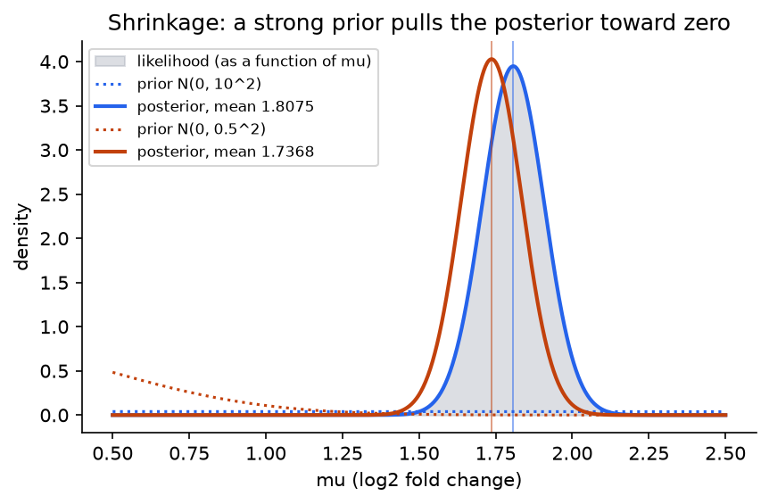
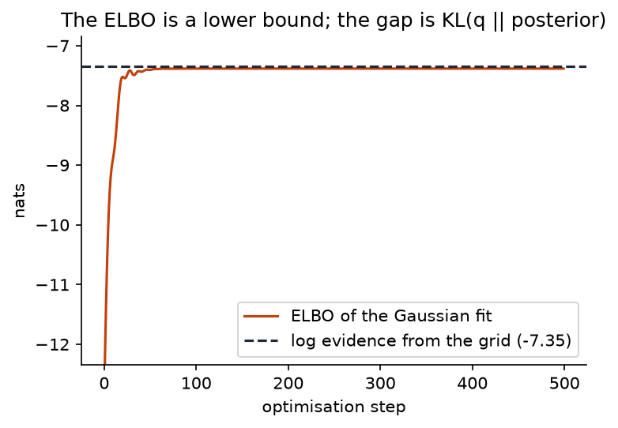
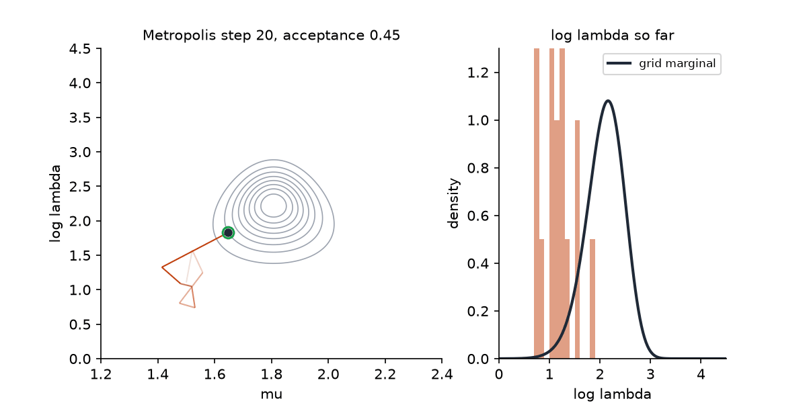

## Overview

**Why this module exists.** The rest of the workshop builds industrial versions of four
ideas: exact inference by algebra (Day 1), approximation by optimisation (Day 2),
approximation by sampling (Day 3) and automation of the bookkeeping (Day 4). This module
builds toy versions of all four on one small model in about two hundred lines, so that
when you meet each idea again at full scale you already know what problem it solves and
what the answer should look like. Nothing here is a coin flip. The model is a real
measurement problem with two unknowns, and every number you compute is checked against
numerical integration.

**What you'll build:** in `workshop/m02b_foundations.py`, the log joint density of a
two-parameter model for qPCR replicates; its posterior on a grid, with the evidence and
posterior moments; the posterior predictive; a Gaussian approximation fitted by
maximising the evidence lower bound (variational inference in miniature) and a Gaussian
at the mode (the Laplace approximation); a random-walk Metropolis sampler (Markov chain
Monte Carlo in miniature); and a one-line function that explains why grids are not an
option beyond a handful of parameters.

**Estimated time:** 3 hours (about 1.5 hours reading, 1.5 hours building).

**Prerequisites:** [Module 1](m01-jax-warmup.qmd). [Module 2](m02-diagnostic.qmd) can be
done before or after. Terms are defined in the [glossary](../reference/glossary.qmd).

## Learning objectives

By the end of this module you can:

1. Write a probabilistic model as a generative story and as a log joint density, and
   derive Bayes' rule from the product rule rather than quoting it.
2. State what the prior, likelihood, evidence and posterior are, and give the
   engineer's reading of each (the prior as a regulariser, the posterior mode as a
   regularised fit).
3. Explain why every question asked of a posterior is an expectation, and why that
   expectation is intractable in general: the evidence integral and the $K^d$ cost of a
   grid.
4. Compute the same posterior four ways (grid, variational Gaussian, Laplace, Metropolis),
   say what each one gets right and wrong, and name the module that scales each up.
5. Explain the Jacobian term that appears when a constrained parameter is transformed to
   the real line.

## Background

### The problem in plain terms

A qPCR assay measures how much a gene's expression changed between two conditions. The
instrument reports a log2 fold change, and the measurement is noisy, so the assay is
repeated. `workshop/data.py` provides twelve replicates:

```
1.844  1.754  2.024  1.837  1.613  1.927  2.256  2.131  1.554  1.357  1.582  1.814
```

Two things are unknown: the true fold change $\mu$ and how noisy the assay is. We
describe the noise by its **precision** $\lambda$, the inverse variance, because the
algebra is cleaner. The questions a biologist asks are: what is $\mu$, how sure are we,
is $\mu > 1.5$ (a biologically meaningful threshold), and what would a thirteenth
replicate look like. Bayesian inference answers all four with one object, the posterior
distribution over $(\mu, \lambda)$ given the twelve numbers. This module is about what
that object is, why it is hard to compute, and the three families of methods for
computing it anyway.

### A model is a generative story

A **model** is a joint probability distribution over everything, data and unknowns
together. The clearest way to write one is as the procedure that would generate a
dataset:

```
mu     ~ Normal(mean=0, sd=10)          # prior on the fold change
lambda ~ Gamma(shape=2, rate=0.5)       # prior on the precision
for i in 1..12:
    x_i ~ Normal(mean=mu, sd=1/sqrt(lambda))   # likelihood of each replicate
```

Read as a density, this is

$$
p(x, \mu, \lambda) = p(\mu)\,p(\lambda)\,\prod_{i=1}^{12} p(x_i \mid \mu, \lambda),
$$

where $x = (x_1, \ldots, x_{12})$. The factorisation follows the arrows of the story:
each line's distribution may depend on the lines above it. Every model in this workshop
is written this way, and on Day 4 you will write a small language whose programs are
exactly such stories.

The two priors deserve a comment, since priors are the part that engineers find
strangest.

- $\mu \sim \mathcal N(0, 10^2)$ says: before seeing data, fold changes between about
  $-20$ and $20$ are plausible. This is deliberately vague. Its job is to make the
  posterior well defined, not to inject knowledge.
- $\lambda \sim \mathrm{Gamma}(2, 0.5)$ (shape 2, rate 0.5) has mean $2/0.5 = 4$ and a
  long right tail, so precisions from well below 1 to several tens are plausible. It
  is positive, as a precision must be.

The engineer's reading of a prior is a **regulariser**. Take a linear model
$y = Xw + \varepsilon$ with Gaussian noise of variance $\sigma^2$ and a prior
$w \sim \mathcal N(0, \tau^2 I)$. The log of the joint density is

$$
\log p(y, w) = -\frac{\|y - Xw\|^2}{2\sigma^2} - \frac{\|w\|^2}{2\tau^2} + \text{const},
$$

and maximising it over $w$ is the same as minimising $\|y - Xw\|^2 + (\sigma^2/\tau^2)\|w\|^2$:
ridge regression, with the regularisation strength set by the ratio of noise variance to
prior variance. A Laplace prior gives the lasso. The maximum of the posterior, the
**MAP estimate**, is a regularised fit. Bayesian inference goes further than the maximum,
and that is the whole point, but the maximum is a familiar place to start.

### From the product rule to Bayes' rule

Probability has two rules. The **product rule** says a joint density factorises either
way round:

$$
p(x, \theta) = p(x \mid \theta)\,p(\theta) = p(\theta \mid x)\,p(x).
$$

The **sum rule** says a marginal is obtained by integrating out what you do not care
about:

$$
p(x) = \int p(x, \theta)\,\dd\theta.
$$

Write $\theta = (\mu, \lambda)$ for all the unknowns at once. Dividing the two forms of
the product rule by $p(x)$ gives

$$
p(\theta \mid x) = \frac{p(x \mid \theta)\,p(\theta)}{p(x)},
\qquad
p(x) = \int p(x \mid \theta)\,p(\theta)\,\dd\theta.
$$

That is Bayes' rule. It is not an axiom; it is the product rule rearranged. The four
objects in it have names, and you will use all four names every day of the workshop.

| Object | Symbol | What it is | Engineer's reading |
|---|---|---|---|
| Prior | $p(\theta)$ | plausibility of the unknowns before data | the regulariser |
| Likelihood | $p(x \mid \theta)$ as a function of $\theta$ | how well each $\theta$ explains the data | the (negative) loss |
| Evidence | $p(x)$ | probability of the data under the whole model | the normaliser; also a model-comparison score |
| Posterior | $p(\theta \mid x)$ | plausibility of the unknowns after data | the answer |

The likelihood is a density in $x$, not in $\theta$: for fixed data it is a function of
$\theta$ that need not integrate to one over $\theta$. For our model,

$$
\log p(x \mid \mu, \lambda) = \sum_{i=1}^{12}\Big(\tfrac12\log\lambda - \tfrac12\log 2\pi - \tfrac{\lambda}{2}(x_i - \mu)^2\Big)
= \tfrac{n}{2}\log\lambda - \tfrac{n}{2}\log 2\pi - \tfrac{\lambda}{2}\sum_i (x_i - \mu)^2 .
$$

The sum of squares is the only feature of the data that enters; this is the sufficient
statistic that Module 3 defines in general.

### What we do with a posterior: everything is an expectation

A posterior is a distribution, and a distribution is used by integrating against it.
Every question in the opening paragraph is an expectation of some function $f$ under
the posterior:

| Question | $f(\theta)$ | Expectation |
|---|---|---|
| What is $\mu$? | $\mu$ | posterior mean $\E[\mu \mid x]$ |
| How sure are we? | $(\mu - \E[\mu\mid x])^2$ | posterior variance |
| Is $\mu > 1.5$? | $\mathbb 1[\mu > 1.5]$ | posterior probability of the event |
| What will the 13th replicate be? | $p(x_{\text{new}} \mid \theta)$ | posterior predictive density |
| Should we act? | utility of the action given $\theta$ | expected utility |

The **posterior predictive** deserves a line of its own because it is the quantity most
often needed in practice:

$$
p(x_{\text{new}} \mid x) = \int p(x_{\text{new}} \mid \theta)\,p(\theta \mid x)\,\dd\theta.
$$

It averages the likelihood of a new point over everything we still do not know about
$\theta$. It is always wider than the likelihood at any single $\theta$, because it adds
parameter uncertainty to measurement noise. A model that plugs in a point estimate of
$\theta$ is overconfident by exactly the omitted spread.

So approximate inference has a precise goal: estimate $\E_{p(\theta\mid x)}[f(\theta)]$ for
the functions $f$ you care about, when $p(\theta \mid x)$ has no closed form.

### Why it is hard: the evidence integral

The numerator of Bayes' rule, $p(x \mid \theta)\,p(\theta)$, is easy: it is the model
evaluated at a point, one line of code. The denominator $p(x)$ is an integral over every
unknown at once. For two unknowns you can do it numerically. Put $\mu$ on a grid of $K$
points and $\log\lambda$ on another, evaluate the log joint at every pair, exponentiate
and sum: $K^2$ evaluations. That is Step 2, and with $K$ around 250 it takes a fraction
of a second. This is what it produces:

{width=70%}

Now count. A grid with $K$ points per dimension in $d$ dimensions costs $K^d$
evaluations:

| $d$ | $K = 200$ | What has that many unknowns |
|---|---|---|
| 2 | $4\times10^4$ | this module |
| 5 | $3.2\times10^{11}$ | the churn regression of Day 2 |
| 10 | $1.0\times10^{23}$ | the hierarchical model of Day 3 |
| 64 | $1.8\times10^{147}$ | the decoder weights of Day 4's smallest VAE, roughly |

The universe has about $10^{80}$ atoms. Grids are not a method; they are a check for
methods, and this module uses them exactly that way.

The posterior itself is not the obstacle. You can evaluate it up to the constant $p(x)$
anywhere, instantly. The obstacle is that expectations need the whole distribution, and
"the whole distribution" in ten dimensions is a volume you cannot enumerate. There are
three ways out, and they are the three technical days of the workshop.

1. **Algebra, when it works.** For special pairs of prior and likelihood the posterior
   has the same form as the prior and the integral is known in closed form. This is
   *conjugacy*, Day 1. It covers few models, but those models are the exact answers that
   everything else is tested against.
2. **Optimisation.** Pick a family of tractable distributions $q_\phi(\theta)$, such as
   Gaussians, and find the member closest to the posterior. "Closest" is measured by the
   KL divergence, and minimising it turns out not to require $p(x)$. This is
   *variational inference*, Day 2. Fast, scalable, biased by the choice of family.
3. **Sampling.** Construct a random walk on $\theta$ whose long-run distribution is the
   posterior, and average $f$ over the walk. This is *Markov chain Monte Carlo*, Day 3.
   Unbiased in the limit, no family to choose, slower, and you must check convergence.

Day 4 adds no fourth method; it builds the machinery (a probabilistic programming
language) that lets you write the model once and run both 2 and 3 on it without
re-deriving anything. Day 5 extends each route.

Steps 4 and 5 of this module build the smallest honest versions of routes 2 and 3 and
compare them with the grid.

### A map of the workshop

| You want to | The tool | Module |
|---|---|---|
| write densities and compute their moments, divergences and updates in closed form | exponential families | 3, 4 |
| get an exact posterior when the model allows it | conjugacy | 5 |
| fit a tractable distribution to a posterior by coordinate updates | CAVI | 6 |
| fit one by gradient ascent on a stochastic objective | black-box VI | 7, 8 |
| draw samples from a posterior with gradients | HMC | 9, 10 |
| know whether your samples can be trusted | $\hat R$, ESS, divergences | 11 |
| write a model once and run any inference on it | effect handlers | 12, 13 |
| learn a posterior approximation shared across data points | amortised VI, VAE | 14 |
| use a richer family than Gaussians | normalising flows | 15a |
| treat generation as inference over a noising process | diffusion models | 15b |
| ask what would have happened | structural causal models | 15c |

### Working on the real line: the Jacobian {#sec-jacobian}

The precision $\lambda$ must be positive. Grids, Gaussians and random walks all prefer
unconstrained coordinates, so every method in this module works with
$\theta = (\mu, \phi)$ where $\phi = \log\lambda$. Changing variables in a density is not
free, and this is the one idea in the workshop that comes back on more pages than any
other, so it gets its full treatment here and a short pointer everywhere else.

Think of probability as a fixed quantity of sand spread along the $\lambda$ axis.
Relabelling the axis as $\phi = \log\lambda$ stretches the part of the axis where
$\lambda$ is small (an interval of $\lambda$ from $0.1$ to $0.2$ becomes a $\phi$ interval
of width $\log 2 = 0.69$) and squeezes the part where $\lambda$ is large (from $10$ to
$10.1$ becomes a width of $0.01$). The sand does not move; the same mass now sits over
a wider or narrower stretch, so the *height* of the pile, the density, must change in
inverse proportion. Mass is conserved: $p_\phi(\phi)\,\dd\phi = p_\lambda(\lambda)\,\dd\lambda$, so

$$
p_\phi(\phi) = p_\lambda(e^\phi)\,\Big|\frac{\dd\lambda}{\dd\phi}\Big| = p_\lambda(e^\phi)\,e^\phi,
\qquad
\log p_\phi(\phi) = \log p_\lambda(e^\phi) + \phi .
$$

The extra $+\phi = +\log\lambda$ is the log absolute Jacobian. In several dimensions the
factor is the absolute determinant of the Jacobian matrix of the map (Module 2 derives
this), which measures how much the map stretches a small volume.


Forgetting the Jacobian is the single most common bug in hand-written inference code,
and it is silent: the posterior is wrong by a factor of $\lambda$, which tilts it toward
small precisions, and nothing crashes. Step 1 makes the term explicit and tests for it.

**Check it, do not trust it.** The provided module `workshop/jacobian_check.py` tests
any transform in three lines. It compares your claimed density in the new coordinates
against the right-hand side above, with the Jacobian computed by autodiff, and it
integrates a one-dimensional density to confirm it is normalised:

```python
import jax.scipy.stats as jss
from workshop.jacobian_check import check_change_of_variables, integral_1d
log_p_lam = lambda lam: jss.gamma.logpdf(lam, a=2.0, scale=1 / 0.5)   # Gamma(shape 2, rate 0.5)
log_p_phi = lambda phi: log_p_lam(jnp.exp(phi)) + phi                  # claimed density of phi
check_change_of_variables(log_p_lam, jnp.exp, log_p_phi, jnp.linspace(-2, 3, 11))  # zeros
integral_1d(log_p_phi, jnp.linspace(-10, 6, 40001))                               # 1.0
```

If you drop the `+ phi`, the first call returns $-\phi$ at every point and the second
returns $0.5$: without the Jacobian you have integrated $p_\lambda(\lambda)/\lambda$,
which is the prior mean of $1/\lambda$, not one. Every later page that changes variables
points back here and shows the two-line check for its own transform.

**Where it comes back.** Module 5 maps a Beta prior to natural parameters and the
Jacobian shifts the exponents by one. Module 8 packages transforms as bijectors whose
`log_det_jacobian` is this term. Modules 9 and 11 write $\tau = e^{\log\tau}$ in the
hierarchical model. Module 13 adds the term automatically for every constrained site of
a probabilistic program. Track A builds a density entirely out of Jacobians (a
normalising flow), Track B integrates one along a trajectory, and Track C uses a unit
Jacobian to turn an observed variable into an observed noise term.

### A worked example with numbers

To see the posterior in closed form, pretend for a moment that the precision is known,
$\lambda = 8.16$ (the value the data were generated with; the noise standard deviation is
$1/\sqrt{8.16} = 0.35$). Then only $\mu$ is unknown, the prior is
$\mathcal N(0, 10^2)$, and the likelihood as a function of $\mu$ is proportional to
$\exp\big(-\frac{n\lambda}{2}(\mu - \bar x)^2\big)$ with $n = 12$ and sample mean
$\bar x = 1.8077$. The product of two Gaussians in $\mu$ is a Gaussian, and precisions
add while means combine in proportion to precision:

$$
\text{posterior precision} = \frac{1}{10^2} + n\lambda = 0.01 + 97.96 = 97.97,
\qquad
\text{posterior mean} = \frac{0.01 \times 0 + 97.96 \times 1.8077}{97.97} = 1.8075,
$$

so $\mu \mid x \sim \mathcal N(1.8075, 0.101^2)$. The data precision outweighs the prior
precision by a factor of ten thousand, and the posterior mean is the sample mean to four
digits: a vague prior is washed out by twelve observations. The posterior probability
that $\mu > 1.5$ is $\Phi\big((1.8075 - 1.5)/0.101\big) = \Phi(3.04) = 0.9988$.

**Predict before reading on.** Change the prior to $\mathcal N(0, 0.5^2)$, a strong
belief that fold changes are small. The prior standard deviation has shrunk by a factor
of twenty. By how much does the posterior mean move, and by how much does the posterior
standard deviation shrink? Write both numbers down, then open the answer.

::: {.callout-note collapse="true" title="Answer"}
Precision $4 + 97.96 = 101.96$, mean $97.96 \times 1.8077 / 101.96 = 1.737$,
standard deviation $0.099$. The mean moves $0.07$, about two thirds of a posterior
standard deviation; the standard deviation barely changes ($0.101$ to $0.099$). Most
people predict a larger shift. The prior is twenty times more confident than before, yet
the data are still twenty-five times more precise than the prior, so the prior gets a
four percent vote. The surprise is how little a "strong" prior does once there are a
dozen observations.
:::

{width=75%}

This is **shrinkage**, and it is the regulariser at work. With $n = 1200$ replicates the
pull would be $0.0007$. The prior matters when data are scarce and fades as they
accumulate, at a rate you can compute.

With $\lambda$ unknown as well, the posterior over $(\mu, \log\lambda)$ has no such
closed form under these priors, which is why Step 2 computes it on a grid. You will find
a posterior mean of $(1.808, 2.09)$, standard deviations $(0.105, 0.378)$, a log evidence
of $-7.35$, and a correlation between $\mu$ and $\log\lambda$ of essentially zero.
Compare: the $\mu$ marginal is nearly the known-precision answer, slightly wider because
uncertainty about the noise level is now included.

### Where this sits in the workshop

Every later module answers one question raised here.

- Step 2's grid gives the exact posterior for free in two dimensions. Module 5 gives it
  in closed form for conjugate models of any dimension.
- Step 4's Gaussian fit maximises the ELBO with reparameterised samples. Module 6 does the
  same with closed-form coordinate updates; Modules 7 and 8 do it with stochastic
  gradients on models where nothing is closed form.
- Step 4's Laplace approximation is the baseline against which Modules 7, 8 and 11
  measure variational and sampling posteriors.
- Step 5's Metropolis sampler accepts 28% of proposals and moves one small step at a
  time. Module 9 replaces the random walk with Hamiltonian dynamics and accepts over 90%
  of proposals that move across the whole posterior.
- Step 1's hand-written Jacobian becomes Module 8's bijectors and Module 13's automatic
  unconstraining.

### Common misconceptions

- **"The prior is a bias I am injecting."** It is a regulariser whose strength you can
  read off, and whose influence decays at a computable rate as data arrive. A model
  without a prior is a model with a flat prior, which is also a choice, and often a worse
  one (a flat prior on a precision puts most of its mass at absurdly large values).
- **"The posterior is the best estimate."** The posterior is a distribution. Any single
  number extracted from it (mean, mode, median) throws away the uncertainty that the
  predictive and the decision need.
- **"The likelihood is the probability of the parameter."** It is the probability of the
  data as a function of the parameter. It does not integrate to one over $\theta$ and it
  is not a posterior; multiplying by the prior and normalising makes it one.
- **"With enough data the prior does not matter."** True for the parameters the data
  inform, at rate $1/n$ in the precision. False for parameters the data do not inform
  (a hierarchical variance with three groups), and false for model comparison, where the
  evidence depends on the prior at every $n$.
- **"The ELBO is the log evidence."** It is a lower bound, equal to the log evidence only
  when the variational family contains the posterior. The gap is the KL divergence, and
  Step 4 measures it: about $0.007$ nats here, because this posterior is nearly Gaussian.

## Steps

Every step edits `workshop/m02b_foundations.py`. The model constants, the constrained
prior `log_prior_constrained`, the Gaussian helpers and `adam_step` are provided.

### Step 1 — The model as three log densities

**What this computes.** The log joint $\log p(x, \theta)$ in the unconstrained
coordinates $\theta = (\mu, \log\lambda)$, split into `log_prior` and `log_likelihood`.
This is the only model-specific code in the module; every later step takes `log_joint`
as a function argument and never looks inside it. The prior over $\theta$ is the
provided constrained prior plus the Jacobian term $+\log\lambda$.

Implement `log_prior(theta)` as `log_prior_constrained(mu, exp(log_lam)) + log_lam`;
`log_likelihood(theta, x)` from the formula in the Background; and `log_joint` as their
sum.

Sanity check: `log_joint(jnp.array([1.8, 2.0]), x)` should print $-6.041$, split as
likelihood $-1.723$ and prior $-4.319$.

```bash
pytest tests/m02b -k step1
```

You should see 3 passed: the likelihood against `scipy.stats.norm`, the constrained prior
against SciPy and the Jacobian term equal to $\log\lambda$ exactly, and the joint equal
to the sum.

### Step 2 — The posterior on a grid

**What this computes.** The posterior and the evidence by brute force. Evaluate the log
joint at every grid point, then normalise. In the log domain the normaliser is
$\log p(x) \approx \log\sum_{ij} e^{\ell_{ij}} + \log(\Delta\mu\,\Delta\phi)$ where
$\ell_{ij}$ is the log joint at cell $(i, j)$ and the second term is the log cell area.
`logsumexp` from Module 1 keeps this from overflowing. `grid_moments` then computes the
posterior mean and covariance as weighted sums over cells.

Implement `grid_log_posterior(log_joint_fn, x, mu_grid, loglam_grid)` with two nested
`jax.vmap` calls and `jax.nn.logsumexp`, returning the normalised log posterior and the
log evidence. Implement `grid_moments(log_post, mu_grid, loglam_grid)`.

Sanity check: on `mu_grid = linspace(1.2, 2.4, 241)` and
`loglam_grid = linspace(0, 4.5, 301)` the log evidence is $-7.348$, the posterior mean is
$(1.8075, 2.092)$ and the standard deviations are $(0.105, 0.378)$. The grid has 72 541
cells; `exp(log_post).sum() * area` must be $1$ to ten digits.

```bash
pytest tests/m02b -k step2
```

You should see 2 passed: normalisation and the evidence against
`scipy.integrate.dblquad` over the constrained space, and the moments.

### Step 3 — Prediction is an expectation under the posterior

**What this computes.** The posterior predictive density of a new replicate,
$p(x_{\text{new}} \mid x) = \sum_{\text{cells}} w_{ij}\,\mathcal N(x_{\text{new}} \mid \mu_i, 1/\lambda_j)$,
a mixture of Gaussians with the posterior cell weights. It is the first expectation you
compute under a posterior; Modules 5 and 13 compute the same object in closed form and
by sampling.

Implement `posterior_predictive_grid(log_post, mu_grid, loglam_grid, x_new)` in the log
domain.

Sanity check: the log predictive density at $x_{\text{new}} = 1.5$ is $-0.289$ and at
$2.3$ is $-0.869$. Integrated over $x_{\text{new}}$ from $-1$ to $4.5$ the density sums
to one.

```bash
pytest tests/m02b -k step3
```

You should see 2 passed, including a check that the predictive variance exceeds the
sample variance of the data (parameter uncertainty adds to noise).

### Step 4 — Variational inference and Laplace, in miniature

**What this computes.** Two Gaussian approximations to the posterior. The first is fitted
by maximising the **evidence lower bound**. For any density $q$,

$$
\log p(x) = \underbrace{\E_q[\log p(x, \theta) - \log q(\theta)]}_{\ELBO(q)} + \KL\big(q\,\|\,p(\theta\mid x)\big),
$$

an identity you will derive in Module 6. Since KL is non-negative, the ELBO is at most
$\log p(x)$, and maximising it over $q$ minimises the KL to the posterior without ever
touching $p(x)$. The ELBO is an expectation under $q$; with $q$ Gaussian we estimate it by
writing $\theta = m + s\odot\varepsilon$ for fixed standard-normal draws $\varepsilon$
(the reparameterisation of Module 7), which makes it a smooth function of $(m, \log s)$
that `jax.grad` can differentiate. The second approximation is the Laplace approximation:
find the mode by Newton's method and use the inverse negative Hessian as the covariance.

Implement `elbo_gaussian(q_mean, q_log_sd, eps, log_joint_fn, x)` as the mean over the
rows of `eps` of the log joint at the reparameterised points, plus the provided entropy.
Implement `fit_gaussian_vi(...)` as gradient ascent with the provided `adam_step` in
`lax.scan`, returning the ELBO trace. Implement `laplace_approx(log_joint_fn, x, theta0)`
as damped Newton (try step fractions $1, \frac12, \ldots, 2^{-8}$ and take the largest
that increases the objective; a full step overshoots where the log joint is not
concave) followed by `inv(-hessian)` at the mode.

Sanity check: from the initialisation in the test, the ELBO rises from $-12.7$ to
$-7.355$, against a log evidence of $-7.348$: a gap of $0.007$ nats. The fitted mean is
$(1.805, 2.093)$ with standard deviations $(0.099, 0.368)$, slightly narrower than the
grid's $(0.105, 0.378)$. The Laplace mode is $(1.808, 2.225)$ with standard deviations
$(0.095, 0.354)$. The mode of $\log\lambda$ sits above its mean because the marginal is
left-skewed; a Gaussian at the mode cannot know that.

{width=70%}


```bash
pytest tests/m02b -k step4
```

You should see 4 passed: KL on the grid is non-negative and larger for a displaced
Gaussian; the ELBO at the grid moments is below the log evidence by less than $0.2$;
the fit converges with KL below $0.1$, mean within $0.05$ and standard deviations no
larger than the grid's; and Laplace matches the grid.

### Step 5 — Markov chain Monte Carlo in miniature, and why grids do not scale

**What this computes.** Samples from the posterior without a grid. Random-walk Metropolis
proposes $\theta' = \theta + s\,\varepsilon$ and accepts with probability
$\min\big(1, p(x, \theta')/p(x, \theta)\big)$; the normaliser $p(x)$ cancels in the
ratio, which is why sampling needs only the unnormalised log joint. Module 9 proves that
this rule leaves the posterior invariant and replaces the random walk with something far
more efficient.



::: {.callout-note title="Interactive"}
The surface is the exact posterior of Step 2 over $(\mu, \log\lambda)$ and the walker is Step 5's sampler. The dark sphere is the current state, the grey trail the recent accepted states; each proposal flashes green when accepted and red when rejected. Raise the step size until most proposals land in the tails and are refused, then lower it until the chain barely moves. The best setting is in between, and the readout shows its acceptance rate is well below one. Drag to rotate, scroll to zoom. The toggle switches to the Hamiltonian sampler of Module 9, which you have not met yet; note how far each of its proposals travels.
:::

```{=html}
<div class="bi-widget" id="qpcr-surface" data-target="qpcr" data-mode="rwm" style="width:100%;max-width:860px;margin:0 auto 1.5rem auto;"></div>
<script type="module">
import { mount } from "../widgets/sampler_surface.js";
mount(document.getElementById("qpcr-surface"));
</script>
```

Implement `random_walk_metropolis(log_target, key, theta0, n_steps, step_size)`: draw all
proposal noise and all uniforms up front, then `lax.scan` over them, carrying the
current point and its log density. Implement `grid_cost(d, k)`.

Sanity check: with step size $0.35$ from $(1.5, 1.0)$ the acceptance rate is $0.28$, and
after discarding the first 5 000 of 60 000 draws the sample mean is $(1.808, 2.10)$ and
the standard deviations $(0.105, 0.37)$, matching the grid. `grid_cost(10, 200)` is
$1.02\times10^{23}$.

```bash
pytest tests/m02b -k step5
```

You should see 3 passed: moments against the grid within Monte Carlo error allowing for
autocorrelation, determinism in the key, and the grid cost.

## Checkpoint

::: {.callout-tip title="Checkpoint"}
```bash
pytest tests/m02b
```
14 tests pass in under 15 seconds. Look again at the four pictures on this page: the
grid posterior, the ELBO rising to the log evidence, the four versions of the
$\log\lambda$ marginal, and the Metropolis chain. `notebooks/m02b_foundations.py`
regenerates them from your own code. Before Day 1, be able to say in one sentence each
what the grid, the variational Gaussian, the Laplace approximation and the sampler get
wrong.

**Which expectation did you just compute?** Three of them: the posterior mean and
variance (Steps 2, 4 and 5), the posterior predictive density at a new point (Step 3),
and the ELBO itself, an expectation under $q$ rather than under the posterior (Step 4).
Every later module's Checkpoint asks this same question.
:::

## Challenge

::: {.callout-note title="Challenge"}
1. Add a third unknown: a per-replicate offset shared by the odd-numbered wells (a plate
   effect). Compute `grid_cost(3, 241)`, then try to run the grid. Fit the Gaussian and
   run Metropolis instead and compare.
2. Replace the independent priors by the Normal–Gamma prior
   $\lambda \sim \mathrm{Gamma}(\alpha, \beta)$, $\mu \mid \lambda \sim \mathcal N(m, (\kappa\lambda)^{-1})$
   and derive the posterior in closed form. Check it against the grid. This is Module 5's
   Step 3; doing it now will make Day 1 faster.
3. The ELBO gap here is $0.007$ nats. Construct a prior and dataset for which a diagonal
   Gaussian is a bad fit (hint: make $\mu$ and $\log\lambda$ correlated by using very few
   replicates) and measure the gap.
:::

## Going deeper

- MacKay, *Information Theory, Inference, and Learning Algorithms* (Cambridge University
  Press, 2003), Chapters 2, 3 and 24. The clearest first-principles account of what a
  posterior is and why the evidence matters.
- Bishop, *Pattern Recognition and Machine Learning* (Springer, 2006), Chapters 1 and 2,
  in particular Section 1.2.3 (Bayesian probabilities) and Section 2.3.6 (Bayesian
  inference for the Gaussian), which contains the known-precision worked example.
- Murphy, *Probabilistic Machine Learning: Advanced Topics* (MIT Press, 2023), Chapter 1
  and Chapter 3.
- Gelman, Carlin, Stern, Dunson, Vehtari and Rubin, *Bayesian Data Analysis*, 3rd
  edition (CRC Press, 2013), Chapters 1 to 3, for the statistician's view and more
  worked examples with real data.
- Blei, Kucukelbir and McAuliffe, "Variational Inference: A Review for Statisticians",
  *JASA* 112(518), 2017, Section 2, for the intractability argument that motivates
  everything on Day 2.
- Betancourt, "A Conceptual Introduction to Hamiltonian Monte Carlo", arXiv:1701.02434,
  2017, Section 1, for why expectations in high dimensions are dominated by regions you
  would not guess.

## Troubleshooting

::: {.callout-warning title="Troubleshooting"}
**`inf` or `nan` in the grid posterior.** You exponentiated the log joint before
subtracting its maximum, or computed the normaliser as `log(sum(exp(...)))`. Use
`logsumexp` and never leave the log domain until the final `exp` of a normalised value.

**Evidence off by a constant; moments correct.** The cell area is missing from the
normaliser. The moments do not care because weights are renormalised; the evidence does.

**Posterior tilted toward small precision; evidence too low.** The Jacobian term
$+\log\lambda$ is missing from `log_prior`. Nothing crashes. The Step 1 test catches it.

**Moments depend on the grid limits.** Posterior mass is falling off the edge. Check that
`exp(log_post)` at every edge row and column is negligible (below $10^{-3}$ of the
maximum) before trusting any number.

**ELBO decreases, or `q_log_sd` runs away.** Plain gradient ascent with one learning
rate: the curvature in $\mu$ is about a hundred times that in $\log\lambda$. Use the
provided `adam_step`, or reduce the learning rate below $0.02$ and run longer.

**Laplace returns `nan` covariance.** Newton diverged from the starting point into a
region where the Hessian is not negative definite. Damp the step as described.

**Acceptance rate near 1 or near 0.** Step size far too small (the chain barely moves,
every proposal accepted, samples nearly identical) or far too large (every proposal
lands in the tails and is rejected). Aim for 0.2 to 0.4 in two dimensions.

**"My grid answer and my Metropolis answer differ in the second decimal."** They should.
Sixty thousand correlated draws give roughly five thousand independent ones, so the
posterior mean is known to about $0.105/\sqrt{5000} = 0.0015$ in $\mu$ and
$0.378/\sqrt{5000} = 0.005$ in $\log\lambda$. Module 11 makes this estimate precise.

**"The ELBO is above the log evidence."** With fixed $\varepsilon$ the ELBO is a Monte
Carlo estimate and can exceed the bound by its own standard error. With 256 draws the
error is a few thousandths of a nat; an excess larger than that is a bug in the entropy
term.
:::
