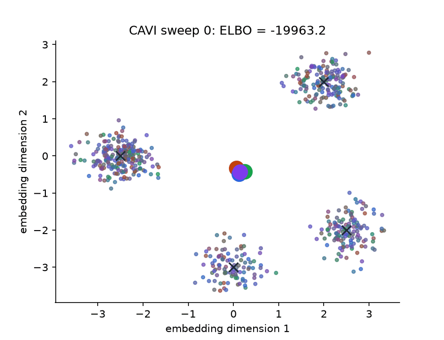
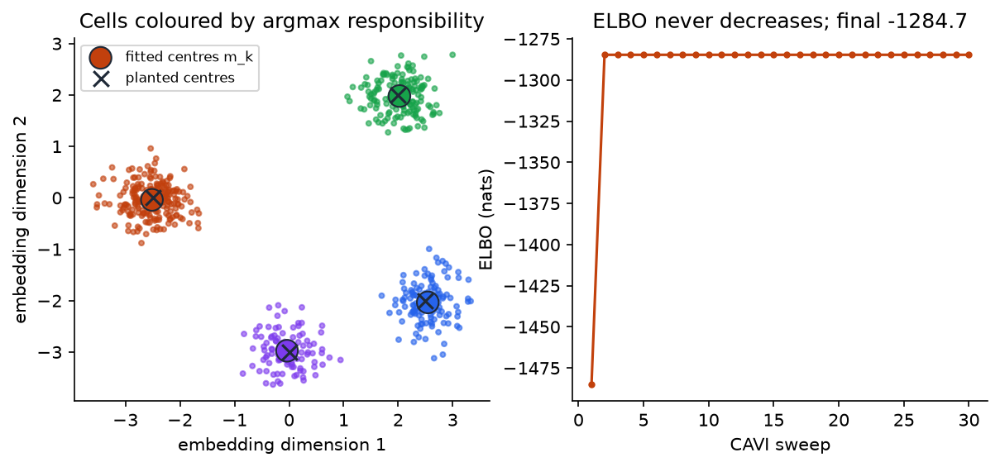
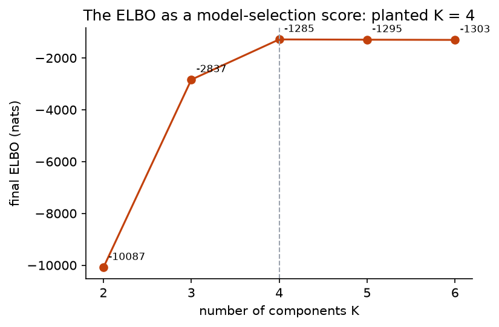

## Overview

**Why this module exists.** Day 1 gave you exact posteriors for conjugate models. Almost
no model you will meet in practice is conjugate, and [Module 2b](../day0/m02b-foundations.qmd)
showed why the honest alternative, integrating on a grid, is hopeless beyond a handful
of unknowns. Variational inference is the first of the two escape routes this workshop
builds. The idea is to stop asking for the posterior and instead ask for the best
approximation to it from a family of distributions you can actually compute with. "Best"
needs an objective that can be evaluated without the posterior, and that objective is
the ELBO. This module derives it from nothing, shows what it rewards and what it
sacrifices, and builds the simplest algorithm that maximises it: coordinate ascent, one
factor at a time, each update in closed form because the model is built from the
exponential families and conjugate pairs of Day 1.

**What you'll build:** in `workshop/m06_cavi.py`, the evidence lower bound (ELBO) of a
Bayesian Gaussian mixture in closed form, the three coordinate-ascent updates of
mean-field variational inference (CAVI), the CAVI loop under `lax.scan`, and the ELBO
as a model-selection score across the number of components. The data are a 2-D
embedding of 600 single cells from four cell types.

**Estimated time:** 3 hours (about 1 hour reading, 2 hours building).

**Prerequisites:** [Module 3](../day1/m03-expfam-core.qmd),
[Module 4](../day1/m04-kl-bregman.qmd), [Module 5](../day1/m05-conjugacy.qmd),
[Module 2b](../day0/m02b-foundations.qmd) for the words posterior, evidence and
expectation. Terms are in the [glossary](../reference/glossary.qmd).

**Dataset:** `single_cell_embedding()` from `workshop/data.py`: $x_i \in \R^2$,
$n = 600$, four planted types with isotropic noise of standard deviation $0.35$. The
likelihood variance is treated as known, so the model is exactly the conditionally
conjugate mixture of Blei, Kucukelbir and McAuliffe (2017), Section 3.

## Learning objectives

By the end of this module you can:

1. Derive the ELBO two ways, from Jensen's inequality and from the KL decomposition of
   the log evidence, and explain in words why maximising it approximates the posterior
   without ever computing the evidence.
2. State the mean-field assumption, say what it throws away, and compute by hand how
   much variance it loses on a correlated Gaussian.
3. Derive the CAVI update $q_j^*(\theta_j) \propto \exp\E_{-j}[\log p(x, \theta)]$ and
   recognise it as the Module 5 conjugate update with soft counts.
4. Implement CAVI as a monotone ascent and verify monotonicity numerically.
5. Use the ELBO to choose the number of components and explain why it is a biased
   estimate of the log evidence.

## Background

### The problem in plain terms

You have a model $p(x, \theta)$ over data $x$ and unknowns $\theta$, and you want the
posterior $p(\theta \mid x) = p(x, \theta)/p(x)$. The numerator is easy: it is the
generative story written down. The denominator, the evidence
$p(x) = \int p(x, \theta)\dd\theta$, is an integral over every unknown at once and is
intractable for anything interesting. So you cannot evaluate the posterior, let alone
compute expectations under it.

Variational inference turns this integration problem into an optimisation problem. Pick
a family $\mathcal Q$ of distributions $q(\theta)$ that you *can* compute with (evaluate,
sample, take expectations under). Then find the member of $\mathcal Q$ closest to the
posterior. The word "variational" is borrowed from the calculus of variations: the
thing being optimised over is a function (a density), not a vector. In practice
$\mathcal Q$ is indexed by a finite vector of **variational parameters**, so the
optimisation is ordinary.

Two things must be settled: what "closest" means, and how to measure it without having
the posterior. The answer to both is the ELBO.

### Definitions

| Term | Meaning |
|---|---|
| variational family $\mathcal Q$ | the set of candidate approximations; here, mean-field products of exponential families |
| variational parameters | the numbers that index a member of $\mathcal Q$: here $\alpha$, $m_k$, $s_k^2$, $r_{ik}$ |
| ELBO | evidence lower bound: $\E_q[\log p(x, \theta)] - \E_q[\log q(\theta)]$, a function of $q$ that can be computed without $p(x)$ |
| mean-field | the assumption that $q$ factorises over the unknowns, $q(\theta) = \prod_j q_j(\theta_j)$ |
| CAVI | coordinate ascent variational inference: maximise the ELBO over one factor $q_j$ at a time |
| responsibilities $r_{ik}$ | the variational probability that cell $i$ belongs to component $k$ |

### The ELBO, derived from Jensen's inequality

Take any density $q(\theta)$ that is positive wherever the posterior is. Multiply and
divide inside the evidence integral by $q$:

$$
\log p(x) = \log\int p(x, \theta)\dd\theta = \log\int q(\theta)\,\frac{p(x, \theta)}{q(\theta)}\dd\theta = \log\E_q\!\left[\frac{p(x, \theta)}{q(\theta)}\right].
$$

The last expression is the log of an expectation. Jensen's inequality says that for a
concave function such as $\log$, the function of the average is at least the average of
the function: $\log\E[Y] \ge \E[\log Y]$. Apply it:

$$
\log p(x) \ge \E_q\!\left[\log\frac{p(x, \theta)}{q(\theta)}\right] = \underbrace{\E_q[\log p(x, \theta)]}_{\text{expected log joint}} - \underbrace{\E_q[\log q(\theta)]}_{-\,\text{entropy } H[q]} \eqqcolon \ELBO(q).
$$

Every quantity on the right is computable: the log joint is the model, $q$ is our
choice, and the expectations are under $q$, which we picked to be tractable. The
evidence never appears. That is the whole trick.

### The same bound from the KL decomposition

The Jensen argument shows the bound holds but not how tight it is. A second derivation
gives the gap exactly. Write the log joint as $\log p(\theta \mid x) + \log p(x)$ inside
the ELBO:

$$
\begin{aligned}
\ELBO(q) &= \E_q[\log p(\theta \mid x) + \log p(x)] - \E_q[\log q(\theta)] \\
&= \log p(x) + \E_q[\log p(\theta \mid x) - \log q(\theta)] \\
&= \log p(x) - \KL\big(q(\theta)\,\|\,p(\theta \mid x)\big).
\end{aligned}
$$

The first line substitutes; the second pulls $\log p(x)$ out of the expectation because
it does not depend on $\theta$; the third recognises
$\E_q[\log q - \log p(\cdot\mid x)]$ as the KL divergence from $q$ to the posterior
(Module 4). Since KL is non-negative, the ELBO is at most $\log p(x)$, with equality
exactly when $q$ is the posterior. Rearranged:

$$
\KL\big(q\,\|\,p(\theta\mid x)\big) = \log p(x) - \ELBO(q).
$$

The left side is what we want to minimise but cannot compute. The right side is a
constant we do not know minus a quantity we can compute. **Maximising the ELBO over
$\mathcal Q$ therefore minimises the KL divergence to the posterior**, and the unknown
constant does not affect where the maximum is. This is the sentence to remember.

### What the two terms reward

$\ELBO(q) = \E_q[\log p(x, \theta)] + H[q]$. The first term is large when $q$ puts its
mass where the joint density is high: on values of $\theta$ that explain the data well
and are plausible under the prior. On its own it would be maximised by a point mass at
the mode. The second term, the entropy, is large when $q$ is spread out, and goes to
$-\infty$ for a point mass. The ELBO rewards explaining the data while staying spread
out, and the posterior is the distribution that gets the balance exactly right.

The direction of the KL matters. $\KL(q\,\|\,p)$ averages $\log(q/p)$ under $q$, so it
punishes $q$ heavily for putting mass where $p$ has almost none ($\log(q/p) \to \infty$),
and barely at all for leaving out regions where $p$ has mass. The optimum therefore
tends to sit inside the posterior and be narrower than it. You will see this as
under-dispersion throughout Days 2 and 3.

### The mean-field assumption and what it costs

The family $\mathcal Q$ must be tractable. The classical choice is to assume the unknowns
are independent under $q$:

$$
q(\theta) = \prod_j q_j(\theta_j).
$$

Nothing is assumed about the form of each factor; the optimal form will fall out of the
derivation. What is thrown away is every correlation between unknowns in the posterior.

**Predict before reading on.** Let the posterior be a bivariate Gaussian with unit
variances and correlation $\rho = 0.9$. Fit the best product of two independent
Gaussians under $\KL(q\,\|\,p)$. Will the fitted means be right? Will the fitted
standard deviations be too large, too small, or right, and by roughly how much? Sketch
the ellipse and your answer before opening the box.

::: {.callout-note collapse="true" title="Answer"}
Write the precision matrix $\Lambda = \Sigma^{-1}$; its diagonal entries are
$\Lambda_{11} = \Lambda_{22} = 1/(1-\rho^2)$. The mean-field optimum under
$\KL(q\,\|\,p)$ is a product of Gaussians with the right means and with variance
$1/\Lambda_{jj}$ for each coordinate, which is the *conditional* variance of $\theta_j$
given the other coordinate, not its marginal variance. So each factor has variance
$1 - \rho^2$ instead of $1$. At $\rho = 0.9$ that is $0.19$: the mean-field fit reports
standard deviations $\sqrt{0.19} = 0.44$ where the truth is $1$, less than half. The
means are exactly right. Challenge 3 asks you to verify this numerically.
:::

{width=60%}

This pattern, means right, variances too small, correlations absent, is the signature
of mean-field VI and the reason Module 11 compares it against HMC.

### The CAVI update, derived from first principles

Fix every factor except $q_j$. Split the ELBO into the part that depends on $q_j$ and
the rest. Writing $\E_{-j}$ for the expectation over all factors other than $q_j$,

$$
\ELBO = \E_{q_j}\Big[\E_{-j}[\log p(x, \theta)]\Big] - \E_{q_j}[\log q_j(\theta_j)] + \text{terms without } q_j.
$$

The first term uses the factorisation: the expectation over the product splits into an
inner expectation over the other factors and an outer one over $q_j$. The entropy of a
product is the sum of entropies, which gives the second term plus constants. Now define
a function of $\theta_j$ alone, $\log\tilde p_j(\theta_j) = \E_{-j}[\log p(x, \theta)] +
\text{const}$, with the constant chosen so that $\tilde p_j$ integrates to one. Then

$$
\ELBO = \E_{q_j}[\log\tilde p_j(\theta_j)] - \E_{q_j}[\log q_j(\theta_j)] + \text{const} = -\KL\big(q_j\,\|\,\tilde p_j\big) + \text{const}.
$$

A KL divergence is minimised, at zero, when its two arguments are equal. So the factor
that maximises the ELBO with the others held fixed is

$$
q_j^*(\theta_j) \propto \exp\Big(\E_{-j}[\log p(x, \theta)]\Big).
$$

This is the coordinate-ascent update. It makes no assumption about the form of $q_j$;
the form is dictated by the model. Because every update is an exact maximisation of the
same objective in its own coordinate, the ELBO never decreases across a sweep. The
objective is not concave in all factors jointly, so CAVI converges to a local optimum
that depends on initialisation.

### The model and the family

With $K$ components: $\pi \sim \mathrm{Dir}(\alpha_0\mathbf 1)$ are the mixing weights,
$\mu_k \sim \mathcal N(0, \sigma_0^2 I)$ the component centres, $z_i \sim \mathrm{Cat}(\pi)$
the cell-type label of cell $i$, and $x_i \mid z_i \sim \mathcal N(\mu_{z_i}, \sigma^2 I)$
its embedding, with $\sigma$ known. The log joint is

$$
\log p(x, z, \pi, \mu) = \log\mathrm{Dir}(\pi) + \sum_k\log\mathcal N(\mu_k) + \sum_i\Big[\log\pi_{z_i} + \log\mathcal N(x_i \mid \mu_{z_i}, \sigma^2 I)\Big].
$$

The mean-field family factorises over $\pi$, each $\mu_k$ and each $z_i$:

$$
q(\pi, \mu, z) = \mathrm{Dir}(\pi\mid\alpha)\prod_k \mathcal N(\mu_k\mid m_k, s_k^2 I)\prod_i \mathrm{Cat}(z_i\mid r_i).
$$

The forms are not assumed; they are what the update rule produces, because each
unknown's conditional in the model is an exponential family (Module 3) with a
conjugate prior (Module 5).

The general rule is the only derivation in this Background. Applying it to each of
the three factors is a page of algebra each, and that algebra is placed inside Steps 1
to 3, next to the code it becomes. The worked example below uses the results; if you
want to follow every number, read Steps 2 and 3 first and come back.

### A worked example with numbers

Four points on a line, $x = (-2, -1.5, 1.5, 2)$, two components, $\sigma = 1$,
$\sigma_0 = 10$, $\alpha_0 = 1$. Start with mild responsibilities leaning the left two
points to component 1 and the right two to component 2:
$r_{i1} = (0.6, 0.6, 0.4, 0.4)$. The updates used below are: expected counts
$N_k = \sum_i r_{ik}$ give the Dirichlet $\alpha_k = \alpha_0 + N_k$; the centres get
precision $1/s_k^2 = 1/\sigma_0^2 + N_k/\sigma^2$ and mean
$m_k = (s_k^2/\sigma^2)\sum_i r_{ik}x_i$; the responsibility logits are
$\psi(\alpha_k) - \psi(\sum_j\alpha_j) - (\|x_i - m_k\|^2 + d\,s_k^2)/(2\sigma^2)$.

- Expected counts: $N_1 = N_2 = 2$, so $\alpha = (3, 3)$ and
  $\E[\log\pi_k] = \psi(3) - \psi(6) = -0.783$ for both.
- Means: $1/s_k^2 = 1/100 + 2/1 = 2.01$, so $s_k^2 = 0.498$;
  $m_1 = 0.498\times(0.6\cdot(-2) + 0.6\cdot(-1.5) + 0.4\cdot 1.5 + 0.4\cdot 2) = 0.498\times(-0.70) = -0.348$,
  and $m_2 = +0.348$ by symmetry. The means have barely moved from zero because the
  responsibilities are nearly uniform.
- Responsibilities for $x_1 = -2$: logit for $k = 1$ is
  $-0.783 - \big((-2 + 0.348)^2 + 0.498\big)/2 = -2.397$; for $k = 2$ it is
  $-0.783 - \big((-2 - 0.348)^2 + 0.498\big)/2 = -3.789$. Softmax gives
  $r_{11} = 0.801$. The point has moved from 0.6 to 0.8 towards the left component.
- ELBO: $-15.69$ after the $\pi$ and $\mu$ updates, $-15.39$ after the responsibility
  update. Up, as it must be.

Iterating converges in a few sweeps to $m = (-1.73, 1.73)$, $r_{i1} = (0.999, 0.994,
0.006, 0.001)$ and ELBO $-12.52$. The means are not $\pm 1.75$ (the data means of each
pair) because the prior pulls them slightly towards zero and the soft assignments mix
in a little of the far points. Run this in a REPL with your Step 2 and 3 functions; the
numbers should match to three decimals.

On the single-cell data the seeded run jumps from an ELBO of $-1488$ to about $-1285$ in
one sweep and does not move after that. The fitted centres match the planted ones to
within $0.05$ after relabelling, the mixing weights are $(0.36, 0.26, 0.21, 0.17)$
against the planted $(0.40, 0.25, 0.20, 0.15)$, and each $s_k^2 = 0.001$: with 100 or
more cells per component, the centres are pinned down to a few hundredths. The ELBO by
$K$ is $(-9661, -2840, -1288, -1299, -1309)$ for $K = 2, \dots, 6$: a huge gain up to
the true $K = 4$ and small losses after it, the extra components costing a little prior
mass and entropy without explaining anything new.

### Why this matters later

- Module 7 drops the conjugacy. The ELBO is the same objective, but its expectations no
  longer have closed forms and must be estimated by sampling; the question becomes how
  to get low-variance gradients.
- Module 8 keeps the mean-field Gaussian family and optimises the ELBO by gradient
  ascent. The under-dispersion you can compute by hand above becomes a diagnostic.
- Module 13 builds the same mean-field Gaussian automatically from a probabilistic
  program; Module 14 makes the variational parameters the output of a neural network.
- Track A replaces the product family by a normalising flow so correlations can be
  represented.

### Common misconceptions

- **"The ELBO is the log evidence."** It is a lower bound whose gap is the KL to the
  posterior. Comparing ELBOs across models compares bounds whose gaps differ; it is a
  useful heuristic for choosing $K$, not a Bayes factor.
- **"Mean-field VI gets the posterior wrong."** It gets the means right in many models
  and the variances too small; whether that matters depends on the decision you will
  make with the posterior.
- **"CAVI converges to the global optimum."** It converges to a local optimum; the
  $K!$ relabellings are equivalent optima, and bad seeds give worse ones. Monotonicity
  of the ELBO is guaranteed, global optimality is not.
- **"Responsibilities are predictions."** They are variational posteriors over labels
  given the current factors, and after convergence they approximate $p(z_i\mid x)$.

## Steps

Every step edits `workshop/m06_cavi.py`. `GMMPrior` and `VarParams` are given, as is
`init_responsibilities`, a deterministic farthest-point seeding.

### Step 1 — The ELBO in closed form

**What this computes.** The five terms of the closed-form ELBO, each as its own
function so the tests can check them separately against Monte Carlo and SciPy. The
expected log likelihood needs the $d\,s_k^2$ correction; the categorical entropy must
treat $0\log 0$ as $0$.

With every factor an exponential family, each expectation in the ELBO is analytic:

$$
\ELBO = \sum_{i,k} r_{ik}\,\E_q[\log\mathcal N(x_i\mid\mu_k, \sigma^2 I)]
+ \sum_{i,k} r_{ik}\,\E_q[\log\pi_k]
+ \sum_i H[r_i]
- \KL\big(q(\pi)\,\|\,p(\pi)\big)
- \sum_k \KL\big(q(\mu_k)\,\|\,p(\mu_k)\big).
$$

The first two terms are the expected log likelihood and expected log prior on the
labels, both linear in $r$. The third is the entropy of the categorical factors. The
two KL terms are the Module 4 closed forms for Dirichlet and Gaussian pairs; they
combine $\E_q[\log p(\pi)] + H[q(\pi)]$ and likewise for $\mu_k$. Nothing is sampled,
which is why CAVI can check its own progress to machine precision. The expected log
likelihood needs $\E_q\|x_i - \mu_k\|^2 = \|x_i - m_k\|^2 + d\,s_k^2$: the squared
distance to the variational mean plus the variational variance, because
$\E\|\mu_k - m_k\|^2 = d\,s_k^2$. Dropping that term is the most common cause of a
decreasing ELBO later.

Implement `expected_log_lik`, `expected_log_prior_z`, `categorical_entropy` (treat
$0\log 0 = 0$ with `jnp.where`), `kl_gaussian_means` (isotropic Gaussians against
$\mathcal N(0, \sigma_0^2 I)$), and `elbo`, which combines them with `kl_dirichlet` from
Module 4.

Sanity check: `categorical_entropy(jnp.array([[0.5, 0.5]]))` is $\log 2 = 0.693$;
`kl_gaussian_means(jnp.zeros((1, 2)), jnp.array([25.0]), 5.0)` is $0$ (the factor
equals the prior).

```bash
pytest tests/m06 -k step1
```

You should see 4 passed: the first two expectations against Monte Carlo over $q(\mu)$
and $q(\pi)$, entropy and KL against SciPy, and on a three-point problem the ELBO is
below the exact log evidence computed by enumerating all $z$ configurations.

### Step 2 — Responsibilities

**What this computes.** The soft assignment of each cell to each component. The softmax
must be applied row-wise in a numerically stable way, since a cell far from every
centre has logits in the hundreds of negative nats.

Apply the CAVI rule $q_j^* \propto \exp\E_{-j}[\log p]$ to $z_i$. Only two terms of the
log joint involve $z_i$:

$$
\log r_{ik} = \E_{q(\pi)}[\log\pi_k] + \E_{q(\mu_k)}\big[\log\mathcal N(x_i\mid\mu_k,\sigma^2 I)\big] + \text{const}.
$$

The first expectation is a Dirichlet mean parameter from Module 3:
$\E[\log\pi_k] = \psi(\alpha_k) - \psi(\sum_j\alpha_j)$. The second is the expected
squared distance from Step 1. So

$$
\log r_{ik} = \psi(\alpha_k) - \psi\Big(\sum_j\alpha_j\Big) - \frac{\|x_i - m_k\|^2 + d\,s_k^2}{2\sigma^2} + \text{const},
$$

normalised across $k$ with a log-sum-exp so that $\sum_k r_{ik} = 1$. The
responsibility is the probability, under $q$, that cell $i$ came from component $k$:
a soft assignment. Notice that the rule did not assume $q(z_i)$ was categorical; it came
out that way because the terms are linear in the one-hot indicator of $z_i$.

Implement `update_responsibilities(x, alpha, m, s2, sigma)` with a row-wise
`jax.nn.softmax` of the logits above.

Sanity check: reproduce the worked example. With `x = [[-2.],[-1.5],[1.5],[2.]]`,
`alpha = [3., 3.]`, `m = [[-0.348],[0.348]]`, `s2 = [0.498, 0.498]` and `sigma = 1.0`,
the first row should be `[0.801, 0.199]`.

```bash
pytest tests/m06 -k step2
```

You should see 3 passed, including a point far from every centre (no underflow) and a
check that the update increases the ELBO.

### Step 3 — Conjugate factor updates

**What this computes.** The Dirichlet update $\alpha_k = \alpha_0 + N_k$ and the
Gaussian update for the centres. Both are Module 5 conjugate updates with the
responsibilities as weights.

**Mixing weights.** Apply the rule to $\pi$. The terms involving $\pi$ are
$\log\mathrm{Dir}(\pi\mid\alpha_0) + \sum_i\E_{q(z_i)}[\log\pi_{z_i}] =
\sum_k(\alpha_0 - 1 + \sum_i r_{ik})\log\pi_k + \text{const}$, which is a Dirichlet with

$$
\alpha_k = \alpha_0 + \sum_i r_{ik} = \alpha_0 + N_k.
$$

Compare Module 5: the Dirichlet–Categorical posterior adds the observed counts to
$\alpha_0$. Here the counts are expected counts $N_k = \sum_i r_{ik}$, soft because the
labels are uncertain. Same update, soft statistics.

**Component means.** The terms involving $\mu_k$ are the Gaussian prior and
$\sum_i r_{ik}\log\mathcal N(x_i\mid\mu_k, \sigma^2 I)$. Completing the square, or
adding natural parameters as in Module 5 with each observation weighted by $r_{ik}$,

$$
\frac{1}{s_k^2} = \frac{1}{\sigma_0^2} + \frac{N_k}{\sigma^2},\qquad
m_k = \frac{s_k^2}{\sigma^2}\sum_i r_{ik}x_i.
$$

The precision adds $N_k/\sigma^2$, one unit of $1/\sigma^2$ per effective observation;
the mean is the precision-weighted combination of the prior mean (zero) and the
weighted data mean. These are exactly Module 5's $\chi' = \chi + \sum_i\E[t(x_i)]$.

Implement `update_dirichlet(r, alpha0)` and `update_gaussian_means(x, r, sigma0, sigma)`.

Sanity check: with the worked example's `r0 = [[0.6,0.4],[0.6,0.4],[0.4,0.6],[0.4,0.6]]`,
`update_dirichlet(r0, 1.0)` is `[3., 3.]` and `update_gaussian_means(x, r0, 10.0, 1.0)`
returns means `[[-0.348],[0.348]]` and variances `[0.498, 0.498]`.

```bash
pytest tests/m06 -k step3
```

You should see 3 passed. The second test uses hard assignments and checks that your
Gaussian update equals the exact conjugate posterior obtained by adding natural
parameters with Module 3's `Gaussian.to_natural` and `to_standard`.

### Step 4 — The CAVI loop

**What this computes.** One sweep is: update $q(\pi)$ and $q(\mu)$ from the current
responsibilities, then the responsibilities from the new factors; record the ELBO. The
loop is a `lax.scan` so the trace is an array you can plot and test for monotonicity.

Implement `cavi_step` (update $q(\pi)$, $q(\mu)$ from `r`, then `r` from the new
factors) and `cavi(x, r0, prior, n_iter)` with `lax.scan`, recording the ELBO after each
sweep.

Sanity check: on the toy data from the worked example with 30 sweeps, the final means
are `[-1.731, 1.731]` and the final ELBO is `-12.523`.





```bash
pytest tests/m06 -k step4
```

You should see 3 passed: the ELBO trace is non-decreasing (slack $10^{-8}$) from both
the seeded and a random initialisation, the recovered means match the planted means
within 0.1 after Hungarian matching, cluster accuracy exceeds 95%, and the mixing
weights are within 0.05 of the truth.

### Step 5 — Choosing K with the ELBO

**What this computes.** A fit for each candidate $K$ from the same deterministic
seeding, returning the final ELBO of each. The bound is a usable model-selection score
because every extra component must pay for itself in expected log likelihood against the
entropy and prior terms it adds.

Implement `elbo_by_k(key, x, ks, prior, n_iter)`: fit each $K$ from the seeded
initialisation and return the final ELBOs.

Sanity check: for $K = 2, \dots, 6$ you should get approximately
`[-9661, -2840, -1288, -1299, -1309]`.

{width=60%}

```bash
pytest tests/m06 -k step5
```

You should see 1 passed: the ELBO is maximised at $K = 4$ and the gain from $K = 3$ to
$4$ exceeds ten times the change from $4$ to $6$.

## Checkpoint

::: {.callout-tip title="Checkpoint"}
```bash
pytest tests/m06
```
14 tests pass in about 10 seconds. `notebooks/m06_cavi.py` regenerates the three
figures on this page from your own code. Before moving on, write down from memory the
identity $\log p(x) = \ELBO(q) + \KL(q\,\|\,p(\theta\mid x))$ and explain to a colleague
why it lets you approximate a posterior you cannot evaluate.

**Which expectation did you just compute?** Every term of the ELBO is an expectation
under $q$, not under the posterior: $\E_q[\log p(x, \theta)]$ and $\E_q[\log q]$. The
responsibilities $r_{ik} = \E_q[\mathbb 1[z_i = k]]$ are posterior-approximating
expectations of indicators, the soft version of "which cluster is this cell in". The
quantity you wanted, $\E_{p(\theta\mid x)}[\cdot]$, is what these approximate.
:::

## Challenge

::: {.callout-note title="Challenge"}
1. Make the likelihood variance unknown with a Gamma prior on the precision
   $\lambda$, add a factor $q(\lambda)$, and derive and implement its update. The
   expected log-likelihood now needs $\E[\lambda]$ and $\E[\log\lambda]$ from the
   Gamma mean parameters of Module 3.
2. Replace the full sweep by stochastic updates: at each step use a minibatch of
   $B$ cells, compute their responsibilities, and update $(\alpha, m, s^2)$ by a
   natural-gradient step with step size $\rho_t = (t + \tau)^{-\kappa}$ on the scaled
   statistics $\frac nB\sum_{i\in B} r_{ik}t(x_i)$. Show the ELBO (on all data) still
   converges. This is stochastic variational inference (Hoffman et al. 2013).
3. Verify the $1 - \rho^2$ claim numerically: write the mean-field ELBO for a
   bivariate Gaussian target with correlation $\rho$ and maximise it over two
   independent Gaussians.
:::

## Going deeper

- Blei, Kucukelbir and McAuliffe, "Variational Inference: A Review for Statisticians",
  *JASA* 112(518), 2017, Sections 2–3: the ELBO, CAVI, and this exact mixture model.
  The best first read on the subject.
- Bishop, *Pattern Recognition and Machine Learning*, Chapter 10, Sections 10.1–10.2:
  the mean-field factorisation and the full Bayesian GMM with unknown covariances.
  Section 10.1.2 has the correlated-Gaussian example worked in full.
- Wainwright and Jordan (2008), Chapter 5: mean-field as an inner approximation to the
  marginal polytope, and why the ELBO is non-convex.
- Hoffman, Blei, Wang and Paisley, "Stochastic Variational Inference", *JMLR* 14, 2013.

## Troubleshooting

::: {.callout-warning title="Troubleshooting"}
**ELBO decreases between sweeps.** One update is not the CAVI optimum for its
coordinate. The usual culprits: a missing $d\,s_k^2$ in the expected squared
distance, the Dirichlet update using $\alpha_0 + N_k - 1$, or computing the ELBO
with stale factors (every term must use the current `VarParams`).

**`nan` in the ELBO.** $r\log r$ with $r = 0$. Guard both the multiplication and
the logarithm with `jnp.where`.

**Responsibilities are one-hot after one sweep.** $\sigma$ is far too small relative
to the spread, or you forgot the `digamma` term so the prior over components is
ignored. Check `update_responsibilities` at a point far from all centres.

**Means recovered but labels permuted.** Expected. The tests match components with
the Hungarian algorithm; your notebook plots should colour by `argmax r`.

**ELBO-versus-K test fails with argmax at 5 or 6.** Your `elbo_by_k` is seeding
randomly for each $K$ and landing in poor optima for the true $K$. Use the provided
deterministic seeding with the same key for every $K$.

**You expected the ELBO to reach the log evidence.** It cannot unless the posterior
is in the family, and a mixture posterior with correlated $(\pi, \mu, z)$ is not a
product. The gap is the KL divergence and is strictly positive here.

**The fitted $s_k^2$ look impossibly small.** They are the variational variance of a
component *centre*, which with 100 cells of noise $0.35$ is about $0.35^2/100 = 0.001$.
Do not confuse it with the spread of the cells, which is $\sigma^2$ and fixed.
:::
