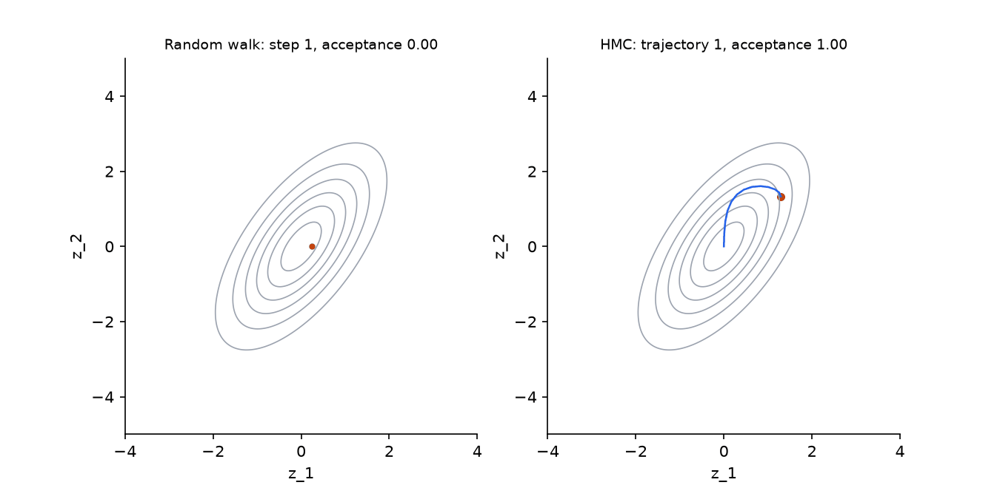
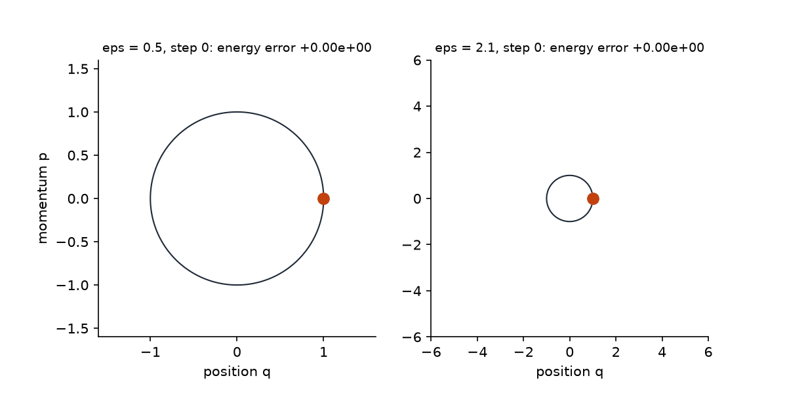

## Overview

**Why this module exists.** Day 2 approximated the posterior by searching a family of
simple distributions for the closest member. That is fast, but you only ever get the
best member of the family, and Module 11 will show how far that can be from the truth.
The other route, which [Module 2b](../day0/m02b-foundations.qmd) previewed in
miniature, is to draw samples from the posterior itself and average them. No family is
imposed; the price is that samples are correlated and come from a random walk that
must be designed with care. This module builds that random walk from first principles,
then replaces the walk with a physical simulation, Hamiltonian Monte Carlo, which moves
far across the posterior while keeping almost every proposal. Everything in Modules 10
and 11 and in Track A of Day 5 runs on the sampler you write here.

**What you'll build:** in `workshop/m09_hmc.py`, a random-walk Metropolis sampler as a
baseline, the leapfrog integrator with its three defining properties tested
(reversibility, volume preservation, second-order energy error), the Hamiltonian and a
single HMC transition with energy-error tracking, and a fixed-settings HMC sampler. All
targets are plain `log_prob(z)` functions of a flat vector; gradients come from
`jax.grad`.

**Estimated time:** 2.5 hours (about 1 hour reading, 1.5 hours building).

**Prerequisites:** [Module 1](../day0/m01-jax-warmup.qmd),
[Module 2b](../day0/m02b-foundations.qmd), [Module 8](../day2/m08-bbvi-engine.qmd)
(for the churn model; not needed for the code in this module). Terms are defined in the
[glossary](../reference/glossary.qmd) the first time they appear.

**Targets** (defined at the bottom of the module): a 1-D standard normal, a correlated
2-D Gaussian, and the hierarchical regional-uplift model from `data.regional_uplift()`
in centred and non-centred parameterisations, used in Modules 10 and 11.

## Learning objectives

By the end of this module you can:

1. Explain in two sentences why a Markov chain can sample a distribution whose
   normaliser is unknown, and write the Metropolis–Hastings acceptance rule in log space.
2. Show from detailed balance that the Metropolis rule leaves the target invariant, and
   say why a symmetric proposal needs no Hastings correction.
3. Explain the step-size dilemma of random-walk Metropolis with numbers, and why it gets
   worse with dimension.
4. Derive the leapfrog scheme as a composition of exact flows and state why it is
   symplectic, reversible and volume preserving.
5. Explain why volume preservation plus reversibility make the HMC acceptance
   probability $\min(1, e^{-\Delta H})$ with no Jacobian term, and read an energy-error
   trace.

## Background

**A note on letters.** From here to the end of Day 3, $q$ is the *position* of a
particle and $p$ its *momentum*, because that is how Hamilton's equations are written
everywhere. The target density is $\pi(q)$. The variational distribution that Days 2
and 4 call $q$ is written $q_\phi$ when it appears on Day 3. The
[glossary](../reference/glossary.qmd#notation) tabulates every such clash.

### The problem in plain terms

Every question you ask a posterior is an expectation: the posterior mean of a
coefficient, the probability that an uplift is positive, a predictive probability for a
new customer. If you could draw $N$ independent samples $\theta^{(1)}, \dots, \theta^{(N)}$
from the posterior, the law of large numbers would let you answer any of them as an
average,

$$
\E_{p(\theta\mid x)}[f(\theta)] \approx \frac1N\sum_{i=1}^N f(\theta^{(i)}),
$$

with an error that shrinks like $1/\sqrt N$ regardless of the dimension of $\theta$.
That last clause is the whole appeal: the grid method of Module 2b costs $K^d$
evaluations, Monte Carlo averaging does not care about $d$.

The obstacle is that you cannot draw from the posterior directly. You can evaluate the
unnormalised density $\tilde\pi(\theta) = p(x\mid\theta)\,p(\theta)$ at any point, but the
normaliser $p(x)$ is the intractable evidence, and every direct sampling method
(inversion, rejection with a tight bound) needs more than pointwise unnormalised
values. What you *can* compute is a **ratio** $\tilde\pi(\theta')/\tilde\pi(\theta)$, in
which the normaliser cancels. Markov chain Monte Carlo is the family of methods that
turn ratios into samples.

### Definitions

A **Markov chain** is a sequence of random states $\theta_0, \theta_1, \theta_2, \dots$
where the distribution of the next state depends only on the current one, through a
**transition kernel** $K(\theta \to \theta')$. Think of it as a randomised function:
feed in the current state, get out the next.

A distribution $\pi$ is **stationary** (or invariant) for $K$ if applying one
transition to a $\pi$-distributed state gives a $\pi$-distributed state:
$\int \pi(\theta)K(\theta\to\theta')\dd\theta = \pi(\theta')$. Once the chain is
distributed as $\pi$, it stays so.

A chain is **ergodic**, informally, if it can get from anywhere to anywhere and does not
cycle. For an ergodic chain with stationary distribution $\pi$, two things hold: the
distribution of $\theta_t$ converges to $\pi$ from any start, and long-run averages of
$f(\theta_t)$ converge to $\E_\pi[f]$. The second is the law of large numbers for
Markov chains, and it is what makes the averaging formula above work even though the
samples are dependent. Dependence costs you: $N$ correlated draws are worth fewer than
$N$ independent ones. Module 11 measures exactly how many fewer.

**Detailed balance** is a sufficient condition for stationarity that is easy to design
for:

$$
\pi(\theta)\,K(\theta\to\theta') = \pi(\theta')\,K(\theta'\to\theta) \quad\text{for all } \theta, \theta'.
$$

In words: under $\pi$, the probability flow from $\theta$ to $\theta'$ equals the flow
back. Integrate both sides over $\theta$: the left gives $\int\pi(\theta)K(\theta\to\theta')\dd\theta$,
the right gives $\pi(\theta')\int K(\theta'\to\theta)\dd\theta = \pi(\theta')$, which is
the stationarity equation. So detailed balance implies stationarity, and it only ever
involves the ratio $\pi(\theta')/\pi(\theta)$.

### Metropolis–Hastings, derived from detailed balance

Build a kernel in two stages. Propose a candidate $\theta' \sim q(\theta'\mid\theta)$
from any distribution you can sample, then accept it with some probability
$\alpha(\theta, \theta')$, otherwise stay at $\theta$. For $\theta' \ne \theta$ the kernel
is $K(\theta\to\theta') = q(\theta'\mid\theta)\,\alpha(\theta,\theta')$. Detailed balance
requires

$$
\pi(\theta)\,q(\theta'\mid\theta)\,\alpha(\theta,\theta') = \pi(\theta')\,q(\theta\mid\theta')\,\alpha(\theta',\theta).
$$

Write $r = \dfrac{\pi(\theta')\,q(\theta\mid\theta')}{\pi(\theta)\,q(\theta'\mid\theta)}$,
the ratio of the two flows. The condition becomes $\alpha(\theta,\theta') = r\,\alpha(\theta',\theta)$.
Since both $\alpha$ values must be at most one, the largest choice that works is

$$
\alpha(\theta,\theta') = \min(1, r), \qquad \alpha(\theta',\theta) = \min(1, 1/r).
$$

Check: if $r \le 1$ then $\alpha(\theta,\theta') = r$ and $\alpha(\theta',\theta) = 1$,
so $\alpha(\theta,\theta') = r\cdot 1$. If $r > 1$ the roles swap. Either way the
equation holds, so the chain has $\pi$ as a stationary distribution. "Largest choice"
matters: accepting more often means moving more, and any smaller $\alpha$ that still
satisfied the equation would waste proposals. This is the Metropolis–Hastings rule.
The normaliser of $\pi$ cancels in $r$, which is the whole point. Staying put when a
proposal is rejected is what keeps the equation true; the rejected state counts as a
sample again.

If the proposal is **symmetric**, $q(\theta'\mid\theta) = q(\theta\mid\theta')$, as for a
Gaussian step $\theta' = \theta + s\,\varepsilon$, the $q$ terms cancel and
$r = \pi(\theta')/\pi(\theta)$. In log space, which is how you will code it, accept when
$\log u < \log\tilde\pi(\theta') - \log\tilde\pi(\theta)$ for $u \sim \mathrm{Uniform}(0,1)$.
This is random-walk Metropolis, the sampler of Module 2b.

### The step-size dilemma, with numbers

A random walk has one knob, the proposal scale $s$. Running `random_walk_mh` on a 1-D
standard normal for 20 000 steps from the solutions gives:

| $s$ | acceptance | lag-1 autocorrelation | mean squared jump |
|---|---|---|---|
| 0.1 | 0.96 | 0.996 | 0.009 |
| 0.5 | 0.84 | 0.92 | 0.17 |
| 1.0 | 0.71 | 0.78 | 0.44 |
| 2.4 | 0.45 | 0.62 | 0.74 |
| 5.0 | 0.24 | 0.72 | 0.56 |
| 10.0 | 0.13 | 0.84 | 0.32 |

**Predict before reading on.** Which row of this table gives the most useful chain, and
what is its acceptance rate? Most people pick the highest acceptance.

::: {.callout-note collapse="true" title="Answer"}
The row with $s = 2.4$: the largest mean squared jump and the lowest lag-1
autocorrelation, at an acceptance rate of only $0.45$. High acceptance is a symptom of
tiny steps, not of a good sampler. The paragraph below explains why, and Module 10
tunes HMC to an acceptance rate of $0.8$ for the same reason.
:::

Small steps are almost always accepted but barely move: consecutive samples are nearly
identical, and you need thousands of them to cover the distribution once. Large steps
land in the tails and are rejected, so the chain sits still. The best scale is in
between, and the acceptance rate there is far from one; for a Gaussian target it is
about 0.45 in one dimension and about 0.23 in high dimension, which is why the test in
Step 1 accepts anything between 0.3 and 0.7 on the 2-D target rather than demanding
high acceptance.

Dimension makes this worse. For a product of $d$ standard normals, a proposal that moves
every coordinate by an independent $\mathcal N(0, s^2)$ increment changes
$\log\pi$ by a sum of $d$ terms, so the proposal scale must shrink like $s \propto 1/\sqrt d$
to keep the acceptance rate fixed (the solutions give acceptance 0.46, 0.26 and 0.24
for $d = 1, 10, 100$ at $s = 2.4/\sqrt d$). Each accepted move is then
$O(1/\sqrt d)$ long in each coordinate, so covering a distribution of unit width takes
$O(d)$ steps. In a 500-coefficient regression a random walk needs hundreds of
proposals per effectively independent draw. The way out is a proposal that uses the
gradient of $\log\pi$ to move far in a direction the target likes.

### Hamiltonian dynamics: the physical picture

Treat $U(q) = -\log\pi(q)$ as a landscape, with the posterior mode at the bottom of a
valley. Place a particle at position $q$, give it a random momentum $p$, and let it
slide without friction. It accelerates downhill, overshoots the bottom, climbs the far
wall until its kinetic energy is spent, and comes back. Along the way it traverses the
whole valley, including the far side, in a single sweep. If you stop the simulation
after a while and record the position, you get a point far from where you started. Then
draw a fresh momentum and repeat.




::: {.callout-note title="Interactive"}
The surface is the unnormalised density of the correlated Gaussian. In HMC mode the blue polyline is the leapfrog trajectory of the current proposal: one proposal crosses the whole mode, and the readout gives the energy error $\Delta H$ and the acceptance probability $\min(1, e^{-\Delta H})$. Push $\varepsilon$ past $2$, the stability limit for a unit-variance direction, and watch $\Delta H$ explode and every proposal turn red. Switch to RWM and find the step size that gives the same travel per accepted move; there is none. Drag to rotate, scroll to zoom.
:::

```{=html}
<div class="bi-widget" id="hmc-surface" data-target="gauss2d" data-mode="hmc" style="width:100%;max-width:860px;margin:0 auto 1.5rem auto;"></div>
<script type="module">
import { mount } from "../widgets/sampler_surface.js";
mount(document.getElementById("hmc-surface"));
</script>
```

Formally, augment $q \in \R^d$ with a momentum $p \in \R^d$ and define the total energy,
the **Hamiltonian**,

$$
H(q, p) = U(q) + K(p), \qquad U(q) = -\log\pi(q), \qquad K(p) = \tfrac12 p^\top M^{-1} p,
$$

with $M$ a positive definite **mass matrix** (take $M = I$ for now; Module 10 chooses
it). The joint density $\propto e^{-H(q,p)} = \pi(q)\,\mathcal N(p; 0, M)$ has exactly
$\pi$ as its $q$-marginal with $p$ independent of $q$. So if we can sample the joint, we
drop $p$ and have samples of $\pi$. Hamilton's equations describe the frictionless
motion:

$$
\dot q = \frac{\partial H}{\partial p} = M^{-1}p, \qquad
\dot p = -\frac{\partial H}{\partial q} = \nabla\log\pi(q).
$$

The first says velocity is momentum divided by mass; the second says the force is the
gradient of the log density, pointing uphill in $\log\pi$, which is downhill in $U$.
Three properties of this flow, call it $\Phi_t$, are what make it a valid proposal.

1. **Energy conservation.** $\dot H = \nabla_q H\cdot\dot q + \nabla_p H\cdot\dot p
   = \nabla_q H\cdot\nabla_p H - \nabla_p H\cdot\nabla_q H = 0$. The particle's total energy
   never changes, so $e^{-H}$ is the same at the start and end of the motion.
2. **Volume preservation** (Liouville's theorem). The vector field
   $(\partial H/\partial p, -\partial H/\partial q)$ has divergence
   $\partial^2 H/\partial q\partial p - \partial^2 H/\partial p\partial q = 0$, so the
   flow neither compresses nor expands regions of $(q, p)$ space: its Jacobian
   determinant is one.
3. **Reversibility.** Negate $p$, run the flow for time $t$, negate $p$ again, and you
   are back at the start. The motion run backwards is the same motion with the
   momentum flipped.

### Why these three properties make the Metropolis correction trivial

Use the flow as a proposal on the joint space. From $(q, p)$ with a fresh
$p \sim \mathcal N(0, M)$, propose $(q^*, p^*) = \Phi_t(q, p)$ followed by negating $p^*$;
call this map $T$. By reversibility, $T$ is an **involution**: $T(T(z)) = z$ for every
$z = (q, p)$. By volume preservation its Jacobian determinant is one.

The Metropolis–Hastings derivation above assumed a proposal *density*
$q(\theta' \mid \theta)$. A deterministic map has none, so detailed balance has to be
checked directly. Write $\rho(z) \propto e^{-H(z)}$ for the joint target. The kernel
is: move to $T(z)$ with probability $\alpha(z)$, otherwise stay. Detailed balance
between a state $z$ and the state $T(z)$ it can move to asks that probability flow in
both directions be equal:

$$
\rho(z)\,\alpha(z) \;=\; \rho(T(z))\,\alpha(T(z)) \quad\text{as densities in } z.
$$

Two things make this a statement about densities in the same variable. First, because
$T$ is an involution, the state $T(z)$ proposes exactly $z$ back, so the only pair of
states that exchange flow is $\{z, T(z)\}$. Second, because $T$ preserves volume, a small
region around $z$ and its image around $T(z)$ have the same size, so comparing the two
densities pointwise is legitimate. Without volume preservation the right-hand side
would carry the factor $|\det J_T(z)|$ to convert between the two volumes; without the
involution property, $T(z)$ would propose some third state and no pairwise equation
would exist. Now the same argument as before: the largest $\alpha$ satisfying the
equation is

$$
\alpha(z) = \min\Big(1, \frac{\rho(T(z))}{\rho(z)}\Big)
= \min\Big(1, \frac{e^{-H(q^*, -p^*)}}{e^{-H(q, p)}}\Big) = \min\big(1, e^{-\Delta H}\big),
\qquad \Delta H = H(q^*, p^*) - H(q, p),
$$

using $K(-p) = K(p)$. If the flow were exact, $\Delta H = 0$ and every proposal would be
accepted. Hold on to that: HMC's acceptance rate is a direct readout of how well the
integrator conserves energy. If the integrator were not volume preserving, the Jacobian
factor would reappear in $\alpha$; if it were not reversible, there would be no
pairwise detailed-balance equation to satisfy at all. The momentum is then discarded
and redrawn; that resampling is what moves the sampler between energy levels, since the
flow alone stays on one. (Neal 2011, Section 3.2, gives the same argument in full.)

### The leapfrog integrator, derived as a splitting

The exact flow is not available in closed form, but $H$ is a sum of a part depending
only on $q$ and a part depending only on $p$, and each part's flow alone *is* exact.
Under $U$ alone, $\dot q = 0$ and $\dot p = \nabla\log\pi(q)$, so for time $t$:
$p \leftarrow p + t\nabla\log\pi(q)$, a **kick**. Under $K$ alone, $\dot p = 0$ and
$\dot q = M^{-1}p$: $q \leftarrow q + tM^{-1}p$, a **drift**. Compose them symmetrically,
half kick, full drift, half kick:

$$
p_{1/2} = p + \tfrac{\varepsilon}{2}\nabla\log\pi(q),\qquad
q' = q + \varepsilon M^{-1}p_{1/2},\qquad
p' = p_{1/2} + \tfrac{\varepsilon}{2}\nabla\log\pi(q').
$$

This is one **leapfrog** (Störmer–Verlet) step of size $\varepsilon$; $L$ of them
approximate $\Phi_{L\varepsilon}$. Its properties follow from the structure, not from
accuracy.

- **Volume preservation, exactly.** Each sub-step changes one block of coordinates by
  a function of the other block only (a shear). The Jacobian of a shear is triangular
  with ones on the diagonal, so its determinant is one, and the determinant of a
  composition is the product. This holds for any $\varepsilon$.
- **Reversibility, exactly.** Negating $p$ and applying the same three sub-steps undoes
  them in reverse order because the sequence is a palindrome (kick, drift, kick).
- **Second-order energy error.** Each half-kick and drift is exact for its own piece
  of $H$, and the symmetric ordering cancels the first-order error of the
  composition. The scheme is *symplectic*, which has a strong consequence: it exactly
  conserves a nearby *shadow* Hamiltonian $\tilde H = H + O(\varepsilon^2)$. So over a
  trajectory of any length the energy error stays bounded at $O(\varepsilon^2)$ rather
  than accumulating step by step. That is why HMC can take hundreds of steps and still
  accept.

### A worked example with numbers

For the 1-D standard normal, $\nabla\log\pi(q) = -q$, and one leapfrog step with
$M = 1$ is a linear map. Substituting the half-kick into the drift and then into the
second half-kick:

$$
\begin{pmatrix} q' \\ p' \end{pmatrix} =
\begin{pmatrix} 1 - \varepsilon^2/2 & \varepsilon \\ -\varepsilon + \varepsilon^3/4 & 1 - \varepsilon^2/2 \end{pmatrix}
\begin{pmatrix} q \\ p \end{pmatrix}.
$$

Its determinant is $(1 - \varepsilon^2/2)^2 + \varepsilon(\varepsilon - \varepsilon^3/4)
= 1 - \varepsilon^2 + \varepsilon^4/4 + \varepsilon^2 - \varepsilon^4/4 = 1$: volume
preserved for every $\varepsilon$, as promised. Starting from $(q, p) = (1, 0)$, where
$H = \tfrac12$, one step gives $q' = 1 - \varepsilon^2/2$, $p' = -\varepsilon + \varepsilon^3/4$,
and

$$
\Delta H = \tfrac12\big(q'^2 + p'^2\big) - \tfrac12 = -\frac{\varepsilon^4}{8} + \frac{\varepsilon^6}{32}.
$$

| $\varepsilon$ | $q'$ | $p'$ | $\Delta H$ |
|---|---|---|---|
| 0.1 | 0.9950 | $-0.0998$ | $-1.25\times10^{-5}$ |
| 0.5 | 0.8750 | $-0.4688$ | $-7.3\times10^{-3}$ |
| 1.0 | 0.5000 | $-0.7500$ | $-9.4\times10^{-2}$ |




The solutions' `leapfrog` reproduces these to machine precision. Two lessons. The
error of a *single* step from this starting point is fourth order; the $O(\varepsilon^2)$
statement is about the whole trajectory, which is why the Step 2 test halves the step
size while holding the integration time $L\varepsilon$ fixed, and expects the error to
drop by about four. And the map has trace $2 - \varepsilon^2$; a linear map with unit
determinant is stable only when $|\mathrm{trace}| \le 2$, so leapfrog on a unit-variance
Gaussian is stable only for $\varepsilon < 2$. At $\varepsilon = 1.9$, 100 steps from
$(1, 0)$ give $|q| = 0.78$; at $\varepsilon = 2.1$ they give $|q| = 10^{27}$. For a
Gaussian with standard deviation $\sigma$ the limit is $\varepsilon < 2\sigma$, which is
the fact behind every step-size problem in Module 10.

Acceptance follows the energy error. On a 5-D standard normal with $L = 10$ steps, the
solutions' `hmc` gives mean acceptance 0.95 at $\varepsilon = 0.5$, 0.86 at 0.8, 0.79 at
1.0 and 0.40 at 1.5. Compare the random walk: a 10-step trajectory at
$\varepsilon = 1$ moves a distance of order 10 while being accepted 79% of the time,
where the random walk needed to shrink its step to be accepted at all.

{width=65%}

### The hierarchical uplift model, from zero

The data in `regional_uplift()` are eight estimated conversion-rate uplifts $y_j$ (in
percentage points) from the same feature tested in eight regions, each with a standard
error $\sigma_j$ from its own A/B test:

| Region | US-East | US-West | UK | DE | FR | JP | BR | IN |
|---|---|---|---|---|---|---|---|---|
| $y_j$ | $-0.18$ | $-0.54$ | $0.19$ | $0.91$ | $-1.61$ | $0.62$ | $-0.91$ | $0.42$ |
| $\sigma_j$ | 1.5 | 1.0 | 1.6 | 1.1 | 0.9 | 1.8 | 2.0 | 1.3 |

Every estimate is noisy; most are within one standard error of zero. Two naive analyses
are both wrong: treating the regions as unrelated wastes the information that they are
tests of the same feature, and pooling them into one average ignores that regions can
genuinely differ. The hierarchical model sits between: each region has its own true
uplift $\theta_j$, and the $\theta_j$ are drawn from a common distribution with mean
$\mu$ (the typical uplift) and standard deviation $\tau$ (how much regions really
differ). The data then decide how much pooling is warranted: if $\tau$ is small, the
$\theta_j$ are shrunk toward $\mu$; if large, each region keeps its own estimate.

The **centred** parameterisation is the generative story told directly:

$$
\mu \sim \mathcal N(0, 5^2),\quad \tau \sim \mathrm{HalfNormal}(5),\quad
\theta_j \sim \mathcal N(\mu, \tau^2),\quad y_j \sim \mathcal N(\theta_j, \sigma_j^2).
$$

The **non-centred** parameterisation tells the same story with a change of variables:
draw a standardised deviation first, then scale it,

$$
\eta_j \sim \mathcal N(0, 1),\qquad \theta_j = \mu + \tau\,\eta_j.
$$

The two define the same joint distribution over $(\mu, \tau, \theta, y)$, so every
posterior quantity is identical. What differs is the shape of the posterior in the
coordinates the sampler sees. In the centred version the width of $\theta_j$ is $\tau$
itself, so as $\tau$ shrinks the $\theta$ coordinates collapse into a needle; in the
non-centred version the $\eta_j$ have unit prior scale whatever $\tau$ is.

You do not need a sampler, or even data, to see this. Draw from the *prior* of both
parameterisations and plot one regional coordinate against $\log\tau$:


::: {.callout-note title="Interactive"}
Every point is one draw from the prior of the regional-uplift model, no data involved. The horizontal axes are $\theta_1$ and $\theta_2$, the height and the colour are $\log\tau$. Where $\tau$ is small the two $\theta$ coordinates collapse onto $\mu$: that is the neck. The step-size slider colours red every draw with $\tau < \varepsilon/2$, where leapfrog on $\theta_j \mid \tau \sim \mathcal N(\mu, \tau^2)$ is unstable, and the readout gives the prior mass a sampler with that step size cannot enter. Switch to non-centred and the same draws are re-plotted in $(\eta_1, \eta_2, \log\tau)$: $\eta$ has unit scale at every $\tau$, the cloud is a cylinder, and nothing turns red. Same joint distribution, different coordinates. Drag to rotate.
:::

```{=html}
<div class="bi-widget" id="funnel-prior" data-points="6000" data-eps="0.3" style="width:100%;max-width:860px;margin:0 auto 1.5rem auto;"></div>
<script type="module">
import { mount } from "../widgets/funnel.js";
mount(document.getElementById("funnel-prior"));
</script>
```

The funnel is a property of the coordinates, not of the data or of the sampler. Module
11 shows what it does to HMC, with numbers. Both targets are written over the
unconstrained vector $z = [\mu, \log\tau, \theta_{1..8}]$ or $[\mu, \log\tau, \eta_{1..8}]$,
and because $\tau = e^{\log\tau}$ is a change of variables, each includes the
log-Jacobian $+\log\tau$.

::: {.callout-important title="Jacobian check"}
This is the [change of variables of Module 2b](../day0/m02b-foundations.qmd#sec-jacobian)
for $\tau = e^{\log\tau}$. Check your target before you sample from it:

```python
from workshop.jacobian_check import check_change_of_variables
log_p_tau = lambda t: log_half_normal(t, 5.0)                       # density of tau
log_p_z   = lambda z: log_half_normal(jnp.exp(z), 5.0) + z          # what your target should contain
check_change_of_variables(log_p_tau, jnp.exp, log_p_z, jnp.linspace(-3, 3, 7))   # zeros
```

Without the `+ z` the posterior piles mass toward $\tau = 0$ and every $\theta_j$
shrinks with it. Module 13 shows the numbers.
:::

### Energy error as a diagnostic

For a correct implementation on a smooth target, $\Delta H$ fluctuates around zero with
scale set by $\varepsilon^2$ and the target's curvature. A trajectory whose $\Delta H$
is in the hundreds, or infinite, has left the region where the integrator is stable;
Stan calls a transition with $\Delta H > 1000$ divergent, and Module 11 counts these. A
non-finite $\Delta H$ must be treated as $+\infty$ so the proposal is rejected rather
than propagating `nan` into the chain.

### Why this matters later

Module 10 tunes $\varepsilon$ and $M$ automatically, using the acceptance statistic
$\E[\min(1, e^{-\Delta H})]$ you compute here as its feedback signal. Module 11 turns
the energy error into a divergence count and the samples into $\hat R$ and effective
sample size. Module 13 runs this sampler on any model written in the PPL. Track A of
Day 5 uses it to produce the reference posterior that a normalising flow is judged
against.

### Common misconceptions

- **"Rejected proposals are wasted samples."** The current state is recorded again.
  Dropping repeats would break detailed balance and bias every average.
- **"Higher acceptance is better."** For a random walk, 96% acceptance means the chain
  is barely moving. For HMC, acceptance near one at a tiny step size means expensive
  trajectories; Module 10 targets 0.8 for a reason.
- **"HMC needs the gradient of the posterior, so it needs the normaliser."** It needs
  $\nabla\log\tilde\pi$, and the normaliser is a constant whose gradient is zero.
- **"Leapfrog is just a good ODE solver."** A fourth-order Runge–Kutta step is more
  accurate per step, but it is neither volume preserving nor reversible, so the simple
  acceptance rule would be wrong with it. The structure matters more than the order.

## Steps

Every step edits `workshop/m09_hmc.py`.

### Step 1 — Random-walk Metropolis

**What this computes.** The Metropolis rule with a symmetric Gaussian proposal: the
baseline every later sampler is measured against, and the sampler of Module 2b in
general dimension.

Implement `random_walk_mh(log_prob, key, x0, n_steps, step_size)` with `lax.scan`.
Carry `(x, log_prob(x), key)`; at each step split the key into a new carried key, a
proposal key and a uniform key. Accept when $\log u < \log\pi(x') - \log\pi(x)$. Return
the samples and the acceptance rate.

Sanity check: on `standard_normal_log_prob` with `step_size=2.4` and 20 000 steps the
acceptance rate should be about 0.45 and the sample variance about 1.

```bash
pytest tests/m09 -k step1
```

You should see 2 passed: moments of the correlated Gaussian within generous tolerances,
determinism in the key, and the fraction of repeated states equal to one minus the
acceptance rate.

### Step 2 — Leapfrog

**What this computes.** The kick–drift–kick map above, iterated $L$ times. The tests
check structure, not accuracy: run forward, flip the momentum, run back, and you must
return exactly; the Jacobian determinant of one step must be exactly one; halving
$\varepsilon$ at fixed $L\varepsilon$ must divide the energy error by about four.

Implement `leapfrog(grad_log_prob, q, p, step_size, n_steps, inv_mass)` with
`lax.fori_loop` (the step count may be traced in Module 10). The mass matrix is
diagonal and passed as its inverse. The gradient is the expensive part of a step, and
the one that closes step $l$ is evaluated at the same $q$ as the one that opens step
$l + 1$. Compute it once before the loop and carry it in the loop state, so $L$ steps
cost $L + 1$ gradient evaluations rather than $2L$. Every sampler in Modules 10 to 13
runs on this function; on the Module 11 churn posterior the change halves the run time.

Sanity check: `leapfrog(grad, [1.0], [0.0], 0.5, 1, [1.0])` on the standard normal
should return `q = 0.875`, `p = -0.46875`, the row of the table above.

```bash
pytest tests/m09 -k step2
```

You should see 4 passed: integrate 25 steps, negate the momentum, integrate 25 more and
recover the start to $10^{-8}$; the Jacobian determinant of one step via `jax.jacfwd` is
one to $10^{-10}$; halving the step size over a fixed integration time divides the
energy error by a factor between 3 and 5.5; and 25 steps call the gradient exactly 26
times, counted at run time with `jax.debug.callback`.

### Step 3 — Hamiltonian and one HMC transition

**What this computes.** One draw of momentum, one leapfrog trajectory, one Metropolis
decision on $e^{-\Delta H}$. The central test is a direct check of stationarity: start
20 000 chains at exact draws from the target, apply one transition each, and the first
two moments must not change. This tests the invariance argument of the Background
without waiting for any chain to mix.

Implement `kinetic_energy(p, inv_mass)`, `hamiltonian(q, p, log_prob, inv_mass)` and
`hmc_step(log_prob, key, q, step_size, n_leapfrog, inv_mass)`. The momentum draw is
$p = \varepsilon / \sqrt{M^{-1}}$ elementwise for $\varepsilon \sim \mathcal N(0, I)$,
so that $p \sim \mathcal N(0, M)$. Replace a non-finite energy error with `inf`. Return
the new state and an `HMCInfo` with fields `accept`, `accept_prob`, `energy_error`,
`log_prob`.

Sanity check: `hamiltonian([1.0], [0.0], standard_normal_log_prob, [1.0])` should be
$0.5$ plus the constant $\tfrac12\log 2\pi$ if your `log_prob` keeps it (the solutions'
targets drop constants, giving exactly 0.5).

```bash
pytest tests/m09 -k step3
```

You should see 3 passed.

### Step 4 — A fixed-settings sampler

**What this computes.** The transition repeated with `lax.scan`, returning every state
and every `HMCInfo`, so Modules 10 and 11 can read acceptance probabilities and energy
errors as time series.

Implement `hmc(log_prob, key, q0, n_samples, step_size, n_leapfrog, inv_mass=None)` with
`lax.scan` over `hmc_step`, returning the samples and the stacked `HMCInfo`.

Sanity check: on the 5-D target $-\tfrac12\|z\|^2$ with $\varepsilon = 1.0$, $L = 10$
and 5 000 iterations, the mean of `infos.accept_prob` should be about 0.79.

```bash
pytest tests/m09 -k step4
```

You should see 2 passed. On the 1-D standard normal with $\varepsilon = 0.05$ the
leapfrog is nearly exact for the harmonic oscillator, so acceptance exceeds 99.5% and
every energy error is below $10^{-2}$.

## Checkpoint

::: {.callout-tip title="Checkpoint"}
```bash
pytest tests/m09
```
10 tests pass in a few seconds. `notebooks/m09_hmc.py` regenerates the phase-space and
trajectory figures on this page from your own code. Be able to say, without looking,
why the acceptance probability has no Jacobian in it.

**Which expectation did you just compute?** The chain's long-run average
$\frac1N\sum_i f(q_i)$ estimates $\E_\pi[f]$ for any $f$; the Step 3 stationarity test
checks the first two moments, $f(q) = q$ and $f(q) = q^2$. The acceptance statistic
$\E[\min(1, e^{-\Delta H})]$ is an expectation too, over the momentum draw, and Module
10 uses it as a feedback signal.
:::

## Challenge

::: {.callout-note title="Challenge"}
1. Implement a dense mass matrix (`inv_mass` as a $d \times d$ matrix with a Cholesky
   factor for the momentum draw) and show on the correlated 2-D Gaussian that setting
   $M^{-1} = \Sigma$ makes the leapfrog nearly exact for any trajectory length.
2. Replace the leapfrog with a fourth-order symplectic integrator (Yoshida's
   composition of three leapfrog steps with coefficients $w_1 = 1/(2 - 2^{1/3})$,
   $w_0 = 1 - 2w_1$) and confirm the energy error scales as $\varepsilon^4$.
3. On the 1-D normal with $L = 10$, the solutions' acceptance is 0.62 at
   $\varepsilon = 1.7$ but 0.94 at $\varepsilon = 1.9$. Use the leapfrog matrix to
   explain this resonance, and show it disappears when $L$ is drawn at random.
:::

## Going deeper

- Betancourt, "A Conceptual Introduction to Hamiltonian Monte Carlo", arXiv:1701.02434, 2017.
  Sections 2–4 for the geometry of typical sets and why Hamiltonian flow explores
  them. Start here if the physical picture above felt too quick.
- Neal, "MCMC Using Hamiltonian Dynamics", in *Handbook of Markov Chain Monte Carlo*,
  Chapman and Hall/CRC, 2011. The clearest derivation of leapfrog's properties and of
  the acceptance rule.
- Leimkuhler and Reich, *Simulating Hamiltonian Dynamics*, Cambridge University Press,
  2004, Chapters 2–4, for splitting methods and shadow Hamiltonians.
- Gelman, Carlin, Stern, Dunson, Vehtari and Rubin, *Bayesian Data Analysis*, 3rd ed.,
  Chapter 11 (Metropolis, with the detailed-balance argument) and Chapter 12 (HMC).

## Troubleshooting

::: {.callout-warning title="Troubleshooting"}
**Reversibility test fails but volume preservation passes.** The two half-steps of
the momentum update are not symmetric (you updated $q$ first, or used a full step
then a half step).

**Volume preservation fails by a small amount.** You evaluated the gradient at the
old $q$ for the second half-kick. Each sub-step must be an exact shear.

**Energy error ratio is about 2 instead of 4.** The integration time is not held
fixed as the step size changes (you kept `n_steps` constant instead of
$T/\varepsilon$), or the comparison uses the first-order Euler update.

**Acceptance is exactly 0 or `nan` appears in the chain.** A non-finite energy
error was compared with a uniform and `nan < u` is `False`, so the state was
accepted with `nan` coordinates. Map non-finite $\Delta H$ to `inf` before the
comparison.

**Moments right but `log_prob` field wrong.** The returned `log_prob` must be the
log target at the *returned* state (new state if accepted, old otherwise), not the
Hamiltonian.

**Acceptance on the standard normal below 99%.** Your momentum scaling uses
`sqrt(inv_mass)` where it should use `1 / sqrt(inv_mass)`; with the identity mass
this does not show, so test with a non-identity `inv_mass`.

**You dropped repeated states to "remove duplicates".** The chain is then no longer
stationary for the target; every average is biased. Repeats are samples.

**The random-walk acceptance is 0.96 and you think the sampler is excellent.** It is
barely moving; look at the lag-1 autocorrelation. Acceptance alone says nothing
about how fast a chain explores.
:::
