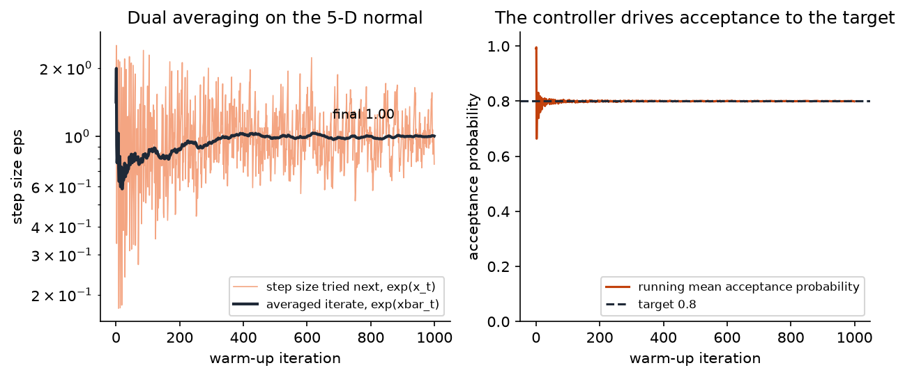

## Overview

**Why this module exists.** The sampler of Module 9 has three knobs: the step size
$\varepsilon$, the number of leapfrog steps $L$, and the mass matrix $M$. Set them
badly and HMC is either unstable, glacial, or wasteful; set them well and it is the
best general-purpose sampler we have. Nobody sets them by hand. This module builds the
automatic tuning that production samplers use: a feedback controller for the step size,
an online variance estimate for the mass matrix, a schedule that lets the two settle
without fighting each other, and randomised trajectory lengths. It ends with the idea
behind the No-U-Turn Sampler, which removes the last knob.

**What you'll build:** in `workshop/m10_adaptation.py`, dual averaging for the step
size, Welford's online variance for a diagonal mass matrix, a Stan-style windowed
warm-up that combines them, an adaptive HMC sampler with jittered trajectory lengths,
and the U-turn criterion of NUTS together with a study of when it fires. Full NUTS
tree building is the Challenge.

**Estimated time:** 3 hours (about 1 hour reading, 2 hours building).

**Prerequisites:** [Module 9](m09-hmc-core.qmd). Terms are defined in the
[glossary](../reference/glossary.qmd).

## Learning objectives

By the end of this module you can:

1. Explain with a picture and with numbers why a badly scaled target forces a small
   step size, and show that a diagonal mass matrix equal to the marginal variances is
   the same thing as standardising the coordinates.
2. Derive the dual-averaging update from the stochastic-approximation problem
   $\E[\delta - \alpha(\varepsilon)] = 0$ and explain the roles of $\mu$, $\gamma$, $t_0$
   and $\kappa$ one at a time.
3. Derive Welford's online variance and say why the estimate is shrunk toward one.
4. Lay out a warm-up schedule in fast and slow windows and say what each is for.
5. State the U-turn criterion and explain how NUTS uses it to choose a trajectory length
   while preserving detailed balance.

## Background

### The problem in plain terms

HMC's acceptance rate is a readout of the integrator's energy error, and that error
depends on the step size relative to the local curvature of $\log\pi$. The curvature is
different in different directions and different places, and you do not know it before
you sample. So the sampler has to learn its own settings from early iterations, before
the iterations you will keep. That learning phase is called **warm-up**, and the draws
made during it are discarded, because a chain whose transition kernel keeps changing is
not a Markov chain with a fixed stationary distribution. Once warm-up ends the settings
are frozen and the chain is valid.

Three things need setting.

- The **step size** $\varepsilon$ trades accuracy for speed. Module 9 showed leapfrog on
  a Gaussian of standard deviation $\sigma$ is stable only for $\varepsilon < 2\sigma$,
  and that the acceptance statistic falls as $\varepsilon$ grows.
- The **mass matrix** $M$ rescales directions so that one step size can serve all of
  them.
- The **trajectory length** $L\varepsilon$ decides how far a proposal travels. Too short
  and HMC degenerates into a random walk; too long and the particle comes back to where
  it started.

### Definitions

The **acceptance statistic** at step size $\varepsilon$ is
$\bar\alpha(\varepsilon) = \E[\min(1, e^{-\Delta H})]$, the average acceptance
probability over momentum draws and states. It is a decreasing function of
$\varepsilon$ over the useful range; a controller can push it to a chosen **target**
$\delta$. Stan uses $\delta = 0.8$: the theoretically optimal value for a Gaussian in
high dimension is nearer 0.65, and 0.8 buys robustness on harder geometry.

A **stochastic approximation** problem is: find $x$ with $\E[h(x, \xi)] = 0$ when you
can only observe noisy $h(x_t, \xi_t)$ at the points you choose. The Robbins–Monro
iteration $x_{t+1} = x_t - \eta_t\,h(x_t, \xi_t)$ with decreasing gains $\eta_t$ solves
it. Here $x = \log\varepsilon$ and $h = \delta - \alpha_t$, the gap between the target
and the acceptance probability actually observed at iteration $t$.

### Why the mass matrix matters: a badly scaled Gaussian

Take a 2-D Gaussian with variances 1 and 100 (standard deviations 1 and 10). With
$M = I$, stability in the narrow direction requires $\varepsilon < 2$, so take
$\varepsilon = 1.5$. In the wide direction that step is $0.15$ standard deviations, so
crossing the distribution once takes about $\pi\cdot 10/1.5 \approx 21$ steps, and a
10-step trajectory moves only a third of the way across. Running the solutions' `hmc`
with $\varepsilon = 1.5$, $L = 10$ confirms it: acceptance 0.75, but the lag-1
autocorrelation of the wide coordinate is 0.28 while the narrow one is already
decorrelated.

Now set $M^{-1} = \mathrm{diag}(1, 100)$, the marginal variances. The claim is that this
is exactly equivalent to sampling the standardised coordinates. Write
$M^{-1} = D^2$ with $D = \mathrm{diag}(\sigma_1, \sigma_2)$ and change variables
$\tilde q = D^{-1}q$, $\tilde p = Dp$. The kinetic energy becomes
$\tfrac12 p^\top D^2 p = \tfrac12\tilde p^\top\tilde p$, the standard one, and the
potential becomes $U(D\tilde q)$, which for the Gaussian is $\tfrac12\|\tilde q\|^2$,
isotropic. The leapfrog in $(q, p)$ with mass $M$ is the leapfrog in $(\tilde q, \tilde p)$
with identity mass, step for step. So one step size now serves both directions: the
same run gives lag-1 autocorrelation 0.14 in the wide coordinate, and the warm-up of
Step 3 recovers $M^{-1} \approx (0.93, 90.6)$ from samples alone. A diagonal mass fixes
scales but not correlations; a dense one (Challenge) fixes both.


### Dual averaging, from first principles

Start with the plain Robbins–Monro controller in $x = \log\varepsilon$ (log so that
multiplicative changes are additive and $\varepsilon$ stays positive):

$$
x_{t+1} = x_t - \eta_t(\delta - \alpha_t).
$$

If the last proposal was accepted with probability above the target, $\delta - \alpha_t < 0$
and the step grows; if below, it shrinks. This works but is noisy: $\alpha_t$ is a
single Bernoulli-like observation, and the iterate jitters forever unless $\eta_t \to 0$,
in which case it stops learning. Nesterov's **dual averaging**, as adapted by Hoffman
and Gelman, fixes both problems by averaging the *observations* rather than damping the
*steps*, and by reporting an average of the iterates. With $H_t = \delta - \alpha_t$:

$$
\bar H_t = \Big(1 - \frac{1}{t + t_0}\Big)\bar H_{t-1} + \frac{1}{t + t_0}H_t
$$

is a running mean of the constraint violation, so far. The weight $1/(t + t_0)$ makes it
an exact running average after an initial phase where $t_0$ extra pseudo-observations of
zero dampen the first few updates ($t_0 = 10$: the first observation gets weight 1/11,
not 1).

$$
x_t = \mu - \frac{\sqrt t}{\gamma}\bar H_t
$$

sets the log step size as a deviation from a fixed point $\mu$ in proportion to the
accumulated average violation. The gain $\sqrt t/\gamma$ *grows* with $t$: as the
average becomes more reliable the controller trusts it more, which is what lets the
iterate converge rather than jitter. $\gamma = 0.05$ sets how aggressive it is (smaller
$\gamma$ means larger moves). $\mu = \log(10\varepsilon_0)$ is deliberately optimistic,
ten times the initial step, so that early on the controller explores large steps and
finds the stability limit from above rather than creeping up to it.

$$
\bar x_t = t^{-\kappa}x_t + (1 - t^{-\kappa})\bar x_{t-1}
$$

is a weighted average of the iterates with weights decaying like $t^{-\kappa}$,
$\kappa = 0.75$, started at $\bar x_0 = \log\varepsilon_0$. At $t = 1$ the weight on
$\bar x_0$ is $1 - 1^{-\kappa} = 0$, so the starting value never affects a run that
makes at least one update; it matters only when there are none, and then the step
size stays at $\varepsilon_0$ instead of becoming $e^0 = 1$. The raw $x_t$ keeps oscillating around the solution because each new
$\alpha_t$ is noisy; the average $\bar x_t$ is what is used after warm-up. Averaging in
log space is why a few very small step sizes during warm-up (after a divergence, say)
do not drag the final value down much.

Worked by hand with $\varepsilon_0 = 0.1$, so $\mu = \log 1 = 0$. Suppose the first
proposal is accepted with probability 1: $\bar H_1 = \tfrac{1}{11}(0.8 - 1) = -0.0182$,
$x_1 = 0 - \tfrac{1}{0.05}(-0.0182) = 0.364$, so $\varepsilon = e^{0.364} = 1.44$, and
$\bar x_1 = x_1 = 0.364$. The controller jumped from 0.1 to 1.44 on one observation:
that is $\mu$ at work. Suppose the second proposal is then rejected outright,
$\alpha_2 = 0$: $\bar H_2 = \tfrac{11}{12}(-0.0182) + \tfrac{1}{12}(0.8) = 0.050$,
$x_2 = -\tfrac{\sqrt2}{0.05}(0.050) = -1.414$, $\varepsilon = 0.243$, and
$\bar x_2 = 2^{-0.75}x_2 + (1 - 2^{-0.75})\bar x_1 = -0.694$. The solutions' `dual_averaging_update`
produces exactly these numbers; the Step 1 test checks the first of them. After 1 000
iterations on a 5-D standard normal the averaged step is $\varepsilon = 0.92$, and
Module 9's table shows that $\varepsilon = 1.0$ with $L = 10$ gives acceptance 0.79 on
that target: the controller found the step whose acceptance is the target.



### Welford's online variance

The diagonal mass matrix is the vector of posterior marginal variances, estimated from
warm-up draws as they arrive, one pass, without storing them. Let $\bar x_n$ and
$M_{2,n} = \sum_{i\le n}(x_i - \bar x_n)^2$ be the running mean and sum of squared
deviations. When $x_{n+1}$ arrives, with $\delta = x_{n+1} - \bar x_n$:

$$
\bar x_{n+1} = \bar x_n + \frac{\delta}{n+1}, \qquad
M_{2,n+1} = M_{2,n} + \delta\,(x_{n+1} - \bar x_{n+1}).
$$

The second line is the identity $M_{2,n+1} - M_{2,n} = (x_{n+1} - \bar x_n)(x_{n+1} - \bar x_{n+1})$,
which you can verify by expanding both sides. The sample variance is $M_{2,n}/(n - 1)$.
Computing $\sum x_i^2 - n\bar x^2$ instead is catastrophically inaccurate when the mean
is large relative to the spread; Welford's form never subtracts two large numbers. On
the eight values $2, 4, 4, 4, 5, 5, 7, 9$ the recursion ends at $\bar x = 5$,
$M_2 = 32$, variance $32/7 = 4.571$, matching `numpy.var(ddof=1)`.

Stan then shrinks the estimate toward the identity,
$\hat\sigma^2 \leftarrow \frac{n}{n+5}\hat\sigma^2 + 10^{-3}\frac{5}{n+5}$, so that a
window with only a handful of draws cannot produce an absurd mass (on the eight values
this gives 2.81). With hundreds of draws the shrinkage is negligible.

### Why windows

The two adaptations interact: changing $M$ changes the geometry and therefore the
right $\varepsilon$, and the variance estimate is only meaningful once the chain has
reached the typical set, which needs a working $\varepsilon$. Stan's schedule separates
them in time. For 1 000 warm-up iterations:

| Iterations | Window | What adapts |
|---|---|---|
| 0–149 | initial fast (15%) | step size only; the chain finds the typical set |
| 150–174, 175–224, 225–324, 325–899 | slow windows, doubling (25, 50, 100, then extended to fill) | variance accumulated; at each window end $M$ is replaced, Welford reset, dual averaging restarted from the current step |
| 900–999 | terminal fast (10%) | step size only, against the final $M$ |

Doubling means most of the variance information comes from the longest, best-mixed
window, and the early short windows exist only to get a rough $M$ quickly. The last
slow window is extended rather than followed by a short one, because a short final
window would overwrite a good estimate with a poor one.

### Trajectory length and jitter

A fixed number of leapfrog steps can resonate with a target's period. On a Gaussian
the exact flow is a rotation in $(q, p)$ with period $2\pi\sigma$; a trajectory of
exactly half a period returns the particle to where it started with its momentum
flipped, and the proposal is useless. Module 9's Challenge 3 is a resonance of this
kind. Drawing $L \sim \mathrm{Uniform}\{1, \dots, L_{\max}\}$ independently at each
iteration breaks the resonance and keeps the kernel valid, because $L$ is chosen
without looking at the state.

### NUTS, for a first-timer

The No-U-Turn Sampler removes $L$ as a setting by growing each trajectory until it
starts to come back. The picture: integrate forward from the start; as long as the
endpoint keeps moving away from the start, continue; the moment the trajectory begins
to curl back, a **U-turn**, stop. For endpoints $(q^-, p^-)$ and $(q^+, p^+)$ of the
trajectory, continuing would reduce the distance between them if

$$
(q^+ - q^-)^\top M^{-1}p^- < 0 \quad\text{or}\quad (q^+ - q^-)^\top M^{-1}p^+ < 0,
$$

that is, if the velocity at either end points back toward the other end. On a
standard normal with $\varepsilon = 0.05$, the solutions' `trajectory_length_study`
reports the first U-turn at step 63, and $\pi/\varepsilon = 62.8$ is half a period.

Stopping when a condition on the trajectory is met looks innocent but breaks detailed
balance if done naively: the probability of proposing $q'$ from $q$ would not equal
the probability of proposing $q$ from $q'$, because the trajectory from $q'$ stops at
a different place. NUTS repairs this with two devices. First, it grows the trajectory by
**doubling** in a random direction (one step backward or forward, then two, then four),
so that the set of states visited is a balanced binary tree in which the start is just
one leaf; any leaf, had it been the start, would have generated the same tree with the
same probability. Second, it checks the U-turn criterion on every sub-tree, not only the
whole, so that the stopping decision does not depend on which leaf was the start. The
next state is then drawn from all leaves with weights $e^{-H}$ (the original paper uses
slice sampling; Stan's multinomial variant biases toward the newest half of the tree to
move further). The result is a kernel with detailed balance whose trajectory length
adapts to the local geometry on every iteration. In this module you implement only the
U-turn criterion and measure where it fires; tree building is the Challenge.

### Why this matters later

Module 11 runs `adaptive_hmc` in parallel chains and judges it with $\hat R$, effective
sample size and divergence counts; the adapted step sizes it prints are themselves a
diagnostic, since a chain forced to a tiny step is a chain in trouble. Module 13 calls
the same sampler on any PPL model. Everything a user of Stan or NumPyro sees as "the
sampler just works" is the code in this module.

### Common misconceptions

- **"Adapt during the whole run; more adaptation is better."** A kernel that keeps
  changing has no fixed stationary distribution. Adapt, freeze, then sample.
- **"Target acceptance 1."** That drives $\varepsilon \to 0$ and trajectories become
  arbitrarily expensive. 0.8 balances cost against error.
- **"The mass matrix is the posterior covariance."** It is a preconditioner; the
  posterior covariance is the ideal choice for a Gaussian target and a good one
  otherwise, but any positive definite $M$ gives a valid sampler.
- **"NUTS has no tuning."** It still adapts $\varepsilon$ and $M$ exactly as here; it
  removes $L$ only.

## Steps

Every step edits `workshop/m10_adaptation.py`.

### Step 1 — Dual averaging

**What this computes.** The three recursions above, as a pure function of a small
named-tuple state. The first test reproduces the hand calculation; the second runs the
controller for 1 500 iterations and checks that the step it settles on actually
achieves the target acceptance.

Implement `dual_averaging_init(step_size0)`, `dual_averaging_update(state, accept_prob, target, gamma, t0, kappa)`
and `dual_averaging_final(state)` exactly as in the Background, with the state as the
`DualAveragingState` named tuple (`log_step`, `log_step_avg`, `h_bar`, `t`, `mu`).

Sanity check: from `dual_averaging_init(0.1)`, one update with `accept_prob=1.0` should
give `log_step = 0.3636` (step size 1.44) and `h_bar = -0.01818`.

```bash
pytest tests/m10 -k step1
```

You should see 2 passed: the first update reproduces the formulas by hand, and 1 500
adaptation iterations on a 5-D standard normal produce a step size whose empirical
acceptance statistic is within 0.1 of the 0.8 target.

### Step 2 — Welford's variance

**What this computes.** The one-pass mean and variance, plus Stan's shrinkage, as the
diagonal inverse mass.

Implement `welford_init`, `welford_update` and `welford_finalize(state, regularize=True)`.

Sanity check: feeding $2, 4, 4, 4, 5, 5, 7, 9$ should leave `mean = 5`, `m2 = 32`, and
`welford_finalize(state, regularize=False)` should return `4.5714`.

```bash
pytest tests/m10 -k step2
```

You should see 2 passed: agreement with `numpy.var(ddof=1)` to $10^{-10}$ and the Stan
shrinkage formula.

### Step 3 — Windowed warm-up

**What this computes.** The schedule table above as two boolean arrays, and a single
`lax.scan` that runs HMC while adapting: every iteration updates dual averaging; slow
iterations feed Welford; window ends swap in the new mass and restart both
accumulators. All branching is `jnp.where` on the schedule flags, because the schedule
is data to the scan, not Python control flow.

Implement `warmup_schedule(n_warmup)` returning boolean arrays `is_slow` and
`window_end`, and `warmup(log_prob, key, q0, n_warmup, step_size0, max_leapfrog, target_accept)`
as a `lax.scan` over the schedule. Inside the body: draw $L$, take one `hmc_step` at
`exp(log_step)`, update dual averaging, conditionally update Welford, and at a window
end swap in the new inverse mass, reset the accumulator and restart dual averaging from
the current step. Use `jax.tree_util.tree_map` to select between two named-tuple states.

Sanity check: `warmup_schedule(1000)[0].sum()` should be 750, and the window ends should
be iterations 174, 224, 324 and 899.

```bash
pytest tests/m10 -k step3
```

You should see 2 passed: the schedule for 1 000 iterations has slow windows ending at
iterations 174, 224, 324 and 899; and on a Gaussian with variances 1 and 100 the adapted
inverse mass is within a factor 1.5 of the truth and post-warm-up acceptance is between
0.6 and 0.98.

### Step 4 — Adaptive HMC with jittered trajectory length

**What this computes.** The sampler you will actually use from now on: warm up, freeze
the settings, then sample with a random $L$ per iteration.

Implement `hmc_jittered(...)` (fixed $\varepsilon$ and $M$, $L \sim \mathrm{Uniform}\{1..L_{\max}\}$)
and `adaptive_hmc(log_prob, key, q0, n_warmup, n_samples, ...)` which runs `warmup`
then `hmc_jittered` from the last warm-up state and returns `(samples, infos, adapted)`.

Sanity check: on the 5-D standard normal with 1 000 warm-up iterations the adapted step
size should be about 0.9 and the inverse mass within about 20% of one in every
coordinate.

```bash
pytest tests/m10 -k step4
```

You should see 2 passed, including the SaaS-churn logistic regression (five
coefficients, 500 accounts): posterior means within 0.15 posterior standard deviations
of the Laplace approximation and standard deviations within 25%.

### Step 5 — The U-turn criterion

**What this computes.** The stopping rule of NUTS, applied between the start of a
trajectory and its current endpoint, and a study of when it first fires.

Implement `uturn(q_minus, q_plus, p_minus, p_plus, inv_mass)` and
`trajectory_length_study(log_prob, q0, p0, step_size, max_steps, inv_mass)`, which
integrates one step at a time and records when the criterion between the start and the
current point first fires.

Sanity check: from $(q, p) = (1, 0)$ on the standard normal with $\varepsilon = 0.05$,
the first U-turn should be at step 63.

```bash
pytest tests/m10 -k step5
```

You should see 2 passed: on the standard normal with $\varepsilon = 0.05$ the first
U-turn is within two steps of $\pi/\varepsilon \approx 63$; on the variances-1-and-100
target the slow direction takes more than five times as long as the fast one.

## Checkpoint

::: {.callout-tip title="Checkpoint"}
```bash
pytest tests/m10
```
10 tests pass in under 10 seconds. `notebooks/m10_adaptation.py` plots the step-size
trace through the windows and the U-turn study. Be able to explain why the step-size
trace jumps at each window end.

**Which expectation did you just compute?** Two running estimates of expectations
drive the adaptation: the mean acceptance probability $\E[\min(1, e^{-\Delta H})]$,
which dual averaging steers to $0.8$, and the posterior variance
$\E_\pi[(q - \E_\pi q)^2]$, which Welford's recursion estimates to set the mass matrix.
Both are computed from the chain while it runs.
:::

## Challenge

::: {.callout-note title="Challenge"}
1. Implement NUTS tree building (Hoffman and Gelman 2014, Algorithm 3, or the
   multinomial variant in Betancourt 2017, Appendix A) using `lax.while_loop` for
   the doubling and recursion unrolled to a fixed maximum depth of 10. Validate on
   the 2-D Gaussian against `hmc` and show that the average trajectory length tracks
   $\pi/\varepsilon$ in the direction of largest scale.
2. Dense mass adaptation: accumulate the full covariance with a matrix Welford update
   and compare ESS per gradient evaluation against the diagonal version on the
   correlated 2-D Gaussian.
3. Riemannian HMC: use the Fisher metric of Module 4 as a position-dependent mass on
   a Gamma-family posterior and implement the generalised leapfrog with fixed-point
   iterations (Girolami and Calderhead 2011).
:::

## Going deeper

- Hoffman and Gelman, "The No-U-Turn Sampler: Adaptively Setting Path Lengths in
  Hamiltonian Monte Carlo", *JMLR* 15, 2014. Algorithm 5 is the dual-averaging step-size
  adaptation; Section 3 the U-turn criterion and tree building.
- Betancourt, "A Conceptual Introduction to Hamiltonian Monte Carlo", arXiv:1701.02434,
  2017, Section 5 and Appendix A (multinomial trajectory sampling).
- Nesterov, "Primal-dual subgradient methods for convex problems", *Mathematical
  Programming* 120, 2009, for the dual-averaging scheme itself.
- Stan Development Team, *Stan Reference Manual*, chapter "MCMC Sampling" (HMC
  algorithm parameters and automatic parameter tuning), for the windowed schedule and
  regularisation constants.
- Girolami and Calderhead, "Riemann manifold Langevin and Hamiltonian Monte Carlo
  methods", *JRSS B* 73(2), 2011.

## Troubleshooting

::: {.callout-warning title="Troubleshooting"}
**Step size collapses toward zero during warm-up.** Acceptance probabilities are
`nan` (treated as 0 by the update), typically because the target returns `nan` far
from the mode. Check `log_prob` at the warm-up states; clip or reparameterise.

**Step size explodes and acceptance is 0.** $\mu = \log(10\varepsilon_0)$ with a large
$\varepsilon_0$ can take many iterations to recover; start from $\varepsilon_0 \le 0.1$.
Also check the sign of `target - accept_prob`.

**Final acceptance well above the target.** Expected to a degree: `log_step_avg`
averages over the whole terminal window and biases toward smaller steps. If it is
above 0.98, the terminal window is too short relative to the oscillation of dual
averaging; increase `n_warmup`.

**Inverse mass contains a value near $10^{-3}$ for a coordinate with unit variance.**
The Welford state was finalised with $n = 0$ or $1$ (a window end before any slow
iteration). Check the schedule flags are aligned with the scan inputs.

**Schedule test fails with window ends off by one.** `window_end[i]` marks the
*last* iteration of the window, so a window covering iterations 150–174 has its flag
at 174.

**U-turn fires immediately.** Momentum sign convention: the criterion uses the
momenta *at the endpoints*, and after `hmc_step`-style negation the sign is flipped.
`trajectory_length_study` must use raw leapfrog output.

**`lax.scan` complains about mismatched types at a window end.** `tree_map` with
`jnp.where` requires both branches to have identical dtypes; `dual_averaging_init`
must produce float arrays, not Python floats.

**You kept the warm-up draws as samples because they "looked fine".** They were
generated by a changing kernel and are not draws from the posterior. Discard them.

**You set the mass matrix from the prior variances.** The mass should reflect the
posterior scale, which the data may shrink by orders of magnitude; that is why it is
estimated from warm-up draws, not from the model.
:::
