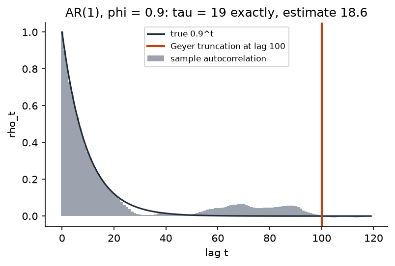

## Overview

**Why this module exists.** A sampler returns numbers whether or not it worked. There
is no error message for "the chain never reached the posterior" or "the chain is stuck
on one side of a funnel". Diagnostics are how you find out, and they are what separates
a sampler you can trust from one you merely ran. This module builds the three standard
ones from first principles, uses them to expose a classic failure (the funnel of the
hierarchical model) and its fix, and then does the comparison the whole of Days 2 and 3
has been building toward: the same posterior, once by variational inference and once
by HMC, with the differences measured.

**What you'll build:** in `workshop/m11_diagnostics.py`, split-$\hat R$, FFT-based
autocorrelation and effective sample size with Geyer's truncation, divergence counting
from the energy error, a multi-chain runner that `vmap`s the adaptive sampler of Module
10, a posterior summary, and a quantitative comparison of the HMC posterior with the
mean-field Gaussian fit from Module 8 on the same SaaS-churn logistic regression. Along
the way you reproduce the funnel pathology of the hierarchical regional-uplift model and
its cure, the non-centred parameterisation.

**Estimated time:** 3 hours (about 1 hour reading, 2 hours building).

**Prerequisites:** [Module 10](m10-adaptation.qmd), [Module 8](../day2/m08-bbvi-engine.qmd).
Terms are defined in the [glossary](../reference/glossary.qmd).

## Learning objectives

By the end of this module you can:

1. List the ways a chain can fail and explain why no diagnostic can prove convergence.
2. Derive $\hat R$ from the comparison of between-chain and within-chain variance,
   compute it by hand on a toy example, and explain what splitting adds.
3. Derive the variance of a mean of correlated samples, define the integrated
   autocorrelation time and effective sample size, and compute them for an AR(1) chain.
4. Diagnose a funnel geometry from divergences and ESS, explain it with numbers, and fix
   it by reparameterising.
5. Quantify how a mean-field variational posterior differs from the MCMC posterior
   (location, dispersion, correlation) and state which direction the bias goes.

## Background

### The problem in plain terms

Module 9 established that an ergodic chain converges to the posterior and that its
averages converge to posterior expectations. Both statements are about the limit. In
practice you run a finite number of iterations from an arbitrary start, and four things
can go wrong.

- **Not converged.** The chain is still travelling from its starting point toward the
  region where the posterior mass is; early draws are from nowhere in particular.
- **Slow mixing.** The chain is in the right region but moves so slowly that 10 000
  draws contain the information of 50 independent ones.
- **Stuck.** The posterior has several separated modes and the chain has found one.
  Within it everything looks healthy.
- **Divergent.** The posterior has a region the integrator cannot enter at the adapted
  step size, so the chain never visits it and every average is biased.

No diagnostic can rule these out, for a simple reason: a chain's output cannot tell you
about regions it never visited. Diagnostics detect failure; they cannot certify success.
The practical standard is to run several chains from dispersed starting points, check
that they agree with each other and with their own halves, convert their length into an
equivalent number of independent draws, and count divergences. A posterior that passes
all of these is one you have found no reason to distrust.

### Definitions

Run $m$ chains of $n$ draws each. For a scalar quantity $\theta$, let $\theta_{ij}$ be
draw $i$ of chain $j$, $\bar\theta_j$ the chain means, $s_j^2$ the chain sample
variances, and $\bar\theta$ the grand mean.

The **within-chain variance** $W = \frac1m\sum_j s_j^2$ is the average spread inside a
chain. The **between-chain variance** $B = \frac{n}{m-1}\sum_j(\bar\theta_j - \bar\theta)^2$
is $n$ times the variance of the chain means: if chains were independent draws from the
posterior, their means would have variance $\sigma^2/n$, so $B$ estimates $\sigma^2$.

The **autocorrelation** at lag $t$ of a stationary chain is
$\rho_t = \mathrm{Corr}(\theta_i, \theta_{i+t})$. The **integrated autocorrelation
time** is $\tau = 1 + 2\sum_{t\ge1}\rho_t$. The **effective sample size** is
$\mathrm{ESS} = N/\tau$ for $N = mn$ total draws.

A **divergent transition** is one whose energy error $\Delta H$ exceeds a threshold
(Stan: 1 000) or is non-finite.

### $\hat R$, derived from the variance comparison

Suppose the chains have converged. Then each chain's variance $s_j^2$ estimates the
posterior variance $\sigma^2$, so $W \approx \sigma^2$; and the chain means scatter like
independent posterior means, so $B \approx \sigma^2$ too. Now suppose instead the chains
started far apart and have not yet merged. Each chain has explored only part of the
posterior, so $W$ *under*estimates $\sigma^2$; the chain means are still spread by their
starting points, so $B$ *over*estimates it. The two estimators disagree precisely when
the chains have not converged. Combine them into an estimate that is unbiased under
convergence and conservative otherwise,

$$
\widehat{\mathrm{var}}^+ = \frac{n-1}{n}W + \frac1n B,
$$

which weights $W$ almost fully and adds a $1/n$ share of $B$ (this is the standard
pooled estimate of total variance from a one-way analysis of variance), and report the
ratio

$$
\hat R = \sqrt{\widehat{\mathrm{var}}^+ / W}.
$$

If the chains agree, $B \approx W$ and $\hat R \approx 1$. If they disagree, $B \gg W$
and $\hat R > 1$. Values below about 1.01 are the modern standard; 1.1 was the old one.

Worked by hand with two chains of four draws, $1, 2, 3, 4$ and $3, 4, 5, 6$. Chain means
$2.5$ and $4.5$, both chain variances $5/3$, grand mean $3.5$. $W = 5/3 = 1.667$;
$B = \frac{4}{1}\big((2.5 - 3.5)^2 + (4.5 - 3.5)^2\big) = 8$;
$\widehat{\mathrm{var}}^+ = \tfrac34(1.667) + \tfrac14(8) = 3.25$; $\hat R = \sqrt{3.25/1.667} = 1.40$.
The chains overlap but their means differ by more than their spread explains, and the
statistic says so.

**Splitting.** A single chain that drifts steadily upward has one mean and one
variance, and if you ran only that chain, or several that all drift the same way, $B$
would not notice. Cut each chain in half and treat the halves as $2m$ chains of $n/2$:
the two halves of a drifting chain have different means, so $B$ grows. On the toy
above, splitting gives four chains $(1,2), (3,4), (3,4), (5,6)$ with $W = 0.5$,
$B = \frac{2}{3}(4 + 0 + 0 + 4) = 5.33$, $\widehat{\mathrm{var}}^+ = 2.92$ and
$\hat R = 2.42$, which is what the solutions' `split_rhat` returns: the within-chain
trend is now visible. Vehtari et al. add rank-normalisation and folding, which make
$\hat R$ robust to heavy tails and sensitive to scale disagreement; that is the
Challenge.

### Effective sample size, derived from the variance of a mean

For $N$ *independent* draws, $\mathrm{Var}[\bar\theta] = \sigma^2/N$. For a stationary
chain, expand the variance of the mean using the autocovariances:

$$
\mathrm{Var}\Big[\frac1N\sum_{i=1}^N\theta_i\Big]
= \frac{1}{N^2}\sum_{i,k}\mathrm{Cov}(\theta_i, \theta_k)
= \frac{\sigma^2}{N^2}\sum_{i,k}\rho_{|i-k|}
\approx \frac{\sigma^2}{N}\Big(1 + 2\sum_{t\ge1}\rho_t\Big) = \frac{\sigma^2\tau}{N}.
$$

The double sum counts each lag $t \ge 1$ about $2N$ times (once in each order) and lag
$0$ exactly $N$ times; the approximation drops edge effects of order $1/N$. So the
mean of $N$ correlated draws has the variance of the mean of $N/\tau$ independent
draws: that quotient is the effective sample size, and $\tau$ is how many consecutive
draws it takes to get one draw's worth of new information.

Worked example. An AR(1) chain $\theta_{i+1} = \phi\theta_i + \text{noise}$ has
$\rho_t = \phi^t$, so $\tau = 1 + 2\sum_{t\ge1}\phi^t = 1 + \frac{2\phi}{1-\phi} = \frac{1+\phi}{1-\phi}$.
At $\phi = 0.9$, $\tau = 19$: 10 000 draws are worth about 526 independent ones, an ESS
fraction of 5.3%. The Step 2 test checks exactly this.

{width=65%} A well-tuned HMC chain can have
*negative* lag-1 autocorrelation (the trajectory tends to land on the far side), giving
$\tau < 1$ and an ESS above $N$; the tests check that too, and Stan caps the estimate at
$N\log_{10}N$ because beyond that the estimator is unreliable.

**Estimating $\tau$.** Sample autocorrelations $\hat\rho_t$ at large lags are pure
noise, and summing all of them gives an estimate whose variance does not shrink with
$N$. Geyer's **initial positive sequence** rule uses a theorem: for a reversible chain
the sums of adjacent pairs $P_k = \rho_{2k} + \rho_{2k+1}$ are positive and decreasing.
So add up $P_k$ while it stays positive, force the running sequence to be monotone, and
stop at the first non-positive pair. That truncation point is where signal ends and
noise begins. With several chains, Stan combines them as

$$
\hat\rho_t = 1 - \frac{W - \frac1m\sum_j s_j^2\hat\rho_{j,t}}{\widehat{\mathrm{var}}^+},
$$

which also penalises chains that disagree in mean. Autocorrelations for all lags at
once cost $O(N\log N)$ by zero-padding the centred series to length at least $2N$,
taking the squared magnitude of its FFT, and inverse-transforming.

### Divergences and the funnel, with numbers

A divergence is the integrator failing: the trajectory entered a region whose curvature
is too high for the adapted step size and its energy error exploded. It is not a
numerical accident, and it is worse than a rejection, because it marks a part of the
posterior the chain systematically fails to enter. Estimates of anything that lives
there are biased.

The hierarchical uplift model of Module 9 is the canonical case. In the centred
parameterisation the conditional distribution of each $\theta_j$ given $\tau$ is
$\mathcal N(\mu, \tau^2)$, with standard deviation $\tau$. Module 9 showed leapfrog on a
Gaussian of standard deviation $\sigma$ is stable only for $\varepsilon < 2\sigma$. At
$\tau = 2$ that allows $\varepsilon < 4$; at $\tau = 0.1$ it demands $\varepsilon < 0.2$;
and the posterior gives $\tau$ real mass at both ends (its posterior for $\log\tau$ has
mean $-0.77$ and standard deviation $1.1$, so $\tau$ ranges over more than two orders
of magnitude). No single step size serves both. Warm-up picks one for the wide region,
and every excursion toward small $\tau$ diverges: in the joint over $(\log\tau, \theta)$
the posterior is a funnel, wide at the top and arbitrarily narrow at the neck, and the
chain bounces off the neck.

**Predict before reading on.** Four chains, 1 000 warm-up and 1 000 draws each, on the
centred model. Out of 4 000 draws, how many will be divergent: a handful, tens, or
over a hundred? How many effectively independent draws of $\log\tau$ will 4 000
correlated ones be worth? And what will the non-centred run look like under identical
settings?

::: {.callout-note collapse="true" title="Answer"}
Running the solutions' `run_chains` with the Step 3 test's seeds and starts
($q_0 = 0.1\,\varepsilon$, $\varepsilon \sim \mathcal N(0, I)$):

| Parameterisation | divergences (of 4 000) | ESS of $\log\tau$ | $\hat R$ of $\log\tau$ | adapted $\varepsilon$ |
|---|---|---|---|---|
| centred | 153 | 59 | 1.07 | 0.15–0.22 |
| non-centred | 0 | 1 326 | 1.003 | 0.28–0.37 |

One draw in twenty-six is divergent in the centred run, and 4 000 draws of $\log\tau$
are worth 59 independent ones. The non-centred run is clean on every count. Other seeds
give between about 100 and 160 divergences and an ESS between 60 and 200; the exact
numbers move, the gap does not.
:::


The centred chains carry little independent information about $\tau$ (ESS 59 from
4 000 draws), have been pushed to smaller step sizes, and, worse than either number,
never enter the neck: no centred draw has $\log\tau$ below about $-2.5$, where the
non-centred run puts a visible share of its mass. $\hat R$ alone would not have caught
this ($1.07$ is only mildly alarming), because all four chains are missing the same
region in the same way. That is what the divergence count is for. In the non-centred parameterisation $\theta_j = \mu + \tau\eta_j$ with
$\eta_j \sim \mathcal N(0, 1)$, the prior over $\eta$ is a standard Gaussian whatever
$\tau$ is; only the likelihood couples $\eta$ and $\tau$, and because the data are weak
(every $\sigma_j$ is comparable to the spread of the $y_j$) that coupling is gentle.
The posterior geometry is nearly Gaussian and the chain is healthy on every count. Same
model, same posterior, different coordinates. Choosing coordinates is part of using a
sampler.

### HMC versus mean-field VI: what to compare

Module 8 fitted $q(\beta) = \prod_k\mathcal N(\beta_k; \ell_k, s_k^2)$ to the churn
posterior by minimising $\KL(q\,\|\,p)$. Two structural facts predict how it will differ
from the HMC posterior. First, a product of independent Gaussians cannot represent
correlation between coefficients. Second, $\KL(q\,\|\,p)$ penalises $q$ heavily for
placing mass where $p$ is small, so the optimal $q$ hugs the posterior's *conditional*
width in each direction rather than its *marginal* width, and conditional variances
are smaller than marginal ones whenever coordinates are correlated. The prediction:
locations close to the HMC means, standard deviations below the HMC marginal standard
deviations, with the shortfall largest for the most correlated coordinates. Here are the
numbers from the solutions (four chains, 500 warm-up, 1 000 draws; VI as in Module 8):

| Coefficient | HMC mean | HMC sd | VI sd | ratio VI/HMC |
|---|---|---|---|---|
| intercept | $-0.95$ | 0.138 | 0.114 | 0.83 |
| tenure | $-0.60$ | 0.134 | 0.132 | 0.98 |
| weekly active days | $-1.25$ | 0.145 | 0.128 | 0.88 |
| support tickets | $0.76$ | 0.125 | 0.115 | 0.92 |
| enterprise plan | $-0.55$ | 0.260 | 0.221 | 0.85 |

VI locations are within 0.17 posterior standard deviations of the HMC means on every
coefficient. Every ratio is below one, and the two coordinates with the largest
shortfall, the intercept and the enterprise-plan indicator, are the most correlated pair
in the HMC posterior (correlation $-0.44$): an enterprise plan shifts the baseline, so
the data cannot separate "high intercept, strong plan effect" from "low intercept, weak
plan effect", and mean-field VI reports each as more certain than it is. The HMC run
itself passes its own diagnostics ($\hat R \le 1.001$, ESS about 3 000 of 4 000 draws
per coefficient, no divergences). `compare_hmc_vs_vi` reports exactly these three
quantities: mean difference in posterior standard deviations, standard-deviation ratio,
and the largest absolute posterior correlation.

### Why this matters later

Module 13 reports `summarize` for every PPL model it samples. Track A of Day 5 uses
HMC on the non-centred model as the reference posterior against which a normalising
flow is scored on exactly the funnel coordinates where mean-field fails. Track C uses
the same chains for counterfactual posteriors. And the comparison table above is the
answer to the question Day 2 left open: what does mean-field VI get wrong, and by how
much.

### Common misconceptions

- **"$\hat R = 1$ means the posterior is right."** It means the chains agree with each
  other. Chains that share a bug, a bad parameterisation, or a mode agree perfectly.
- **"More iterations fix a stuck chain."** A chain in one of several modes will not
  leave it on any practical timescale; the fix is a different parameterisation or
  sampler, and the symptom is high $\hat R$ with every chain looking stationary.
- **"Divergences are numerical noise; just increase the threshold."** They mark a
  region the sampler cannot enter. Raising the threshold hides the warning and keeps
  the bias.
- **"ESS is the number of samples after thinning."** Thinning throws draws away; ESS
  tells you what the draws you kept are worth. Thinning never increases ESS.

## Steps

Every step edits `workshop/m11_diagnostics.py`. Chains are arrays `[m, n, d]`.

### Step 1 — Split-$\hat R$

**What this computes.** The variance comparison above, after cutting every chain in
half, per coordinate.

Implement `split_rhat(chains)`: split each chain in half (dropping the last draw if $n$
is odd), stack into $2m$ chains, compute $W$, $B$, $\widehat{\mathrm{var}}^+$ and
$\hat R$ per coordinate.

Sanity check: on the toy chains $[1,2,3,4]$ and $[3,4,5,6]$ (shape `[2, 4, 1]`) you
should get $2.415$.

```bash
pytest tests/m11 -k step1
```

You should see 3 passed: iid chains give $|\hat R - 1| < 0.01$; chains with means
$0, 1, 2, 3$ give $\hat R > 1.5$ on that coordinate only; a single chain with a linear
drift gives $\hat R > 1.1$, which the unsplit statistic would miss.

### Step 2 — Autocorrelation and ESS

**What this computes.** All-lag autocorrelations by FFT, the multi-chain combination,
Geyer's truncation, and $N/\tau$.

Implement `autocorrelation(x)` by FFT and `ess(chains)` with the combined-chain
$\hat\rho_t$, Geyer's initial positive (and monotone) sequence, and the
$N\log_{10}N$ cap. NumPy is acceptable here; this is a diagnostic, not a sampled
computation.

Sanity check: generate four AR(1) chains with $\phi = 0.9$ and 10 000 draws each; `ess`
should return roughly $40\,000/19 \approx 2\,100$.

```bash
pytest tests/m11 -k step2
```

You should see 4 passed: agreement with a direct $O(N^2)$ autocorrelation; iid chains
give ESS within 15% of $mn$; AR(1) chains with $\phi = 0.9$ give ESS within 25% of
$mn(1-\phi)/(1+\phi)$; an antithetic MA(1) chain gives ESS above the number of draws.

### Step 3 — Divergences and multi-chain runs

**What this computes.** The divergence count from the energy-error field, and the
multi-chain runner: one `adaptive_hmc` per chain, vectorised with `jax.vmap` and
compiled once, so four chains cost about what one does on a multi-core CPU.

Implement `divergences(infos, threshold=1000.0)` counting energy errors above the
threshold or non-finite, and `run_chains(log_prob, key, q0s, n_warmup, n_samples, ...)`
as a `jax.jit` of `jax.vmap` over `adaptive_hmc` with one key per chain.

Sanity check: `run_chains` on the centred uplift model from four zero starts with
1 000 warm-up and 1 000 draws should report well over a hundred divergences; the non-centred
model, zero.

```bash
pytest tests/m11 -k step3
```

You should see 2 passed. The second runs four chains of 1 000 warm-up and 1 000 draws on
the centred and non-centred uplift models with identical seeds and settings: the
centred run has at least 10 divergences, the non-centred at most 5, and the ESS of
$\log\tau$ is more than doubled by reparameterising. Both runs take about one second
after compilation.

### Step 4 — Summary and comparison with VI

**What this computes.** The standard posterior table (mean, sd, quantiles, $\hat R$,
ESS) and the three numbers of the HMC-versus-VI comparison.

Implement `summarize(chains)` (mean, sd, 5% and 95% quantiles, split-$\hat R$, ESS) and
`compare_hmc_vs_vi(hmc_chains, vi_loc, vi_scale)` returning `mean_diff_in_sd`,
`sd_ratio` and `max_abs_corr`. `churn_log_joint` and `laplace_approximation` are
provided.

Sanity check: on the churn posterior, `max_abs_corr` should be about 0.44 and every
entry of `sd_ratio` below 1.


```bash
pytest tests/m11 -k step4
```

You should see 3 passed: four chains on the churn posterior agree with the Laplace mode
to 0.1 posterior standard deviations with $\hat R < 1.05$ and ESS above 400; the
comparison exposes a posterior correlation above 0.1; and the Module 8 mean-field fit
has locations within 0.3 standard deviations of HMC with every standard-deviation ratio
below 1.1 and a mean ratio at or below 1.

Then look at the numbers yourself:

```python
from workshop.data import saas_churn
from workshop.m11_diagnostics import *
from workshop.m08_bbvi import fit
import jax, jax.numpy as jnp
X, y, _ = saas_churn(); X, y = jnp.asarray(X), jnp.asarray(y, float)
lj = lambda b: churn_log_joint(b, X, y)
chains, info, _ = run_chains(lj, jax.random.key(0), jnp.zeros((4, 5)), 500, 1000)
params, _ = fit(lj, 5, jax.random.key(1), n_steps=3000, lr=0.02, n_samples=8)
print(summarize(chains)); print(compare_hmc_vs_vi(chains, params["loc"], jnp.exp(params["log_scale"])))
```

The intercept and the enterprise-plan coefficient are the most correlated pair, and
that is where the variational standard deviation falls furthest short.

## Checkpoint

::: {.callout-tip title="Checkpoint"}
```bash
pytest tests/m11
```
12 tests pass in about 15 seconds. `notebooks/m11_diagnostics.py` regenerates the
funnel figure above from your own sampler; keep it for the Day 5 report. Be able to
say in one sentence each what $\hat R$, ESS and a divergence count tell you, and what
none of them can.

**Which expectation did you just compute?** The whole module is about the error bars
on $\frac1N\sum_i f(q_i)$ as an estimate of $\E_\pi[f]$: ESS converts $N$ correlated
draws into the number of independent ones the average is worth, and $\hat R$ asks
whether the chains are even estimating the same expectation. The comparison with VI
checks $\E_\pi[\beta]$, $\mathrm{Var}_\pi[\beta]$ and the correlations against the
mean-field values.
:::

## Challenge

::: {.callout-note title="Challenge"}
1. Implement rank-normalised, folded split-$\hat R$ and bulk/tail ESS from Vehtari
   et al. (2021). Show on a Cauchy target that the plain statistics report
   convergence while the rank-normalised ones do not.
2. Compute the ESS per gradient evaluation for `hmc` with fixed $L$ against
   `hmc_jittered` on the 2-D Gaussian, sweeping $L$ through the resonant value
   $\pi/\varepsilon$.
3. Fit a full-covariance Gaussian guide (Cholesky parameterisation) with the Module 8
   engine on the churn posterior and show that `sd_ratio` moves to 1 and
   `max_abs_corr` is recovered.
:::

## Going deeper

- Vehtari, Gelman, Simpson, Carpenter and Bürkner, "Rank-Normalization, Folding, and
  Localization: An Improved $\hat R$ for Assessing Convergence of MCMC", *Bayesian
  Analysis* 16(2), 2021.
- Geyer, "Practical Markov Chain Monte Carlo", *Statistical Science* 7(4), 1992
  (initial sequence estimators).
- Gelman, Carlin, Stern, Dunson, Vehtari and Rubin, *Bayesian Data Analysis*, 3rd ed.,
  Section 11.4–11.5, for the original $\hat R$ derivation at textbook pace.
- Betancourt and Girolami, "Hamiltonian Monte Carlo for Hierarchical Models",
  arXiv:1312.0906, 2013, for the funnel and centred versus non-centred parameterisations.
- Blei, Kucukelbir and McAuliffe, "Variational Inference: A Review for Statisticians",
  *JASA* 112(518), 2017, Section 5.2 on the under-dispersion of mean-field solutions.

## Troubleshooting

::: {.callout-warning title="Troubleshooting"}
**$\hat R$ slightly below 1.** Normal; $\widehat{\mathrm{var}}^+$ can be below $W$ by
chance when $B$ is small. Values far below 1 mean you swapped $W$ and
$\widehat{\mathrm{var}}^+$.

**High $\hat R$ with every chain looking stationary.** Multimodality: chains are
stuck in different modes. Trace plots per chain will show flat, separated bands
rather than slow drift. No amount of extra iterations fixes this; reparameterise or
change the sampler.

**ESS wildly above $N\log_{10}N$, or negative.** The pair-sum loop did not stop at
the first non-positive pair, so noisy tail autocorrelations were summed.

**ESS exactly $N$ for every coordinate.** You truncated at $t = 0$ because the
loop compared $\rho_{2k}$ instead of the pair sum, or `autocorrelation` returned the
autocovariance (unnormalised).

**Centred model shows no divergences.** The threshold is applied to
`accept_prob` instead of `energy_error`, or non-finite errors are dropped. Also
confirm the log-Jacobian $+\log\tau$ is present; without it $\tau \to 0$ has
finite density and the funnel is milder.

**`nan` gradients in the centred model at small $\tau$.** $\theta - \mu$ divided by
$\tau = e^{\log\tau}$ with $\log\tau \approx -700$ underflows; this is the funnel at
work. The non-centred model has no division by $\tau$.

**VI test fails on `sd_ratio` above 1.** The variational fit has not converged (ELBO
still rising) or `log_scale` was initialised large; run more steps or check the
Module 8 learning rate.

**You concluded the centred model's posterior for $\tau$ is "about $-1.1$ on the log
scale" from the centred chains.** Those chains have 153 divergences and never visit
$\log\tau < -2.5$; their mean is biased upward by the region they could not enter, and
$\hat R = 1.07$ would not have told you. Diagnostics come before summaries, and the
divergence count is the one that matters here.

**You read the VI-versus-HMC gap as HMC being wrong.** HMC passed every diagnostic
and is the reference here; mean-field VI is structurally unable to represent the
correlation, and its variances are the ones that are off.
:::
