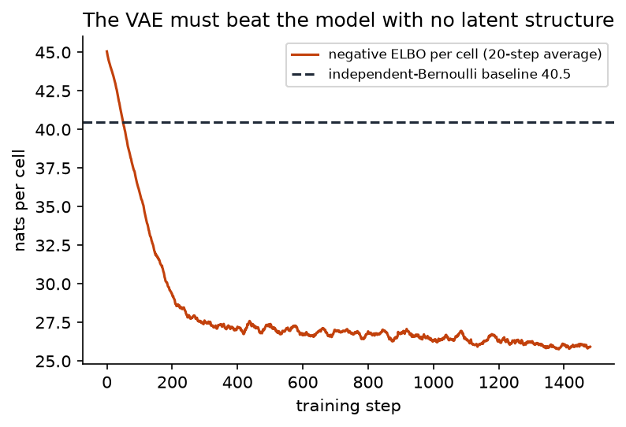
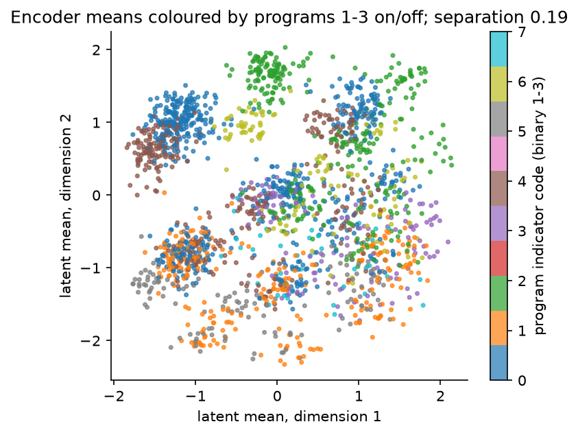

## Overview

**Why this module exists.** Everything so far had a handful of unknowns shared by all
the data. Many problems have an unknown *per data point*: a latent description of each
cell, each customer, each image. Module 8's recipe still applies in principle, with a
variational Gaussian per data point, but the number of variational parameters grows
with the dataset and a new data point needs a fresh optimisation. Amortised inference
replaces the per-point parameters with a function, learned once, that maps a data point
to its variational parameters. The variational autoencoder (VAE) is that idea applied
to a model with a neural-network likelihood. It is usually presented as a kind of
autoencoder; here it is presented as what it is, mean-field variational inference with
local latents and an amortised guide, and every term of its objective is a term you
have already built. The dataset is a binary matrix of 2 000 cells by 64 genes generated
by six hidden transcriptional programs, and the question the VAE answers is whether it
can discover that hidden structure from the on/off patterns alone.

**What you'll build:** in `workshop/m14_vae.py`, a variational autoencoder written as
two programs in the Module 12 PPL, a model with one local latent per datum and a neural
decoder, and a guide whose variational parameters are produced by an encoder network.
The ELBO is computed from two traces, the way a generic engine would; training uses
Module 8's Adam.

**Estimated time:** 3 hours (about 1 hour reading, 2 hours building).

**Prerequisites:** [Module 12](m12-effect-handlers.qmd), [Module 8](../day2/m08-bbvi-engine.qmd),
[Module 7](../day2/m07-gradient-estimators.qmd). Vocabulary:
[ELBO](../reference/glossary.qmd#elbo-evidence-lower-bound),
[reparameterisation](../reference/glossary.qmd#reparameterisation-pathwise-gradient),
[amortised inference](../reference/glossary.qmd#amortised-inference).

## Learning objectives

By the end of this module you can:

1. State the VAE as mean-field VI with local latents and an amortised guide, count the
   parameters saved by amortisation, and define the amortisation gap.
2. Write the per-datum ELBO, derive the closed-form KL between a diagonal Gaussian and
   the standard normal from Module 2's formula, and say why the closed form lowers
   variance.
3. Compute the ELBO from a guide trace and a replayed model trace, and the same
   objective with the analytic KL, and show they agree in expectation.
4. Train a VAE through the PPL with hand-written networks and optimiser, beat the
   independent-gene baseline by a stated margin, and explain the number in bits.
5. Read the latent space: cells sharing a program cluster, and reconstructions are
   stochastic through the posterior over $z$.

## Background

### The problem in plain terms

Each cell $i$ is a vector $x_i \in \{0, 1\}^{64}$ saying which of 64 genes are switched
on. The data were generated by a small number of hidden *programs*: each program turns
on a block of genes, each cell runs a sparse subset of the programs (on average 1.8 of
the six), and the observed on/off values are noisy readouts. The genes are therefore
far from independent: if gene 3 is on, genes 1 to 8 probably are too. We want a model
that captures that dependence through a low-dimensional latent variable per cell, and
we want to infer that latent for every cell.

The honest baseline is the best model that ignores all dependence: treat each gene as
an independent coin with its observed frequency $p_j$ (which ranges from $0.05$ to
$0.51$ across genes here). Its per-cell log-likelihood is
$\sum_j [p_j\log p_j + (1 - p_j)\log(1 - p_j)] = -40.47$ nats, or $58.4$ bits per cell.
Any model that has found structure must beat it.

### Definitions

| Term | What it is |
|---|---|
| **local latent** $z_i$ | an unknown attached to one data point; there are $N$ of them |
| **global parameters** $\theta$ | the decoder network weights, shared by all data |
| **decoder** $g_\theta$ | a network from $z_i \in \R^L$ to 64 logits, one per gene |
| **encoder** $e_\phi$ | a network from $x_i$ to the variational parameters $(\mu_i, \sigma_i)$ of $q(z_i)$ |
| **amortised guide** | $q_\phi(z_i \mid x_i) = \mathcal N(\mu_i, \mathrm{diag}\,\sigma_i^2)$ with $(\mu_i, \sigma_i) = e_\phi(x_i)$ |
| **amortisation gap** | the ELBO lost by using $e_\phi(x_i)$ instead of the best per-datum $(\mu_i, \sigma_i)$ |
| **posterior collapse** | a failure mode where $q(z_i \mid x_i)$ equals the prior for every $i$ and the decoder ignores $z$ |

### The generative story

In words: for each cell, draw a latent position $z_i$ in an $L$-dimensional space
from a standard Gaussian; feed it through the decoder to get 64 logits; flip each gene
on with probability $\sigma(\text{logit})$. As a model,

$$
z_i \sim \mathcal N(0, I_L), \qquad x_{ij} \sim \mathrm{Bernoulli}\big(\sigma(g_\theta(z_i)_j)\big),
\quad i = 1, \dots, N,\ j = 1, \dots, 64.
$$

As a program in the Module 12 PPL, for a batch of $B$ rows:

```python
def vae_model(params, x, latent_dim):
    dec = param("dec", params["dec"])
    z = sample("z", Normal(jnp.zeros((B, latent_dim)), 1.0))   # B local latents at once
    sample("x", Bernoulli(logits=mlp(dec, z)), obs=x)
```

The decoder's outputs are *logits*, numbers in $\R$; the probability of gene $j$ being
on is $\sigma(\ell_j) = 1/(1 + e^{-\ell_j})$. Working in logits keeps the Bernoulli
log-probability stable: $\log\sigma(\ell)$ is computed as `log_sigmoid`, never as the
log of a probability that may have underflowed.

The posterior $p(z_i \mid x_i)$ is intractable (a Gaussian prior pushed through a
network and multiplied by 64 Bernoulli terms), and there is one per cell.

### Mean-field VI with local latents, and what amortisation saves

Module 8 would introduce a guide $q_{\phi_i}(z_i) = \mathcal N(\mu_i, \mathrm{diag}\,\sigma_i^2)$
with its own parameters for each cell: $N \times 2L = 2\,000 \times 8 = 16\,000$ numbers
for $L = 4$. The ELBO of the whole dataset is a sum of per-cell ELBOs,

$$
\ELBO(\theta, \phi) = \sum_{i=1}^N \Big( \E_{q_{\phi_i}}\big[\log p_\theta(x_i \mid z_i)\big] - \KL\big(q_{\phi_i}(z_i)\,\|\,p(z_i)\big) \Big),
$$

and it is exactly Module 8's objective $\E_q[\log p(x, z) - \log q(z)]$ with the joint
split into likelihood and prior. The first term rewards reconstructing $x_i$ from
$z_i$; the second keeps $q$ close to the prior.

Amortisation replaces $\phi_i$ by $e_\phi(x_i)$. The encoder used here has
$64 \times 64 + 64 + 64 \times 8 + 8 = 4\,680$ weights, against $16\,000$ per-datum
parameters, and the count does not grow with $N$. More importantly, a cell never seen
during training gets a posterior from one forward pass. The ELBO is unchanged in form;
the optimisation is now over $(\theta, \phi)$ jointly.

The price is the **amortisation gap**. The encoder is one function that must serve
every cell; the best $(\mu_i, \sigma_i)$ for a particular cell is generally not what
that function outputs. So the amortised ELBO is at most the ELBO the per-datum
parameters would reach, and the difference is the gap. The Challenge measures it.

### The analytic KL

The KL term has a closed form because both distributions are Gaussian. Module 2's
formula for $\KL(\mathcal N(\mu_0, \Sigma_0)\,\|\,\mathcal N(\mu_1, \Sigma_1))$ with
$\Sigma_0 = \mathrm{diag}(\sigma^2)$, $\mu_1 = 0$, $\Sigma_1 = I$ gives, term by term,
$\tr(\Sigma_1^{-1}\Sigma_0) = \sum_l \sigma_l^2$,
$(\mu_1 - \mu_0)^\top\Sigma_1^{-1}(\mu_1 - \mu_0) = \sum_l \mu_l^2$,
$\log\det\Sigma_1 - \log\det\Sigma_0 = -\sum_l\log\sigma_l^2$, and the $-d$ becomes $-L$:

$$
\KL\big(\mathcal N(\mu, \mathrm{diag}\,\sigma^2)\,\|\,\mathcal N(0, I)\big)
= \tfrac12\sum_{l=1}^L\big(\mu_l^2 + \sigma_l^2 - 1 - \log\sigma_l^2\big).
$$

Each term is zero at $\mu_l = 0$, $\sigma_l = 1$ and positive elsewhere. The module
computes the ELBO two ways: from traces, where the KL is estimated as
$\log q(z) - \log p(z)$ at one sample, and with this closed form. Both are unbiased for
the same ELBO. The closed form removes one of the two sources of Monte Carlo noise, so
its gradient estimate has lower variance, and training uses it.

### Gradients

The reconstruction term is an expectation under $q_\phi$, and we need its gradient with
respect to $\phi$. This is Module 7's situation, and the answer is the pathwise
estimator: write $z_i = \mu_i + \sigma_i \odot \varepsilon$ with
$\varepsilon \sim \mathcal N(0, I)$, so the randomness no longer depends on $\phi$, and
differentiate through $\mu_i$, $\sigma_i$ and the decoder. One sample of $\varepsilon$
per cell per step is enough in practice because the batch averages over 128 cells.

### Through the PPL

The guide is a program with one site, `sample("z", Normal(mu(x), sigma(x)))`, where
`mu` and `sigma` come from the encoder. Running it under `trace(seed(...))` draws
$z$ and records it. Running the model under `replay(vae_model, guide_trace)` makes the
model's `z` site take the guide's value, so the model trace scores $\log p(z) +
\log p(x \mid z)$ at that $z$ while the guide trace scores $\log q(z)$. The ELBO is the
difference of the two trace totals. No line of the ELBO code mentions an encoder or a
decoder; that is the point of the PPL, and it is how a generic SVI engine computes the
same quantity.

### A worked example with numbers

The reference training run uses $L = 4$, hidden width 64, batches of 128, learning
rate $10^{-3}$ and 1 500 Adam steps.

| Quantity | Value (nats per cell) |
|---|---|
| independent-gene baseline | $-40.47$ |
| ELBO at the start of training | $-41.4$ |
| ELBO after 1 500 steps (full data, 10-key average) | $-25.4$ |
| of which reconstruction $\E_q[\log p(x \mid z)]$ | $-20.6$ |
| of which $-\KL$ | $-4.8$ |

The gain over the baseline is $15.1$ nats, or $21.7$ bits per cell: the VAE needs 22
fewer bits to describe a cell than a code that treats genes independently, because it
has learned which genes switch on together. The test asks for at least 2 nats ($2.9$
bits); the reference clears it by a wide margin.

The KL term is informative. It is $4.8$ nats per cell, well above zero; the encoder's
output has mean $\lvert\mu\rvert$ of about $0.9$ and mean $\sigma$ of about $0.34$, so the
guide is far from the prior and does depend on $x$. That is the opposite of posterior
collapse. The latent space also separates the programs: the mean distance between
cells that run identical programs is $0.20$ of the mean distance between arbitrary
pairs, and reconstructions through one posterior sample agree with the data at 88% of
gene positions.

### Posterior collapse, mechanically

The ELBO has two terms pulling in opposite directions. If the decoder can model $x$
reasonably well while ignoring $z$ (a powerful decoder, or data with little structure),
then the reconstruction term gains almost nothing from an informative $q$, while the KL
term is minimised by setting $q(z_i \mid x_i) = p(z_i)$ for every cell. The optimiser
takes the free KL reduction: the encoder outputs $\mu = 0$, $\sigma = 1$ regardless of
$x$, the KL goes to zero, and the decoder's input is noise it has learned to ignore.
The latent space is then useless even though the ELBO looks fine. The usual cure is to
weight the KL term by a factor that rises from 0 to 1 over the first few hundred steps,
giving the reconstruction term time to make $z$ worth using. On this dataset the
structure is strong enough that collapse does not occur.

### Why this matters later

- The per-datum versus amortised distinction reappears in Track A, where the flow is a
  global guide for a global posterior, and in Track B, where the encoder of a diffusion
  model is the fixed forward noising process.
- The ELBO decomposition into reconstruction minus KL is the quantity Track B's
  objective generalises to a continuum of noise levels.

### Common misconceptions

- **"A VAE is an autoencoder with noise added."** The encoder is a variational
  posterior and the objective is an evidence lower bound. The "noise" is the sampling
  in the reparameterised expectation, and the KL term is the prior doing its job. Drop
  the probabilistic reading and nothing about the objective makes sense.
- **"The KL term is a regulariser you can drop."** Without it the objective is no
  longer a bound on $\log p(x)$ and the model is no longer generative: the decoder
  input at test time, drawn from $\mathcal N(0, I)$, would be nothing like the encoder
  outputs seen in training.
- **"The ELBO is the log-likelihood."** It is a lower bound. The gap is
  $\KL(q(z \mid x)\,\|\,p(z \mid x))$ summed over cells, and it is the sum of the
  mean-field restriction and the amortisation gap. The importance-weighted bound in
  the Challenge tightens it.
- **"More latent dimensions are always better."** Unused dimensions collapse to the
  prior individually and cost nothing in the ELBO, but they make the latent space
  harder to read. $L = 4$ for six programs is a deliberate squeeze.

## Steps

Every step edits `workshop/m14_vae.py`. $L = 4$ throughout the tests.

### Step 1 — A hand-written MLP

**What this computes.** The two networks, as a list of weight matrices and bias
vectors with `tanh` between layers. Glorot initialisation keeps the activations at a
sensible scale so the first ELBO is finite and the gradients are not tiny.

Implement `init_mlp(key, sizes)` with Glorot-uniform weights and zero biases, and
`mlp(params, x, activation=jnp.tanh)` with `activation` between layers and a linear
output. This is the only network in the workshop: Module 15a's coupling conditioners
and Module 15b's score network are built from these two functions, the second with
`activation=jax.nn.silu`.

Sanity check: `mlp(init_mlp(key, [64, 64, 8]), X[:5])` has shape `(5, 8)`, and the
parameter count of that network is $64 \times 64 + 64 + 64 \times 8 + 8 = 4\,680$.

```bash
pytest tests/m14 -k step1
```

You should see 2 passed.

### Step 2 — Model and guide as programs

**What this computes.** The generative story and the amortised guide as Module 12
programs. The decoder and encoder weights enter through `param` sites so a `substitute`
handler could override them; the guide's `z` site is where the two programs meet.

Implement `vae_model(params, x, latent_dim)` and `vae_guide(params, x, latent_dim)`.
Network weights enter through `param("dec", ...)` and `param("enc", ...)`; the encoder
output of width $2L$ is split into $\mu$ and a raw scale passed through `softplus` plus
$10^{-4}$.

Sanity check: `trace(seed(vae_guide, key)).get_trace(params, X[:3], 4)["z"]["value"]`
has shape `(3, 4)`, and feeding two identical rows gives identical `fn.loc` rows.

```bash
pytest tests/m14 -k step2
```

You should see 2 passed, including a check that identical inputs receive identical
variational parameters (amortisation).

### Step 3 — Two ELBOs

**What this computes.** The per-datum ELBO, first as the difference between a replayed
model trace and the guide trace (the generic way), then with the closed-form KL from
the Background (the low-variance way).

Implement `elbo(key, params, x, latent_dim)` from two traces and
`elbo_analytic_kl(key, params, x, latent_dim)` with the closed-form KL; both return the
per-datum average.

Sanity check: at freshly initialised parameters both ELBOs are near $-44$ nats per
cell (64 genes at roughly $\log 2$ each plus a small KL), and averaging each over 400
keys gives values within $0.1$ of each other.

```bash
pytest tests/m14 -k step3
```

You should see 2 passed: equal in expectation over 400 keys within Monte Carlo error,
analytic variance strictly smaller, and finite gradients with the same pytree
structure as `params`.

### Step 4 — Training

**What this computes.** Adam ascent on the analytic-KL ELBO over random minibatches,
plus the independent-gene baseline the result must beat.

Implement `independent_bernoulli_baseline(X)` and
`train_vae(key, X, latent_dim=4, n_steps=1500, batch_size=128, lr=1e-3, hidden=64)`
with Module 8's `adam_init` / `adam_update` (ascent) inside `lax.scan`, minibatches
drawn with `jax.random.randint`.

Sanity check: `independent_bernoulli_baseline(X)` is $-40.47$; the ELBO trace should
start near $-41$ and end near $-25$.

{width=65%}


```bash
pytest tests/m14 -k step4
```

You should see 2 passed. The full-data ELBO after 1 500 steps exceeds the baseline by at
least 2 nats (the reference clears it by about 15).

### Step 5 — Using the fitted model

**What this computes.** The encoder means as a latent embedding, reconstructions
through one posterior sample, and a statistic that says whether cells with the same
programs land near each other.

Implement `latent_means`, `reconstruct` and `program_separation`.

Sanity check: `program_separation(latent_means(params, X, 4), Z)` is about $0.2$;
`reconstruct(params, X[:200], key, 4)` thresholded at $0.5$ agrees with `X[:200]` at
about 88% of positions.

{width=65%}


```bash
pytest tests/m14 -k step5
```

You should see 2 passed: the mean latent distance between cells with identical program
indicators is below 0.6 of the mean distance between arbitrary pairs (about 0.2 in the
reference), permuted labels give no separation, and reconstructions are at least 80%
accurate at threshold 0.5 while differing between two keys.

## Checkpoint

::: {.callout-tip title="Checkpoint"}
```bash
pytest tests/m14
```
10 tests pass in about 10 seconds. This completes Day 4: both inference engines and
the amortised variant now run through one 200-line PPL. Before moving on, be able to
point at each term of the ELBO in the worked example and say what it measures.

**Which expectation did you just compute?** Per cell, $\E_{q_\phi(z_i \mid x_i)}[\log p_\theta(x_i \mid z_i)]$
by one reparameterised sample, and $\KL(q_\phi(z_i\mid x_i)\,\|\,p(z_i))$ in closed form.
The reconstruction in Step 5 is $\E_{q_\phi(z\mid x)}[\sigma(\text{decoder}(z))]$ with a
single sample; the latent embedding is $\E_{q_\phi(z\mid x)}[z]$, read off the encoder.
:::

## Challenge

::: {.callout-note title="Challenge"}
1. **Amortisation gap.** For 50 cells, start from the encoder's $(\mu_i, \sigma_i)$
   and optimise them per datum with Module 8's `fit`-style loop for 200 steps.
   Report the ELBO gain; this is the amortisation gap of Cremer, Li and Duvenaud.
2. **Importance-weighted ELBO.** Implement the IWAE bound with $K \in \{1, 5, 50\}$
   samples through the PPL (replay the model $K$ times against $K$ guide traces),
   and show it is monotone in $K$ on held-out cells.
3. **Induce collapse.** Make the decoder much larger and train with the KL weight at
   1 from the start; watch the KL term go to zero. Then add a KL warm-up and show the
   latent space recovers.
:::

## Going deeper

- Kingma and Welling, "Auto-Encoding Variational Bayes", *ICLR*, 2014. Read Section 2
  after this module; it is short, and every equation now has a line of your code.
- Rezende, Mohamed and Wierstra, "Stochastic Backpropagation and Approximate Inference
  in Deep Generative Models", *ICML*, 2014.
- Cremer, Li and Duvenaud, "Inference Suboptimality in Variational Autoencoders",
  *ICML*, 2018: the amortisation gap, measured.
- Burda, Grosse and Salakhutdinov, "Importance Weighted Autoencoders", *ICLR*, 2016.
- Blei, Kucukelbir and McAuliffe, "Variational Inference: A Review for Statisticians",
  *JASA*, 2017, Section 5.2 on amortisation and Section 4 on local and global latents.

## Troubleshooting

::: {.callout-warning title="Troubleshooting"}
**ELBO starts near $-44$ and does not improve.** Learning rate too small for the
hand-written Adam, or Adam written for descent (Module 8's `adam_update` *adds* the
step). Check that the ELBO after 100 steps is higher than at step 0.

**ELBO improves then the KL term goes to zero and reconstructions become the mean
cell.** Posterior collapse: the decoder ignores $z$. With this small data it is
rare; if it occurs, lower the decoder capacity or warm up the KL weight from 0 to 1
over the first 500 steps.

**You read the ELBO as a log-likelihood and reported it as such.** It is a lower
bound; the true $\log p(x)$ is higher by the KL between the guide and the exact
posterior. Say "ELBO" when you mean the ELBO.

**The KL term is zero from the start and you concluded the model is perfect.** A zero
KL means the guide equals the prior and the latent carries no information. It is the
symptom of collapse, not of success.

**`Bernoulli.log_prob` returns `nan` or positive values.** You passed probabilities
where logits are expected, or computed $\log\sigma(\ell)$ as `log(sigmoid(l))`,
which underflows. The provided distribution uses `log_sigmoid`.

**The two ELBOs disagree systematically.** The analytic version must use the guide
trace's `z` for the likelihood term, not a fresh draw, and the KL must be summed
over all $B \times L$ entries before dividing by $B$.

**Gradient test fails with a structure mismatch.** `param` sites must receive the
full pytree (`params["enc"]`), not a flattened copy, so that `jax.grad` returns the
same nesting.

**Reconstruction accuracy near 0.6.** The decoder is being evaluated at the prior
sample, not the guide's. `reconstruct` must run the guide to get $z$.
:::
