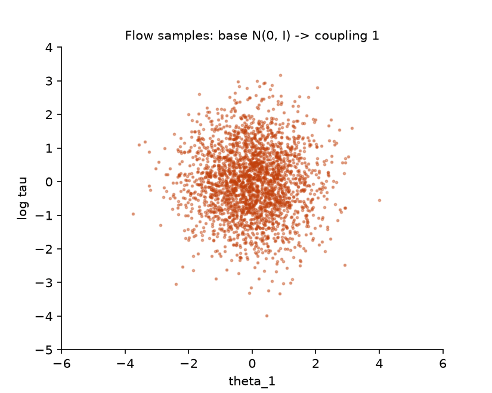

## Overview

**Why this track exists.** On Day 2 you approximated posteriors with a product of
independent Gaussians and on Day 3 you saw, on the churn model, that this family gets
the means right and the variances wrong. On a hierarchical model it does worse: the
posterior has a funnel shape that no product of Gaussians can follow, and the fit
quietly drops most of the uncertainty about the group-level scale. This track builds
the standard remedy. A normalising flow is a variational family made by pushing a
simple distribution through a learned invertible map; it can bend, stretch and
correlate coordinates while still giving an exact density, so the same ELBO machinery
from Module 8 applies with a far more expressive $q$. You build the flow from the
change-of-variables formula up, fit it to the funnel, and measure how much of the gap to
HMC it closes.

**What you'll build:** in `workshop/m15a_flows.py`, a RealNVP normalising flow from
scratch: affine coupling layers with hand-written conditioner MLPs, a stack with a final
learned affine layer, exact inverse and log-determinant, a flow-based variational
objective optimised with the Adam of Module 8, and importance-weighted bounds that use
the flow as a proposal. You fit the flow to the centred hierarchical regional-uplift
posterior whose funnel geometry defeats the mean-field Gaussian of Module 8, and
compare both against the HMC reference from Module 11.

**Estimated time:** 7 hours (about 2 h reading and derivation, 4 h building through
Step 5, 1 h report).

**Prerequisites:** [Module 8](../day2/m08-bbvi-engine.qmd), [Module 10](../day3/m10-adaptation.qmd),
[Module 11](../day3/m11-diagnostics.qmd). The target and reference are the uplift model of
Module 9 (`uplift_centered_log_prob`, `uplift_noncentered_log_prob`) and `run_chains`
from Module 11. The vocabulary of posterior, ELBO and variational family is from
[Module 2b](../day0/m02b-foundations.qmd) and the [glossary](../reference/glossary.qmd).

**Dataset:** `regional_uplift()` (eight regional A/B tests, estimated uplift and
standard error each), through the Module 9 model
$\mu \sim \mathcal N(0, 5^2)$, $\tau \sim \mathrm{HalfNormal}(5)$,
$\theta_j \sim \mathcal N(\mu, \tau^2)$, $y_j \sim \mathcal N(\theta_j, \sigma_j^2)$.
$\mu$ is the average uplift across regions, $\tau$ is how much regions differ, and
$\theta_j$ is region $j$'s true uplift.

## Learning objectives

By the end of this module you can:

1. Derive the density of a flow from the change-of-variables formula, starting in one
   dimension, and explain why an affine coupling layer has a triangular Jacobian with an
   $O(d)$ log-determinant and an exact inverse.
2. Implement RealNVP with alternating masks and verify invertibility and the
   log-determinant against autodiff to $10^{-8}$.
3. Write the flow-based ELBO as a reparameterised expectation over the base
   distribution, and show it reduces to the Module 8 objective when the flow is affine.
4. Explain in words why a product of independent Gaussians cannot represent a funnel,
   and demonstrate with HMC as reference that a flow captures the dispersion and lower
   tail of $\log\tau$ where mean-field VI does not.
5. Compute importance-weighted bounds and the effective sample size of flow-proposal
   weights, and explain why both improve with a better variational family.

## Background

### The problem in plain terms

Variational inference (Module 6) replaces the posterior $p(x)$ with the closest member
$q_\phi$ of a family you can sample from and evaluate, where "closest" means smallest
$\KL(q_\phi\,\|\,p)$. The quality of the answer is capped by the family. Module 8's
family was the mean-field Gaussian: every coordinate gets its own centre and width, and
the coordinates are independent. That family has exactly $2d$ numbers in it. It cannot
represent "coordinate 3 is wide when coordinate 2 is large and narrow when coordinate 2
is small", and that is the shape of every hierarchical posterior.

Here is the concrete case. In the uplift model, each region's true uplift $\theta_j$ is
drawn around $\mu$ with spread $\tau$. If the data say $\tau$ might be small, then all
eight $\theta_j$ must sit close to $\mu$; if $\tau$ might be large, they may spread out.
So the posterior over $(\log\tau, \theta_1, \dots, \theta_8)$ looks like a funnel: wide
in $\theta$ at the top (large $\log\tau$), pinched to a needle at the bottom (small
$\log\tau$). A mean-field Gaussian must pick a single width for each $\theta_j$. Because
$\KL(q\,\|\,p)$ penalises $q$ for putting mass where $p$ has little, the optimiser
chooses the width that fits the wide top and then shrinks $\log\tau$'s marginal so that
$q$ never visits the needle, where its fixed-width $\theta$ would be badly wrong. The
fitted $q$ has about a quarter of the true spread in $\log\tau$ and no lower tail at
all. The numbers are in the worked example below.

The fix is not a cleverer optimiser. It is a family that can represent the funnel. This
track builds one.

### Definitions

| Term | Meaning |
|---|---|
| base distribution | a simple distribution you can sample from and evaluate, here $\mathcal N(0, I_d)$ |
| bijector | a smooth map with a smooth inverse (Module 8 used elementwise ones) |
| flow | a bijector $f_\phi: \R^d \to \R^d$ with learnable parameters, applied to base samples |
| Jacobian $J_f(\epsilon)$ | the $d \times d$ matrix of partial derivatives $\partial f_i/\partial\epsilon_j$ |
| log-determinant | $\log\lvert\det J_f\rvert$, the local log volume change of $f$ |
| coupling layer | a bijector that transforms half the coordinates using a function of the other half |
| conditioner | the neural network inside a coupling layer that computes the shift and scale |
| mask | a 0/1 vector saying which coordinates a coupling layer leaves unchanged |
| importance weight | $w = p(x)/q(x)$ for a sample $x \sim q$; corrects for sampling from the wrong distribution |
| effective sample size (of weights) | how many equally weighted samples a set of weighted samples is worth |

### The change of variables, from one dimension up

Take a base variable $\epsilon$ with density $p_\epsilon$ and a strictly increasing
smooth map $f$ on the real line. Define $x = f(\epsilon)$. What is the density of $x$?
Densities are derivatives of probabilities, so compute the probability first:

$$
P(x \le a) = P\big(f(\epsilon) \le a\big) = P\big(\epsilon \le f^{-1}(a)\big).
$$

The first equality is the definition of $x$; the second applies $f^{-1}$ to both sides,
which is allowed because $f$ is increasing. Differentiate with respect to $a$ using the
chain rule:

$$
q(a) = p_\epsilon\big(f^{-1}(a)\big)\,\frac{\dd f^{-1}}{\dd a}(a)
= \frac{p_\epsilon(\epsilon)}{f'(\epsilon)}\bigg|_{\epsilon = f^{-1}(a)}.
$$

The second form uses the inverse-function rule $\dd f^{-1}/\dd a = 1/f'(\epsilon)$. Read
it as a conservation law: $f$ stretches a small interval around $\epsilon$ by the factor
$f'(\epsilon)$, the probability mass in that interval is unchanged, so the density
drops by the same factor. For a decreasing $f$ the same argument gives $|f'|$.

In $d$ dimensions the stretching factor of a small cube is $|\det J_f(\epsilon)|$,
the absolute determinant of the Jacobian, and the formula becomes

$$
\log q_\phi(x) = \log p_\epsilon(\epsilon) - \log\left|\det J_{f_\phi}(\epsilon)\right|,
\qquad \epsilon = f_\phi^{-1}(x).
$$

This is the change-of-variables formula you tested in Module 2, now with the map in the
forward direction. Two costs appear. Evaluating $q_\phi$ at an arbitrary $x$ needs
$f_\phi^{-1}$, and the determinant of a general $d \times d$ matrix costs $O(d^3)$. A
flow is useful only if both are cheap, and the whole design problem of normalising
flows is choosing maps that are expressive yet have an explicit inverse and a cheap
determinant. Triangular Jacobians are the standard answer: the determinant of a
triangular matrix is the product of its diagonal, $O(d)$.

::: {.callout-important title="Jacobian check"}
A flow is the [change of variables of Module 2b](../day0/m02b-foundations.qmd#sec-jacobian)
with nothing else: the entire density is Jacobians. Check your `flow_log_prob` against
autodiff on a small flow before trusting it on the funnel:

```python
from workshop.jacobian_check import check_change_of_variables
params    = init_flow(jax.random.key(0), dim=2, n_layers=2)
log_p_eps = lambda e: -0.5 * jnp.sum(e**2) - jnp.log(2 * jnp.pi)   # base density, known
fwd       = lambda e: flow_forward(params, e)[0]                   # eps -> x
log_q_x   = lambda x: flow_log_prob(params, x)                     # your claimed density of x
eps_pts   = jax.random.normal(jax.random.key(1), (6, 2))
check_change_of_variables(log_q_x, fwd, log_p_eps, eps_pts)         # zeros
```

Read the call against the checker's contract: the "original" coordinate is $x$ with
density `log_q_x`, the "new" coordinate is $\epsilon$ with density `log_p_eps`, and the
map from new to original is `fwd`. The relation it tests,
$\log p_\epsilon(\epsilon) = \log q(f(\epsilon)) + \log|\det J_f(\epsilon)|$, is the
change-of-variables formula above rearranged. If `flow_log_prob` has the sign of the
log-determinant wrong, the discrepancy is twice the log-determinant at every point.
:::

### The affine coupling layer, derived

Split the coordinates with a binary mask $m \in \{0, 1\}^d$. Call the coordinates with
$m_i = 1$ the *conditioning half* and the others the *transformed half*. The layer
leaves the conditioning half unchanged and applies an elementwise affine map to the
transformed half, with a shift $t$ and a log-scale $s$ computed from the conditioning
half only:

$$
x = m \odot z + (1 - m)\odot\big(z \odot e^{s(m \odot z)} + t(m \odot z)\big),
$$

where $(t, s): \R^d \to \R^d \times \R^d$ is any function, here a small MLP that
receives $m \odot z$ (the conditioning half, with zeros elsewhere). Three properties
follow from the structure, and each is the reason for a design choice.

**The inverse is explicit.** Given $x$, the conditioning half is $m \odot x = m \odot z$,
so $s$ and $t$ can be recomputed from $x$ alone, and the transformed half is undone by
$z = (x - t)\odot e^{-s}$. No equation solving. This is why half the coordinates must
be left untouched: if the conditioner saw the transformed coordinates, you would need
$z$ to compute $s$ and $s$ to compute $z$.

**The Jacobian is triangular.** Order the coordinates so the conditioning half comes
first. The conditioning outputs do not depend on the transformed inputs (identity
block), and each transformed output $x_i$ depends on the transformed input $z_i$ only
through the factor $e^{s_i}$ (diagonal block), while its dependence on the conditioning
inputs lands in the off-diagonal block, which does not affect a triangular
determinant. So

$$
\log\left|\det J\right| = \sum_{i:\,m_i = 0} s_i(m \odot z),
$$

a sum of $d/2$ numbers the conditioner already produced. No matrix is ever formed.

**Masks must alternate.** One layer transforms only half the coordinates. Flipping the
mask in the next layer transforms the other half, conditioned on the first. After two
layers every coordinate has been transformed once and has influenced the other half
once; after $K$ layers the composition can represent rich dependence. Composition is
free: for $x = f_K \circ \cdots \circ f_1(\epsilon)$ the chain rule gives
$J = J_K \cdots J_1$, and $\det$ of a product is the product of $\det$s, so the
log-determinants add.

Two engineering details are what make the layer trainable on a difficult target. The
last layer of each conditioner is initialised to zero, so $s = t = 0$ and the flow
starts as the identity: the first ELBO evaluation is finite and the optimiser moves
away from a known-good point. And the log-scale is squashed as
$s = B\tanh(\tilde s / B)$ with $B = 2$, so one layer can scale a coordinate by at
most $e^2$. Without the bound, one bad early step on a target with a narrow neck
produces scales of $e^{30}$, the target returns $-\infty$, and the next gradient is
`nan`.

### A flow as a variational family

Variational inference needs two operations from $q_\phi$: draw a sample, and evaluate
$\log q_\phi$ *at that sample*. The flow provides both from a single forward pass: draw
$\epsilon$, compute $x = f_\phi(\epsilon)$ and accumulate the log-determinants along the
way. Then $\log q_\phi(x) = \log\mathcal N(\epsilon; 0, I) - \log|\det J_{f_\phi}(\epsilon)|$.
You never need the inverse during training. (You need it only to evaluate $q_\phi$ at
points you did not generate, such as HMC samples; Step 2 implements it for the tests.)

Now substitute into Module 6's ELBO, $\ELBO(\phi) = \E_{q_\phi}[\log p(x) - \log q_\phi(x)]$,
writing the expectation over $x \sim q_\phi$ as an expectation over
$\epsilon \sim \mathcal N(0, I)$ with $x = f_\phi(\epsilon)$:

$$
\ELBO(\phi)
= \E_{\epsilon}\Big[\log p\big(f_\phi(\epsilon)\big) - \log\mathcal N(\epsilon; 0, I) + \log\left|\det J_{f_\phi}(\epsilon)\right|\Big]
= \E_{\epsilon}\Big[\log p\big(f_\phi(\epsilon)\big) + \log\left|\det J_{f_\phi}(\epsilon)\right|\Big] + H\big[\mathcal N(0, I)\big].
$$

The first equality is the change of variables for $\log q_\phi$; the second pulls the
base log-density out as a constant, the entropy $H[\mathcal N(0, I)] = \frac d2\log(2\pi e)$.
Here $p$ is the unnormalised posterior (the log joint), so the ELBO is below
$\log Z$ by $\KL(q_\phi\,\|\,p)$, as always. Because $\epsilon$ does not depend on
$\phi$, this is a reparameterised expectation (Module 7): the gradient with respect to
$\phi$ is the expectation of the gradient of the integrand, which JAX computes by
differentiating through the flow and the target.

When the flow is a single diagonal affine layer,
$f_\phi(\epsilon) = \mathrm{loc} + e^{\mathrm{log\_scale}}\odot\epsilon$, the
log-determinant is $\sum_i \mathrm{log\_scale}_i$ and the objective is exactly the
Module 8 mean-field ELBO. A RealNVP is a strict generalisation of the family you have
already fitted; the only new code is the coupling layer.




### Importance weighting: a diagnostic and a tighter bound

Importance sampling estimates an expectation under $p$ with samples from $q$:
$\E_p[h] = \E_q[h\,p/q]$. Apply it to $h = 1$ with $p$ unnormalised: $Z = \E_q[w]$ with
$w(x) = p(x)/q(x)$. Three lines then give both the ELBO and its improvement.

$$
\log Z = \log\E_q[w] \;\ge\; \E_q[\log w] = \E_q[\log p - \log q] = \ELBO,
$$

by Jensen's inequality ($\log$ is concave). This is a second derivation of the ELBO:
it is the log of a one-sample importance estimate, averaged. With $k$ independent
draws $x_1, \dots, x_k \sim q$ the same inequality applied to the sample mean gives

$$
\mathcal L_k = \E\Big[\log\tfrac1k\sum_{j=1}^k w_j\Big] \le \log Z,
\qquad \mathcal L_1 = \ELBO \le \mathcal L_2 \le \cdots \to \log Z,
$$

where the monotonicity in $k$ is the result of Burda, Grosse and Salakhutdinov (2016):
averaging more weights inside the log makes the argument less variable, and Jensen's
gap shrinks with the variance. In the limit the bound is exact for any $q$ with full
support, so $\mathcal L_k$ for moderate $k$ measures how good $q$ is as a *proposal*
rather than as an approximation.

The effective sample size makes the same point without the target's normaliser. With
normalised weights $\bar w_j = w_j/\sum_l w_l$,

$$
\mathrm{ESS} = \frac{1}{\sum_j \bar w_j^2} = \frac{(\sum_j w_j)^2}{\sum_j w_j^2}.
$$

If all weights are equal, $\bar w_j = 1/k$ and $\mathrm{ESS} = k$. If one weight
dominates, $\mathrm{ESS} \to 1$: the $k$ samples are worth one. A mean-field proposal on
a funnel has an effective sample fraction near zero because the rare draw that lands in
the needle, where $p/q$ is enormous, carries almost all the weight.

### A worked example with numbers

The Step 4 fixture fits both families to the centred uplift posterior (dimension 10)
with fixed keys and compares them to 4 000 HMC draws mapped into centred coordinates.

| Quantity | Mean-field | Flow (4 layers) | HMC reference |
|---|---|---|---|
| ELBO (nats) | 2.0 | 3.4 | — |
| sd of $\log\tau$ | 0.27 | 0.73 | 1.05 |
| mass at $\log\tau < -1$ | 0.00 | 0.23 | 0.30 |
| effective sample fraction as proposal | 0.0003 | 0.35 to 0.57 | — |

Read the rows together. The ELBO difference of 1.4 nats is the reduction in
$\KL(q\,\|\,p)$: the flow is $e^{1.4} \approx 4$ times closer to the posterior in
likelihood-ratio terms. The mean-field fit has a quarter of the true spread in
$\log\tau$ and puts no mass at all below $\log\tau = -1$, where HMC puts 30%; it has
decided that regions are reliably different when the data leave that open. The flow
recovers most of the spread and most of the tail, and is still short of HMC. As a
proposal, the mean-field fit is useless: an effective sample fraction of $3 \times 10^{-4}$
means that 10 000 draws are worth three. The flow turns a third to a half of its draws
into useful ones, which is what makes the importance-weighted bound of Step 5 tight.

### Why this matters

Flows as variational families were introduced by Rezende and Mohamed (2015), and the
coupling-layer construction you build is Dinh, Sohl-Dickstein and Bengio's RealNVP
(2017). Three lines of research follow from this page. Autoregressive flows (IAF, MAF)
replace the coupling split with a full triangular structure, trading parallelism in
one direction for expressiveness. Spline flows replace the affine map with a monotone
spline to capture multimodal conditionals. And neural transport (Hoffman et al. 2019)
uses a fitted flow not as the answer but as a preconditioner for HMC: run the sampler
in $\epsilon$-space where the posterior is close to a standard normal, and the funnel
disappears. The Challenge asks you to try all three. In applied work the funnel you
fit today appears in every hierarchical model with a learned scale, which is most of
them.

### Common misconceptions

- **"More layers are always better."** Each layer adds parameters and optimisation
  difficulty; past a few layers the ELBO on this target stops improving and the fit
  becomes seed-dependent. The report prompt on depth versus fit measures this.
- **"A flow can fit any posterior."** With enough layers it can represent any smooth
  density, but you fit it by mode-seeking KL with finite samples. A flow will still
  miss modes it never samples, and it cannot represent discrete structure.
- **"A higher ELBO means the posterior is right."** It means $\KL(q\,\|\,p)$ is smaller.
  A $q$ can have a better ELBO and still miss a tail that matters for a decision. Always
  compare a marginal against a sampler, as Step 4 does.
- **"The flow needs its inverse to train."** Training uses only the forward pass and
  the forward log-determinant. The inverse is for evaluating $q$ at external points.

## Steps

Every step edits `workshop/m15a_flows.py`. The flow's parameters are a plain pytree,
`{"layers": [mlp params per coupling], "act_log_scale", "act_shift"}`, so the Module 8
Adam applies unchanged. Masks are not parameters; recompute them from the number of
layers.

### Step 1 — Conditioner MLP and one coupling layer

**What this computes.** One coupling layer in both directions, with the
log-determinant of whichever map was applied. The conditioner is an ordinary MLP; the
zero last layer makes the layer start as the identity, and the `tanh` bound keeps the
scale finite.

Implement `init_mlp(key, sizes)` (Gaussian hidden weights with standard deviation
$1/\sqrt{\text{fan-in}}$, zero biases, zero last layer) and `mlp(params, x)` with `tanh`
between layers and a linear output. Implement `make_masks(dim, n_layers)` returning
`[n_layers, dim]` with layer $k$ conditioning on the coordinates whose index has parity
$k \bmod 2$.

Implement `coupling_forward(params, mask, z)` and `coupling_inverse(params, mask, x)`.
The conditioner receives `mask * z` and outputs `2 * dim` values: the first `dim` are the
shift, the second `dim` the raw log-scale, squashed with `SCALE_BOUND * tanh(raw / SCALE_BOUND)`.
Return the log-determinant of the map you applied: positive-signed sum of log-scales
for the forward map, its negative for the inverse.

Sanity check in a REPL: with freshly initialised parameters, `coupling_forward` must
return the input unchanged and a log-determinant of exactly `0.0`, because the zero
last layer gives $s = t = 0$.

```bash
pytest tests/m15a -k step1
```

You should see 4 passed: shapes and zero last layer, identity at initialisation, inverse
and log-determinant against `jax.jacfwd` on a perturbed layer, and masks that alternate
and cover every coordinate twice in four layers.

### Step 2 — The RealNVP stack

**What this computes.** The composition of $K$ coupling layers and a final diagonal
affine layer, with log-determinants summed across layers, plus the density of the flow
at an arbitrary point via the inverse. `flow_sample` is the operation training uses;
`flow_log_prob` is the operation the tests and HMC comparisons use.

Implement `init_flow(key, dim, n_layers, hidden=32)` (conditioners
`dim -> hidden -> hidden -> 2 dim`), `flow_forward(params, z)` (couplings in order, then
`x * exp(act_log_scale) + act_shift`), `flow_inverse(params, x)` (undo the affine layer,
then the couplings in reverse order), `flow_log_prob(params, x)` (standard-normal base plus
the inverse log-determinant), and `flow_sample(key, params, n)` returning samples and
their log-densities computed from the forward pass.

Sanity check: `flow_log_prob(init_flow(key, 2, 4), jnp.zeros(2))` must equal the
standard-normal log-density at the origin, $-\log 2\pi = -1.8379$, since the flow is the
identity at initialisation.

```bash
pytest tests/m15a -k step2
```

You should see 4 passed: identity and standard-normal log-density at initialisation,
inverse and log-determinant for the full stack to $10^{-8}$, a two-dimensional density
that integrates to one on a grid, and `flow_sample` log-densities equal to
`flow_log_prob` at the samples.

### Step 3 — Flow-based variational inference

**What this computes.** The reparameterised ELBO from the Background, estimated with
`n_samples` base draws per step, and its maximisation with Adam under `lax.scan`. On a
Gaussian target with a known normaliser the ELBO converges to $\log Z$, which the test
sets to zero.

Implement `flow_elbo(key, params, log_prob, n_samples)` from the reparameterised form
above and `fit_flow_vi(log_prob, params, key, n_steps, lr, n_samples)` with
`adam_init`/`adam_update` from Module 8 under `lax.scan`, returning the final parameters
and the per-step ELBO trace.

Sanity check: at initialisation the flow is $\mathcal N(0, I)$, so `flow_elbo` against a
normalised Gaussian target $\mathcal N(0, \Sigma)$ equals $-\KL(\mathcal N(0, I)\,\|\,\mathcal N(0, \Sigma))$
up to Monte Carlo noise. For $\Sigma = [[1, 0.8], [0.8, 1]]$ that is $-1.267$ (Module 2's
`kl_gaussians` gives the exact value).

```bash
pytest tests/m15a -k step3
```

You should see 3 passed. The target is a correlated bivariate Gaussian with known
normaliser: sample mean and covariance within 0.1, ELBO within 0.05 of zero, and a
trace that rises by more than 0.5 nats between its first and last 500 steps. The fit
takes about two seconds.

### Step 4 — The funnel

**What this computes.** The reference posterior (HMC on the non-centred model, mapped
to centred coordinates, so the sampler sees no funnel while the comparison does) and
the tail statistic used to compare marginals of $\log\tau$.

Implement `hmc_reference(key, n_warmup=1000, n_samples=1000)`: four chains of Module 11's
`run_chains` on `uplift_noncentered_log_prob` from `q0 = 0.1 * N(0, I)`, mapped through
`uplift_noncentered_to_centered` and flattened to `[4000, 10]`. Implement
`tail_mass(samples, coord=1, threshold=-1.0)`.

Sanity check: `tail_mass` on 100 000 standard-normal draws with the default threshold
returns about $\Phi(-1) = 0.159$.


The test fixture in `tests/m15a/_common.py` fits a mean-field Gaussian with Module 8
(4 000 steps) and a four-layer flow (12 000 steps, 64 samples per step, learning rate
$2\times10^{-3}$), both on `uplift_centered_log_prob` with fixed keys.

```bash
pytest tests/m15a -k step4
```

You should see 3 passed: the reference has between 15% and 45% of its mass at
$\log\tau < -1$ and a $\log\tau$ standard deviation above 0.8; the flow's ELBO exceeds
the mean-field ELBO by more than 0.5 nats; and the flow's $\log\tau$ standard deviation
and tail mass are both closer to the reference than mean-field's by stated margins.
Expect the numbers of the worked example. The flow is a large improvement and still
short of HMC; the report asks you to investigate why.

### Step 5 — Importance-weighted bounds (report experiment)

**What this computes.** $\mathcal L_k$ for several $k$ and the effective sample size of
the flow's importance weights, computed from log-weights with a `logsumexp` shift so
that $e^{w}$ never overflows.

Implement `importance_weighted_elbo(log_prob, params, key, n_samples, k)` and
`importance_ess(log_w)` (compute $(\sum w)^2/\sum w^2$ from log-weights with a
`logsumexp` shift).

Sanity check: `importance_ess(jnp.zeros(100))` is `100.0`; `importance_ess(jnp.array([10., 0., 0., 0.]))`
is about `1.0003`, one dominant weight.

```bash
pytest tests/m15a -k step5
```

You should see 3 passed: uniform weights give an effective sample size of $n$; the
bound is non-decreasing in $k \in \{1, 4, 16, 64\}$ up to Monte Carlo slack and rises
by more than 0.1 nats from $k = 1$ to $k = 64$; and the flow proposal's effective sample
fraction exceeds 10% and is more than ten times the mean-field proposal's.

**Experiments for the report.** Pick one of the Track A prompts in the
[report template](report-template.qmd): depth versus fit (2, 4, 8 layers; ELBO and
$\log\tau$ tail against HMC), the marginal of $\log\tau$ for flow, mean-field and HMC
with quantified tail mass below $\log\tau = -2$, or the number of importance samples
needed for the flow proposal's effective sample fraction to exceed 50%. The notebook
`notebooks/m15a_flows.py` has the scaffolding for all three.

## Checkpoint

::: {.callout-tip title="Checkpoint"}
```bash
pytest tests/m15a
```
17 tests pass in about 25 seconds on a laptop CPU, including the HMC reference and
both variational fits. Then write the report. Before you do, be able to explain to a
colleague, without equations, why the coupling layer leaves half the coordinates alone
and why the mean-field fit has no lower tail in $\log\tau$.

**Which expectation did you just compute?** The ELBO as
$\E_\epsilon[\log p(f_\phi(\epsilon)) + \log|\det J_{f_\phi}(\epsilon)|]$, a reparameterised
expectation under the base distribution; the importance-weighted bound
$\E[\log\frac1k\sum_j w_j]$; and the tail mass $\E_\pi[\mathbb 1[\log\tau < -1]]$, estimated
from HMC draws and from flow draws and compared.
:::

## Challenge

::: {.callout-note title="Challenge"}
1. Replace the coupling layer with a masked autoregressive layer (MAF: Papamakarios,
   Pavlakou and Murray 2017) or its inverse (IAF: Kingma et al. 2016). One direction
   is $O(d)$ and the other needs $d$ sequential passes. Which one do you want for
   variational inference, where sampling and density evaluation at the sample are
   the only operations, and why?
2. Replace the affine transform with a monotone rational-quadratic spline (Durkan et
   al. 2019). Measure the $\log\tau$ tail mass against HMC and against the affine
   flow with the same parameter count.
3. Use the fitted flow as a preconditioner for HMC: run Module 10's `adaptive_hmc`
   on the pulled-back target $\log p(f_\phi(\epsilon)) + \log|\det J_{f_\phi}(\epsilon)|$
   (Hoffman et al. 2019, NeuTra). Compare divergences and effective sample size for
   $\log\tau$ with HMC on the centred and non-centred parameterisations.
:::

## Going deeper

- Papamakarios, Nalisnick, Rezende, Mohamed and Lakshminarayanan. "Normalizing Flows for
  Probabilistic Modeling and Inference." *JMLR* 22, 2021. Sections 2 to 3 for the
  change-of-variables view and coupling layers; Section 5 for flows in variational
  inference. The best single reference; read Section 2 before Step 1.
- Dinh, Sohl-Dickstein and Bengio. "Density Estimation Using Real NVP." *ICLR*, 2017.
- Rezende and Mohamed. "Variational Inference with Normalizing Flows." *ICML*, 2015.
- Kingma, Salimans, Jozefowicz, Chen, Sutskever and Welling. "Improved Variational
  Inference with Inverse Autoregressive Flow." *NeurIPS*, 2016.
- Papamakarios, Pavlakou and Murray. "Masked Autoregressive Flow for Density
  Estimation." *NeurIPS*, 2017.
- Durkan, Bekasov, Murray and Papamakarios. "Neural Spline Flows." *NeurIPS*, 2019.
- Hoffman, Sountsov, Dillon, Langmore, Tran and Vasudevan. "NeuTra-lizing Bad Geometry
  in Hamiltonian Monte Carlo Using Neural Transport." arXiv:1903.03704, 2019.
- Burda, Grosse and Salakhutdinov. "Importance Weighted Autoencoders." *ICLR*, 2016.

## Troubleshooting

::: {.callout-warning title="Troubleshooting"}
**`nan` in the ELBO trace within the first hundred steps.** The log-scale is not
bounded, or `SCALE_BOUND` is applied to the shift instead of the log-scale. With an
unbounded $s$ one bad step scales a coordinate by $e^{30}$ and the target returns
`-inf`. Check `tanh` squashing is on the second half of the conditioner output.

**Inverse test fails but the log-determinant test passes.** The conditioner in
`coupling_inverse` was fed `mask * z` instead of `mask * x`. They are equal only when
the conditioned coordinates are untouched, which is what the mask guarantees; check
that you multiply by the mask before calling the MLP in both directions.

**Log-determinant disagrees with `slogdet` by a sign.** `coupling_inverse` must
return the log-determinant of the inverse map, $-\sum(1-m)\odot s$. `flow_log_prob`
adds that quantity; `flow_sample` subtracts the forward one. Mixing the two
conventions makes the ELBO decrease steadily while the samples look fine.

**Half the coordinates are never transformed.** The mask is identical in every
layer. `make_masks` must alternate parity with the layer index, and the inverse must
traverse layers and masks in reversed order together.

**The flow's $\log\tau$ marginal collapses to a point near the top of the funnel.**
Mode-seeking KL plus too few samples per step. Increase `n_samples` to 64, lower the
learning rate to $2\times10^{-3}$ or less, and train for at least 10 000 steps; the
trace should still be rising at 4 000. If it has plateaued low, the optimiser found
the mean-field solution, which is a stationary point of the flow objective because
the couplings start at the identity.

**Target returns `nan` for very negative $\log\tau$.** $\tau = e^{\log\tau}$
underflows and $(\theta - \mu)/\tau$ overflows. The flow proposes such points when its
scale is too large early in training; the bound on $s$ and the zero initialisation
prevent it. In your own experiments, clip `act_log_scale` or lower the learning rate.

**Step 4 margins fail although the flow trains.** Compare your fixture settings with
`tests/m15a/_common.py`; the margins assume 12 000 steps with 64 samples. A four-layer
flow with 2 000 steps gives an ELBO near 3.1 and a tail mass near 0.09, which fails
the tail-closeness margin.

**You expected the flow to match HMC exactly.** It will not, for two reasons you can
separate: the family (four affine couplings cannot represent the needle perfectly) and
the objective (mode-seeking KL under-weights tails even within the family's reach).
The depth experiment in the report isolates the first; comparing the ELBO with the
importance-weighted bound isolates the second.

**You read the ELBO as a probability.** It is a log-evidence lower bound in nats;
differences between fits of the same target are KL differences, and only those are
meaningful. Its absolute value depends on the arbitrary constant in the log joint.
:::
