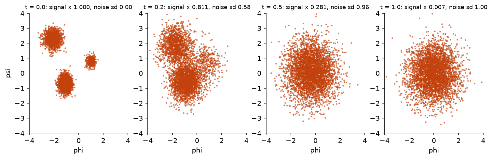
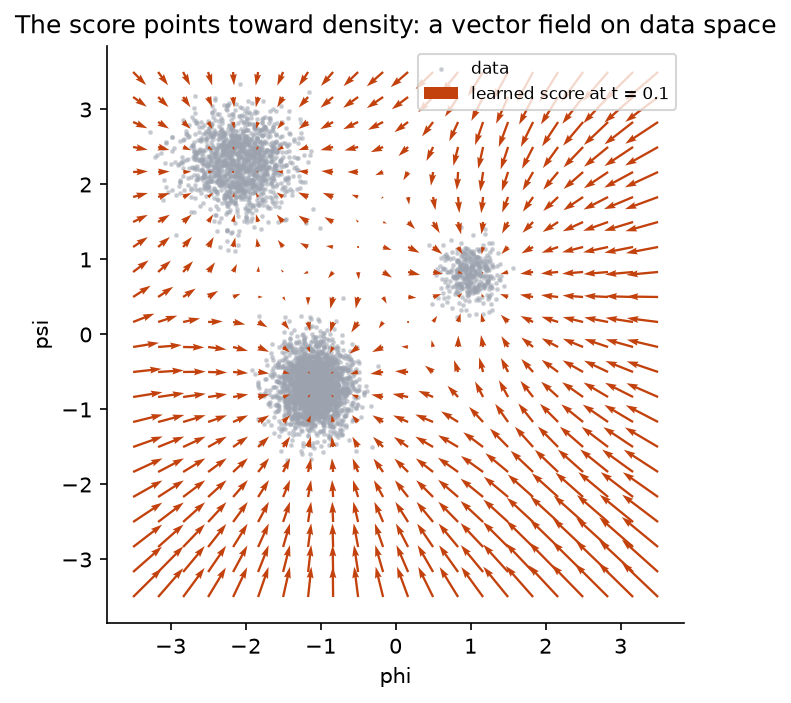
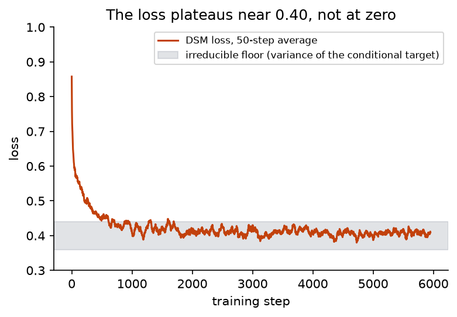
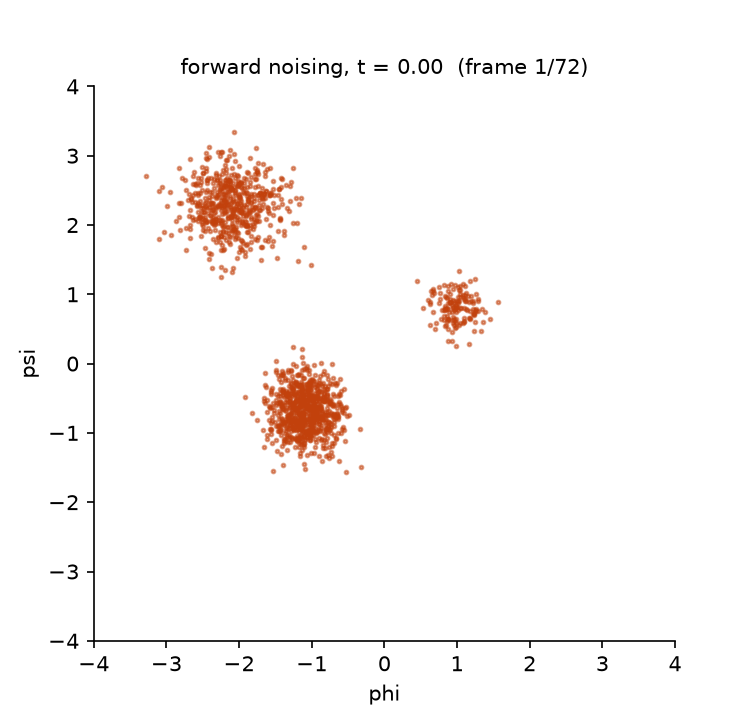
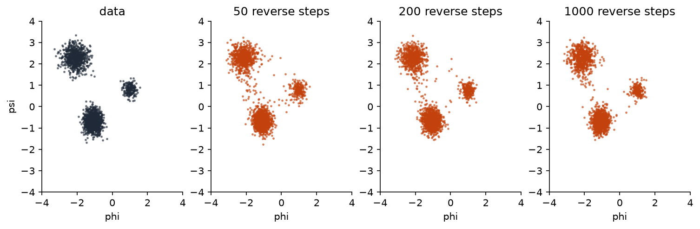

## Overview

**Why this track exists.** Days 1 to 4 were about inferring unknowns from data under a
model you wrote down. Generative modelling turns the question around: learn a model
that produces data like the data you have, with a density you can evaluate. Diffusion
models are the current standard answer, and they are usually presented as a bag of
tricks. This track presents them as what they are: a latent-variable model with a fixed
variational posterior, trained by an objective that is a weighted ELBO, whose score
network is a learned gradient of a log density. Every piece is something you have
built before. You will write the forward noising process as a stochastic differential
equation, derive its closed form, learn its reverse by regression, sample from the
reverse, and compute exact log-likelihoods with an ordinary differential equation.

**What you'll build:** in `workshop/m15b_diffusion.py`, a complete score-based
generative model on two-dimensional backbone torsion angles: the variance-preserving
SDE and its closed-form perturbation kernel, exact scores for Gaussian-mixture data as a
reference, a time-conditioned score network trained by denoising score matching, an
Euler–Maruyama sampler for the reverse-time SDE, and the probability-flow ODE with an
exact and a Hutchinson log-likelihood. The day ends with an experiment and a report
following the [report template](report-template.qmd).

**Estimated time:** 7 hours (about 2 h reading and derivation, 4 h building through
Step 5, 1 h report).

**Prerequisites:** [Module 1](../day0/m01-jax-warmup.qmd),
[Module 7](../day2/m07-gradient-estimators.qmd), [Module 8](../day2/m08-bbvi-engine.qmd).
You reuse the hand-written Adam from Module 8. The ELBO and latent-variable vocabulary
is from [Module 2b](../day0/m02b-foundations.qmd), [Module 6](../day2/m06-cavi.qmd) and
the [glossary](../reference/glossary.qmd); no stochastic calculus is assumed.

**Dataset:** `data.torsion_angles()`, 4 000 $(\phi, \psi)$ pairs in radians drawn from
three Ramachandran-like modes ($\alpha$-helix, $\beta$-sheet, left-handed helix) with
weights 0.55, 0.35, 0.10. A held-out set is `torsion_angles(seed=1, n=200)`. For
non-biologists: each amino acid in a protein backbone has two rotatable bonds, and the
pair of angles $(\phi, \psi)$ describes the local shape; the Ramachandran plot of these
pairs across a protein shows a few dense clusters corresponding to helices and sheets.
The dataset is a synthetic version of that plot.

## Learning objectives

By the end of this track you can:

1. Explain what a stochastic differential equation is in terms of an Euler step with
   noise, derive the perturbation kernel of the VP-SDE from first principles, and state
   why the forward process is a fixed variational posterior over a continuum of latent
   variables.
2. Define the score of a density, explain why the reverse-time SDE needs it and nothing
   else, and state Anderson's result.
3. Derive denoising score matching from score matching line by line and implement the
   weighted objective with a time-conditioned network.
4. Sample from the reverse SDE and diagnose under-training, drift-sign errors and
   discretisation errors from the samples alone.
5. Derive the instantaneous change-of-variables formula and Hutchinson's trace
   estimator, and compute exact log-likelihoods with the probability-flow ODE.

## Background

**A note on letters.** In this track the score is $\nabla_x \log p_t(x)$, a gradient
with respect to the *data point*, not the parameter gradient $\nabla_\phi\log q_\phi$ of
Module 7; $\theta$ is the network weights; and $x_t$ is a noised data point. The
[glossary](../reference/glossary.qmd#notation) tabulates the clashes.

### The problem in plain terms

You have 4 000 points in the plane that form three blobs of different sizes. You want a
model that can produce new points with the same distribution and that can tell you
how probable any given point is. The flows of Track A do this with a single
invertible map; they are constrained by the need for a cheap Jacobian. Diffusion
models take a different route that removes the constraint.

The idea in one paragraph. Take a data point and add a little Gaussian noise. Add a
little more. Keep going until the point is indistinguishable from a draw from
$\mathcal N(0, I)$. That forward process is fixed, needs no learning, and is easy to
analyse. Now ask: given a noisy point at some noise level, which direction would make it
slightly *less* noisy? If a network can answer that at every noise level, you can start
from pure noise and walk backwards, step by step, to a sample of the data. The
direction the network must learn turns out to be the gradient of the log density of the
noisy data, called the score, and there is a simple regression objective for it. The
same network also gives an exact likelihood through a deterministic version of the
reverse walk.

### Definitions

| Term | Meaning |
|---|---|
| Brownian motion $W_t$ | a random path whose increments over a time $\Delta t$ are independent $\mathcal N(0, \Delta t)$ |
| stochastic differential equation (SDE) | $\dd x = f(x, t)\dd t + g(t)\dd W_t$: an ODE with drift $f$ plus noise of size $g$ per unit $\sqrt{\text{time}}$ |
| Euler–Maruyama | the Euler scheme for an SDE: $x_{t+\Delta t} = x_t + f\Delta t + g\sqrt{\Delta t}\,\xi$, $\xi \sim \mathcal N(0, I)$ |
| marginal $p_t$ | the distribution of $x_t$ when $x_0$ is drawn from the data |
| perturbation kernel $p_t(x_t \mid x_0)$ | the distribution of $x_t$ given a specific starting point |
| score $\nabla_x\log p_t(x)$ | the gradient of the log density *with respect to the point*, not the parameters |
| score network $s_\theta(x, t)$ | a neural network approximating the score at every time |
| denoising score matching | the regression objective that trains $s_\theta$ without knowing $p_t$ |
| probability-flow ODE | a deterministic ODE whose solution has the same marginals $p_t$ as the SDE |
| divergence $\nabla\cdot f$ | the trace of the Jacobian of a vector field; how much it expands volume |

The $\sqrt{\Delta t}$ in Euler–Maruyama is the one thing that distinguishes an SDE from
an ODE with noise added by hand. Brownian increments over a time $\Delta t$ have
variance $\Delta t$, so their standard deviation is $\sqrt{\Delta t}$. Halving the step
halves the drift contribution but only reduces the noise contribution by $\sqrt 2$;
this is why noise does not disappear as $\Delta t \to 0$ and why variances, not
standard deviations, add up along a path.

### The forward process, step by step

With a schedule $\beta(t) > 0$ on $t \in [0, 1]$, the variance-preserving SDE is

$$
\dd x = -\tfrac12\beta(t)\,x\,\dd t + \sqrt{\beta(t)}\,\dd W_t .
$$

Read it through its Euler–Maruyama step: $x_{t+\Delta t} = x_t - \frac12\beta(t)x_t\Delta t + \sqrt{\beta(t)\Delta t}\,\xi$.
Each step shrinks the point toward the origin by a factor $1 - \frac12\beta\Delta t$ and
adds Gaussian noise of variance $\beta\Delta t$. The shrink and the noise are balanced so
that the total variance stays constant; that is the "variance preserving" in the name,
and the derivation below shows it.

Because the drift is linear in $x$ and the noise does not depend on $x$, $x_t$ given
$x_0$ stays Gaussian for all $t$, so it suffices to track its mean $m(t)$ and variance
$v(t)$ (per coordinate). Take the expectation of the Euler step: the noise has mean
zero, so

$$
m(t + \Delta t) = m(t) - \tfrac12\beta(t)\,m(t)\,\Delta t
\quad\Longrightarrow\quad
\frac{\dd m}{\dd t} = -\tfrac12\beta(t)\,m
\quad\Longrightarrow\quad
m(t) = x_0\exp\Big(-\tfrac12\int_0^t\beta(s)\dd s\Big).
$$

The first line is the expectation of the step; the second is its limit; the third
solves the linear ODE by separation of variables. For the variance, the shrink scales
the existing variance by $(1 - \frac12\beta\Delta t)^2 \approx 1 - \beta\Delta t$ and
the independent noise adds $\beta\Delta t$:

$$
v(t + \Delta t) = (1 - \beta\Delta t)\,v(t) + \beta\Delta t
\quad\Longrightarrow\quad
\frac{\dd v}{\dd t} = \beta(t)\,(1 - v)
\quad\Longrightarrow\quad
v(t) = 1 - \exp\Big(-\int_0^t\beta(s)\dd s\Big),
$$

using $v(0) = 0$. Write $\bar\alpha(t) = \exp(-\int_0^t\beta)$. Then

$$
p_t(x_t \mid x_0) = \mathcal N\big(\sqrt{\bar\alpha(t)}\,x_0,\; (1 - \bar\alpha(t))\,I\big),
$$

so a noisy point can be produced in one shot as
$x_t = \sqrt{\bar\alpha(t)}\,x_0 + \sigma_t\,\varepsilon$ with
$\sigma_t = \sqrt{1 - \bar\alpha(t)}$ and $\varepsilon \sim \mathcal N(0, I)$. No
simulation is needed in training. Variance preservation is now visible: if
$x_0 \sim \mathcal N(0, I)$ then $\mathrm{Var}[x_t] = \bar\alpha + (1 - \bar\alpha) = 1$.

With the linear schedule $\beta(t) = 0.1 + 19.9\,t$:

| $t$ | $\int_0^t\beta$ | $\sqrt{\bar\alpha(t)}$ (signal factor) | $\sigma_t$ (noise sd) |
|---|---|---|---|
| 0.1 | 0.11 | 0.947 | 0.32 |
| 0.5 | 2.54 | 0.281 | 0.96 |
| 1.0 | 10.05 | 0.0066 | 1.00 |

At $t = 0.5$ the data are already mostly noise; at $t = 1$ the signal is scaled by
0.0066 and $p_1$ is indistinguishable from $\mathcal N(0, I)$. That is the starting
distribution for generation.



::: {.callout-note title="Interactive"}
Time runs upward. Forward: 400 points from the three-mode torsion mixture, coloured by mode, follow $\dd x = -\tfrac12\beta x\,\dd t + \sqrt\beta\,\dd W$ from $t = 0$ at the bottom to $t = 1$ at the top, where the cloud is a standard Gaussian and the colours are thoroughly mixed. Reverse: a fresh Gaussian cloud at the top follows the reverse SDE driven by the exact score of the perturbed mixture and arrives at the three modes; the readout shows $t$ and the factors $\sqrt{\bar\alpha(t)}$ and $\sigma_t$. Reduce the number of reverse steps to 50 and the small mode loses mass to discretisation bias. Tick the probability-flow ODE box: the same marginals are reached along deterministic paths, which is what makes the likelihood computation of Step 5 possible. Drag to rotate.
:::

```{=html}
<div class="bi-widget" id="diffusion-paths" data-points="400" data-steps="200" style="width:100%;max-width:860px;margin:0 auto 1.5rem auto;"></div>
<script type="module">
import { mount } from "../widgets/diffusion_paths.js";
mount(document.getElementById("diffusion-paths"));
</script>
```

### Reversing time

Anderson (1982) proved that a diffusion $\dd x = f(x, t)\dd t + g(t)\dd W$ run backwards
in time is itself a diffusion,

$$
\dd x = \big[f(x, t) - g(t)^2\,\nabla_x \log p_t(x)\big]\dd t + g(t)\,\dd\bar W_t ,
$$

run from $t = 1$ to $0$ with a reverse-time Brownian motion $\bar W$. The full proof
uses stochastic calculus, but the result can be derived in discrete time with nothing
more than Bayes' rule from Module 2b, and that derivation shows exactly where the
score comes from.

**One reverse step is a posterior.** Take one small forward step of size $\Delta t$
from $x_t$ to $x_{t+\Delta t}$. The forward kernel is Gaussian,

$$
p(x_{t+\Delta t} \mid x_t) = \mathcal N\big(x_{t+\Delta t};\; x_t + f(x_t, t)\Delta t,\; g^2\Delta t\, I\big),
$$

and the marginal at time $t$ is $p_t(x_t)$. We want the reverse kernel: given where the
point *ended*, where did it come from? That is a posterior over $x_t$ with "prior"
$p_t(x_t)$ and "likelihood" the forward kernel, so by Bayes' rule

$$
p(x_t \mid x_{t+\Delta t}) \propto p(x_{t+\Delta t} \mid x_t)\,p_t(x_t).
$$

Take logs and keep terms in $x_t$. The kernel contributes
$-\|x_{t+\Delta t} - x_t - f\Delta t\|^2 / (2g^2\Delta t)$. For small $\Delta t$ the kernel
is narrow, so $x_t$ is close to $x_{t+\Delta t}$ and the prior can be expanded to first
order around that point:
$\log p_t(x_t) \approx \log p_t(x_{t+\Delta t}) + (x_t - x_{t+\Delta t})^\top\nabla\log p_t(x_{t+\Delta t})$.
Adding the two and completing the square in $x_t$ (drop terms of order $\Delta t^2$, and
evaluate $f$ at $x_{t+\Delta t}$, which costs only $O(\Delta t^2)$) gives a Gaussian with

$$
\text{mean} = x_{t+\Delta t} - \big[f(x_{t+\Delta t}, t) - g^2\,\nabla\log p_t(x_{t+\Delta t})\big]\Delta t,
\qquad
\text{variance} = g^2\Delta t\, I .
$$

Read it line by line. The reverse step undoes the drift ($-f\Delta t$), adds the same
amount of noise the forward step added ($g^2\Delta t$), and shifts the mean *toward
higher density* by $g^2\nabla\log p_t\,\Delta t$. That shift is the prior's vote: of all
the points that could have produced $x_{t+\Delta t}$, the ones in dense regions were
more likely to have been there in the first place. Letting $\Delta t \to 0$ turns this
one-step Gaussian into Anderson's SDE, drift $f - g^2\nabla\log p_t$ and the same
diffusion coefficient $g$. The score is nothing more mysterious than the gradient of
the log prior in a one-step Bayesian update.

{width=75%}

Forward diffusion spreads mass from where it is dense to where it is sparse; to undo
it, the reverse process must push mass back toward dense regions, and the score is
exactly the direction of increasing density. The size of the push, $g^2$, matches the
amount of spreading the noise caused.

Everything in this equation is known except $\nabla_x\log p_t(x)$. If a network
$s_\theta(x, t)$ approximates it, starting from $x_1 \sim \mathcal N(0, I)$ and running
the reverse SDE with Euler–Maruyama generates approximate samples of $p_0$, the data.

### What the score is and why it can be learned

For a density $p$, the score is $\nabla_x\log p(x)$: a vector field on data space that
points toward higher density. For $\mathcal N(m, \sigma^2 I)$ it is $-(x - m)/\sigma^2$,
pointing to the mean with strength inversely proportional to the variance. It is not
the gradient with respect to parameters that you used throughout Days 2 and 3; it is a
gradient with respect to the point.

Hyvärinen (2005) proposed fitting a model score by minimising
$\E_{x \sim p_t}\|s_\theta(x, t) - \nabla_x\log p_t(x)\|^2$. This cannot be computed
directly because $p_t$ is the unknown marginal. Vincent (2011) showed that the
*conditional* score, which is known, gives the same minimiser. Expand the square:

$$
\E_{p_t}\|s_\theta - \nabla\log p_t\|^2
= \E_{p_t}\|s_\theta\|^2 - 2\,\E_{p_t}\big[s_\theta^\top\nabla\log p_t\big] + \text{const}.
$$

Only the cross term involves the unknown. Write $p_t(x) = \int p_0(x_0)\,p_t(x \mid x_0)\dd x_0$
and use $p_t\nabla\log p_t = \nabla p_t$:

$$
\E_{p_t}\big[s_\theta^\top\nabla\log p_t\big]
= \int s_\theta(x)^\top\nabla_x p_t(x)\dd x
= \int s_\theta(x)^\top\int p_0(x_0)\,\nabla_x p_t(x \mid x_0)\dd x_0\dd x
= \E_{x_0}\,\E_{x \mid x_0}\big[s_\theta(x)^\top\nabla_x\log p_t(x \mid x_0)\big].
$$

The second equality moves the gradient inside the integral over $x_0$; the third uses
$\nabla p_t(x\mid x_0) = p_t(x\mid x_0)\nabla\log p_t(x\mid x_0)$ and recognises the
double integral as an expectation over a data point and a noisy version of it.
Substituting back and completing the square gives

$$
\E_{p_t}\|s_\theta - \nabla\log p_t\|^2
= \E_{x_0}\,\E_{x_t \mid x_0}\big\|s_\theta(x_t, t) - \nabla_{x_t}\log p_t(x_t \mid x_0)\big\|^2 + \text{const}',
$$

and the conditional score is the Gaussian one from the kernel:
with $x_t = \sqrt{\bar\alpha}\,x_0 + \sigma_t\varepsilon$,

$$
\nabla_{x_t}\log p_t(x_t\mid x_0) = -\frac{x_t - \sqrt{\bar\alpha}\,x_0}{\sigma_t^2} = -\frac{\varepsilon}{\sigma_t}.
$$

So the network is trained to predict the negative noise divided by the noise scale,
using only data points, times and Gaussian draws. Weighting the squared error at time
$t$ by $\lambda(t) = \sigma_t^2$ cancels the $1/\sigma_t$ and gives the objective you
implement,

$$
\mathcal J(\theta) = \E_{t \sim U(\epsilon, 1)}\,\E_{x_0}\,\E_{\varepsilon}
\big\|\sigma_t\,s_\theta(x_t, t) + \varepsilon\big\|^2 ,
$$

the "predict the noise" loss of DDPM. Its minimum is not zero: the constants dropped
above are the variance of the conditional score around the marginal score, which the
network cannot remove, so the loss plateaus at a positive value (about 0.40 on the
torsion data). The network output is divided by $\sigma_t$ inside `score_net` so that
its raw output stays $O(1)$ while the score itself grows like $1/\sigma_t$ as $t \to 0$.

{width=65%}

{width=65%}

### Sampling

Generation is Euler–Maruyama on the reverse SDE from $t = 1$ down to $t = \epsilon$:
start at $x \sim \mathcal N(0, I)$, and at each step with $\Delta t > 0$ going backwards,

$$
x \leftarrow x - \Big[-\tfrac12\beta x - \beta\,s_\theta(x, t)\Big]\Delta t + \sqrt{\beta\Delta t}\,\xi .
$$

The final step omits the noise so the output is the mean of the last transition. The
number of steps matters: Euler discretisation of a curved drift is biased, and with
too few steps the samples are pulled toward the origin and the small mode loses mass.
The Step 4 test uses 400 steps.





### Likelihood via the probability-flow ODE

There is a deterministic ODE,

$$
\frac{\dd x}{\dd t} = f(x, t) - \tfrac12 g(t)^2\,s(x, t) = -\tfrac12\beta(t)\big(x + s(x, t)\big) \eqqcolon \tilde f(x, t),
$$

whose solutions, started from $x_0 \sim p_0$, have exactly the marginals $p_t$ of the
SDE (Song et al. 2021; it follows from writing the Fokker–Planck equation of the SDE as
a continuity equation with a modified drift). It is a continuous-time invertible map,
so Track A's change-of-variables formula applies in differential form. Follow one point
$x(t)$ along the flow and ask how its log density changes. Conservation of probability
says $\partial_t p + \nabla\cdot(p\tilde f) = 0$ (the continuity equation); expanding
the divergence and dividing by $p$,

$$
\frac{\dd}{\dd t}\log p\big(x(t), t\big) = \partial_t\log p + \tilde f^\top\nabla\log p = -\nabla\cdot\tilde f(x(t), t).
$$

The first equality is the total derivative along the moving point; the second
substitutes the continuity equation. So

$$
\log p_0(x_0) = \log p_1(x_1) + \int_0^1 \nabla\cdot\tilde f\big(x(t), t\big)\dd t,
$$

integrated along the trajectory from the data point $x_0$ forward to $x_1$, where
$p_1 = \mathcal N(0, I)$ is known. The divergence is the trace of the Jacobian of
$\tilde f$. In two dimensions `jax.jacfwd` gives it exactly at the cost of two
Jacobian-vector products. In high dimensions Hutchinson's estimator replaces the trace
by one product: for $\varepsilon$ with independent entries of mean zero and unit
variance,

$$
\E\big[\varepsilon^\top J\varepsilon\big] = \sum_{i,j}J_{ij}\,\E[\varepsilon_i\varepsilon_j] = \sum_i J_{ii} = \tr J,
$$

because $\E[\varepsilon_i\varepsilon_j]$ is 1 when $i = j$ and 0 otherwise. One
Rademacher $\varepsilon$ per data point, kept fixed along the trajectory, gives an
unbiased but noisy log-likelihood; averaging over points removes the noise.

### Why this is a latent-variable model

The whole noisy path $\{x_t\}_{t \in (0, 1]}$ is a latent variable attached to each data
point. The forward SDE defines a *fixed* variational posterior $q(x_{(0,1]} \mid x_0)$
with nothing to learn, and the reverse SDE defines the generative model
$p_\theta(x_0, x_{(0,1]})$. The ELBO of this pair, in the continuous-time limit, is the
score-matching objective with the weighting $\lambda(t) = g(t)^2 = \beta(t)$ (Song,
Durkan, Murray and Ermon 2021; Huang, Lim and Courville 2021). The $\sigma_t^2$
weighting used here is the choice that gives the best samples; the $\beta(t)$ weighting
is the choice that gives the best likelihoods. So the Day 2 picture holds: a
variational posterior, a generative model, an ELBO, and gradient steps on it. What is
unusual is that the posterior is fixed by design and only the generative side learns.

### A worked example with numbers

Running the solution with the fixture settings (6 000 Adam steps, batch 256, learning
rate $2\times10^{-3}$, hidden width 128):

| Quantity | Value |
|---|---|
| DSM loss, mean of first 100 steps | 0.78 |
| DSM loss, mean of last 100 steps | 0.40 (the irreducible floor is near here) |
| mode proportions, data | 0.55 / 0.35 / 0.09 |
| mode proportions, 2 000 samples at 400 steps | 0.51 / 0.37 / 0.12 |
| held-out log-likelihood per point, exact divergence | $-1.35$ |
| held-out log-likelihood per point, Hutchinson | $-1.35$ (sd 0.86 per point) |
| held-out log-likelihood per point, single Gaussian fit | $-2.97$ |
| ODE pipeline error with the exact Gaussian score | 0.002 nats |

The last row is the test that matters most when something looks wrong: with a target
whose score is known analytically, the ODE likelihood must reproduce the Gaussian
log density, and 0.002 nats says the integrator and the change-of-variables code are
correct. Then the 1.6-nat gap between the trained model and a single Gaussian on the
held-out set says the model has learned the three modes: $e^{1.6} \approx 5$, so each
held-out point is about five times more probable under the diffusion model. The
Hutchinson column has the same mean as the exact one but a per-point standard
deviation of 0.86 nats; it is useful only as an average.

### Why this matters

The continuous-time formulation (Song et al. 2021) unified denoising diffusion (Ho et
al. 2020) and score matching and gave the probability-flow ODE, which is what makes
diffusion models likelihood-based generative models rather than samplers only. The
same objects reappear across the field: the perturbation kernel in every noise
schedule design (Karras et al. 2022), the score network as the thing guidance
manipulates, and the ODE as the basis of fast deterministic samplers. In structural
biology, diffusion over backbone geometry is the generative engine of current protein
design systems; the two-dimensional torsion data here is the smallest version of that
problem.

### Common misconceptions

- **"A diffusion model is an autoencoder."** There is no encoder to learn; the
  "encoder" is a fixed noising process with a closed form. The learned part is the
  decoder direction only.
- **"More sampler steps are always better."** More steps reduce discretisation bias of
  the reverse SDE, but they also accumulate score-network error, and past a few hundred
  steps on this data nothing improves. The report prompt on step count measures the
  trade.
- **"The score is a gradient with respect to the parameters."** It is
  $\nabla_x\log p_t(x)$, a function of the data point. Parameter gradients appear only
  inside the optimiser.
- **"The DSM loss should go to zero."** The conditional target $-\varepsilon/\sigma_t$
  is noisy around the true score; the floor is the variance of that noise. A loss of
  0.40 on this data is a fitted model, not a failing one.
- **"The ODE and the SDE give the same samples."** They give the same *marginals*
  $p_t$. Individual trajectories differ, and the ODE from a fixed $x_1$ is
  deterministic.

## Steps

Every step edits `workshop/m15b_diffusion.py`. Functions act on one point `x` and one
time `t`; the tests `vmap` them.

### Step 1 — The VP-SDE and its kernel

**What this computes.** The closed-form solution of the forward process derived above:
given a data point and a time, the mean and standard deviation of the noisy point, and
a one-shot sampler for it. Everything downstream (training, likelihood) uses this
instead of simulating the SDE.

Implement `beta(t)`, `alpha_bar(t)` (integrate $\beta$ in closed form:
$\beta_{\min}t + \frac12(\beta_{\max}-\beta_{\min})t^2$), `perturbation_kernel(x0, t)`
returning `(mean, std)` with a scalar `std`, and `sample_forward(key, x0, t)`.

Sanity check: `alpha_bar(0.5)` is `0.0791` and `perturbation_kernel(x0, 0.5)` returns
`std = 0.960`; at `t = 1.0` the mean factor $\sqrt{\bar\alpha}$ is `0.0066`.

```bash
pytest tests/m15b -k step1
```

You should see 3 passed: $\bar\alpha$ against numerical quadrature of $\beta$, variance
preservation $\bar\alpha + \sigma_t^2 = 1$, and the sampler's moments against the kernel
over 100 000 draws.

### Step 2 — Exact scores for mixture data

**What this computes.** The true score at every time for data that is a Gaussian
mixture, which the kernel keeps Gaussian. This is the reference that lets you test the
sampler and the likelihood code with no trained network in the loop.

Implement `gaussian_mixture_score(x, t, weights, means, covs)`. Each component
$\mathcal N(m_k, S_k)$ of $p_0$ becomes $\mathcal N(\sqrt{\bar\alpha}\,m_k,\;
\bar\alpha S_k + (1-\bar\alpha)I)$ under the kernel; the score of the mixture is the
responsibility-weighted sum of the component scores $-S_k(t)^{-1}(x - m_k(t))$. The
reference `perturbed_mixture_log_density` is provided; do not call `jax.grad` on it.

Sanity check: for a single standard-normal component the marginal stays
$\mathcal N(0, I)$ at every $t$, so `gaussian_mixture_score(x, 0.5, [1.], zeros, eye)`
returns `-x`.

```bash
pytest tests/m15b -k step2
```

You should see 2 passed, against autodiff of the reference at four times and the
single-component special case.

### Step 3 — Score network and the DSM objective

**What this computes.** The network that will approximate the score, with time fed in
as sinusoidal features and the output divided by $\sigma_t$, and the "predict the
noise" loss derived above, estimated on a minibatch with one random time and one noise
draw per row.

Implement `init_score_net(key, dim, hidden, n_freqs)` and `score_net(params, x, t)`:
a three-layer SiLU MLP on `[x, time_features(t)]` whose output is divided by
$\sigma_t$. Then implement `dsm_loss_fn(score_fn, key, x0)` for a batch `x0 [n, d]`:
draw $t \sim U(\epsilon, 1)$ and $\varepsilon$ per row, form $x_t$, return the batch mean
of $\|\sigma_t s(x_t, t) + \varepsilon\|^2$. `dsm_loss(params, key, x0)` wraps it with
the network.

Sanity check: `dsm_loss_fn(lambda x, t: jnp.zeros_like(x), key, x0)` is about `2.0`,
because with a zero score the loss is $\E\|\varepsilon\|^2 = d = 2$.

```bash
pytest tests/m15b -k step3
```

You should see 2 passed: for Gaussian data the zero score scores $d = 2$ and the exact
score is at least 10% better; network outputs are finite, differentiable, and amplified
by $1/\sigma_t$ near $t = \epsilon$.

### Step 4 — Training and the reverse-time sampler

**What this computes.** Minibatch Adam on the DSM loss, and Euler–Maruyama on the
reverse SDE from pure noise back to data.

Implement `train_score_model(key, X, n_steps, batch_size, lr, hidden)` with one
`lax.scan` over Adam steps (Module 8's `adam_update` ascends; negate the gradient).
Implement `reverse_drift(score_fn, x, t)` $= -\frac12\beta x - \beta s$ and
`sample_reverse(key, score_fn, n, n_steps, dim)`: Euler–Maruyama from $t = 1$ to
$\epsilon$ with $x \leftarrow x - \text{drift}\,\Delta t + \sqrt{\beta\Delta t}\,\xi$,
omitting the noise on the final step.

Sanity check: with the exact standard-normal score $s(x, t) = -x$, `reverse_drift`
returns $+\frac12\beta(t)\,x$, and `sample_reverse` with that score returns samples
whose mean is near 0 and variance near 1 at any step count.

```bash
pytest tests/m15b -k step4
```

You should see 3 passed. Training 6 000 steps at batch 256 takes about 5 seconds on a
laptop CPU; the loss must fall below 70% of its initial average, and 2 000 generated
samples must reproduce the three mode proportions within 0.12 and the data mean and
standard deviation within tolerance.

### Step 5 — Probability-flow ODE and likelihood

**What this computes.** The deterministic drift, and the log-likelihood of a data point
by integrating the point and the divergence term forward to $t = 1$ with RK4, once with
the exact trace and once with Hutchinson's estimator.

Implement `probability_flow_drift(score_fn, x, t)` and the two likelihoods.
`ode_log_likelihood_exact(score_fn, x, n_steps)` integrates the augmented state
$(x, \ell)$ from $\epsilon$ to 1 with fixed-step RK4 in `lax.scan`, where
$\dot\ell = \tr J_{\tilde f}$ via `jax.jacfwd`, and adds $\log\mathcal N(x_1; 0, I)$.
`ode_log_likelihood(score_fn, x, key, n_steps)` replaces the trace by
$\varepsilon^\top J\varepsilon$ with one Rademacher $\varepsilon$ per data point,
evaluated with `jax.jvp`.

Sanity check: with $s(x, t) = -x$ the probability-flow drift is identically zero (the
standard normal is a fixed point of the flow), and `ode_log_likelihood_exact` with that
score returns $\log\mathcal N(x; 0, I)$ for any `x`, since the point does not move and
the divergence is zero.

```bash
pytest tests/m15b -k step5
```

You should see 3 passed: the drift formula; with the exact Gaussian score the ODE
likelihood matches the analytic log density to 0.02 nats on average over 200 points,
and the Hutchinson version is unbiased to 0.1; and the trained torsion model beats a
single Gaussian fit by more than 0.3 nats per held-out point.

### Experiments for the report

Pick one of the Track B prompts in the [report template](report-template.qmd): sampler
step count versus a distributional distance; ODE likelihood versus a Gaussian mixture
with matched parameter count; or linear versus cosine $\beta(t)$. The notebook
`notebooks/m15b_diffusion.py` has the plotting scaffolding.

## Checkpoint

::: {.callout-tip title="Checkpoint"}
```bash
pytest tests/m15b
```
13 tests pass in about 25 seconds on a laptop CPU, two model trainings included. Before
writing the report, be able to say in one sentence each what the forward SDE, the
score, the DSM loss and the probability-flow ODE are, without using the words
"diffusion" or "denoising".

**Which expectation did you just compute?** The DSM loss is an expectation over data,
time and noise, estimated by minibatch. The log-likelihood is an expectation of a
divergence along a trajectory, estimated by Hutchinson's trick. And every reverse step
is a posterior mean: the one-step Bayes update of the Background, with the score as
the gradient of the log prior.
:::

## Challenge

::: {.callout-note title="Challenge"}
1. Add a Langevin corrector after each predictor step (Song et al. 2021,
   Algorithm 2) with signal-to-noise ratio 0.16 and measure the change in mode
   proportions at 50 reverse steps.
2. Train with the mode label as a condition and implement classifier-free guidance:
   $\tilde s = (1 + w)\,s(x, t, y) - w\,s(x, t)$. Show that $w > 0$ sharpens the
   conditional modes and distorts the proportions.
3. Show that the DDPM discretisation with $\beta_i = \beta(t_i)\Delta t$ is the
   Euler–Maruyama scheme for this SDE, and that the DDPM reverse variance choice
   $\sigma_i^2 = \beta_i$ matches `sample_reverse`.
4. Retrain with the likelihood weighting $\lambda(t) = \beta(t)$ and compare held-out
   ODE log-likelihood and sample quality against the $\sigma_t^2$ weighting.
:::

## Going deeper

- Song, Sohl-Dickstein, Kingma, Kumar, Ermon and Poole. "Score-Based Generative Modeling
  through Stochastic Differential Equations." *ICLR*, 2021. The paper this track
  follows; read Sections 3 and 4 after the Background.
- Ho, Jain and Abbeel. "Denoising Diffusion Probabilistic Models." *NeurIPS*, 2020.
- Vincent. "A Connection Between Score Matching and Denoising Autoencoders." *Neural
  Computation* 23(7), 2011. The derivation in the Background, in full.
- Hyvärinen. "Estimation of Non-Normalized Statistical Models by Score Matching." *JMLR*
  6, 2005.
- Anderson. "Reverse-time Diffusion Equation Models." *Stochastic Processes and their
  Applications* 12(3), 1982.
- Chen, Rubanova, Bettencourt and Duvenaud. "Neural Ordinary Differential Equations."
  *NeurIPS*, 2018. The instantaneous change of variables.
- Grathwohl, Chen, Bettencourt, Sutskever and Duvenaud. "FFJORD: Free-Form Continuous
  Dynamics for Scalable Reversible Generative Models." *ICLR*, 2019. Hutchinson's
  estimator in this setting.
- Song, Durkan, Murray and Ermon. "Maximum Likelihood Training of Score-Based Diffusion
  Models." *NeurIPS*, 2021.
- Huang, Lim and Courville. "A Variational Perspective on Diffusion-Based Generative
  Models and Score Matching." *NeurIPS*, 2021.
- Karras, Aittala, Aila and Laine. "Elucidating the Design Space of Diffusion-Based
  Generative Models." *NeurIPS*, 2022.

## Troubleshooting

::: {.callout-warning title="Troubleshooting"}
**`nan` loss at the first step.** You sampled $t$ down to 0, where $\sigma_t = 0$
and the network output is divided by zero. Sample $t \in [\epsilon, 1]$ with
$\epsilon = 10^{-3}$ everywhere, including the sampler and the ODE.

**Loss decreases but samples collapse toward the mean.** The score is under-trained
at small $t$, where the true score is large; check that the output is divided by
$\sigma_t$ and that $t$ is not restricted to large values. Sampling with fewer than
about 100 Euler steps also pulls mass toward the origin.

**Samples explode to $\pm 10^3$.** The reverse drift has the wrong sign. With the
exact standard-normal score $s = -x$ the reverse drift is $+\frac12\beta x$ and the
Euler update $x - \text{drift}\,\Delta t$ contracts toward zero. The test in Step 4
checks exactly this case.

**Mode proportions wrong, means right.** Too few reverse steps (discretisation bias
favours the heavier modes) or a learning rate that left the network under-fitted at
intermediate $t$. Try 400 steps and 6 000 training iterations before suspecting the
model.

**ODE likelihood is biased with the exact score.** RK4 with 200 steps gives errors
around $10^{-3}$; a larger bias means the drift is missing the factor $\frac12$ on the
score term, or the prior is evaluated at $x_0$ instead of $x_1$.

**Hutchinson likelihood varies by several nats per point.** Expected; the estimator
is unbiased but noisy, and only averages over many points are meaningful. Draw one
$\varepsilon$ per data point and keep it fixed along the trajectory, which lowers the
variance relative to redrawing at every step.

**Time features have no effect.** The frequencies $2^k$ with $t \in [0,1]$ need the
$2\pi$ factor; without it the highest frequencies barely complete a cycle.

**You expected the loss to reach zero and kept training.** The target is noisy; the
floor near 0.40 is the variance of $-\varepsilon/\sigma_t$ around the true score. Judge
the model by samples and held-out likelihood, not by the loss value.

**You confused the two gradients.** `jax.grad(dsm_loss)` is the parameter gradient for
Adam; the score network's *output* approximates the data-space gradient
$\nabla_x\log p_t$. The loss never differentiates the network with respect to $x$,
except inside the ODE divergence of Step 5.
:::
